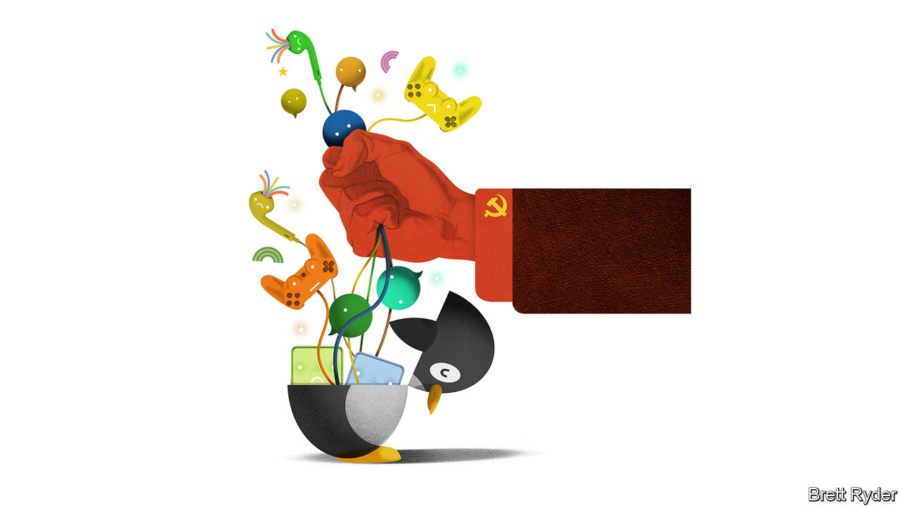

###### Schumpeter

# Tencent is a success story bedevilled by the splinternet 

##### WeChat, they snoop, no one wins 

 

> Aug 11th 2022 

Earlier this year it suddenly became clear what a subversive force WeChat could become. It happened on April 22nd, when Shanghai was in lockdown. A black-and-white video swiftly went viral among the 1bn-plus Chinese users of the social-media platform owned by Tencent, China’s biggest internet firm. For six minutes, as a camera panned over Shanghai’s skyline, it carried an audio montage of babies crying after being separated from their quarantined parents, residents complaining of hunger, apartment dwellers banging bins, a mother desperately seeking medicine for her child. “The virus is not killing people, starvation is,” a person cries out. It was a haunting, dystopian scene.

As Lulu Yilun Chen recounts in her book, “Influence Empire: The Story of Tencent and China’s Tech Ambition”, China’s web censors swiftly blocked the video, though some netizens sought to defy them by posting it upside down. It was a rare moment when WeChat ( within China) was used to express people’s anger and pain, rather than the blander stuff—swanky dinners, clouds at dusk—that people usually post. WeChat is Tencent’s flagship product, a “Swiss Army Knife” of a super app, offering messages, search, ride-hailing, food delivery and other applications on a single platform. But in a paranoid regime, its power is also a threat. 

One can only imagine how much the episode must have unnerved executives at Tencent. Since early 2021 its value has plummeted by more than three-fifths, to $365bn, amid a Communist Party crackdown on the consumer-tech industry. It is a firm that in many ways belies stereotypes about China and offers lessons to Silicon Valley. It eschews personality cults. It is obsessively innovative. It takes a radically decentralised view of investment. Yet in recent years, like other tech firms in China, it has been under pressure to bow to the whims of President Xi Jinping. That threatens its reputation in the West, where it is a huge investor in gaming (among other businesses) and where it is keen to expand its reach.

Tencent is not easy to chronicle. Other tech giants, including Alibaba, its Chinese nemesis, have been the subjects of riveting bestsellers. Before Ms Chen’s book, Tencent’s only corporate biography was an authorised one by Wu Xiaobo, a management scholar, published in Chinese in 2016. Mr Wu started by lamenting that he had failed to find the secret to Tencent’s success despite more than 60 interviews with senior executives. A big problem for any biographer is the firm’s publicity-shy founder, Huateng “Pony” Ma. He is an erudite engineer who seems to hate the sound of his own voice. Ms Chen, a Bloomberg reporter who has covered China’s tech firms for a decade, has spoken to him only once, as part of a gaggle of journalists in 2015.

As it turns out, Mr Ma’s reticence is a source of strength, not weakness. What he lacks in outward charisma, he makes up for with steely resilience (“You either wait for someone to kill you or you kill yourself first,” is how he describes the firm’s constant efforts at reinvention). The lack of a domineering personality lets others thrive, for example Allen Zhang, creator of WeChat, who is equally shy, yet so competitive that he is a master gamer and champion golfer. Most important of all, keeping a low profile has kept Pony Ma personally out of the sort of political trouble Jack Ma (no relation), co-founder of Alibaba, has suffered—though it hasn’t kept Tencent out of the government’s line of fire.

Without rigid hierarchies, Tencent can let internal competition run amok, especially when it comes to creating innovative new products. In his book, Mr Wu describes this as “internal horse-racing” (as it happens, means “horse” in Chinese). He says almost all of Tencent’s transformational ideas, including WeChat, came from second-tier teams competing against each other, not from the top brass. Like many Chinese businesses, Tencent has often been accused of plagiarism. But its modus operandi is to make swift, incremental innovations that create blockbusters. 

Mr Ma’s decentralised approach to the way Tencent deploys capital has been similarly astute. According to Ms Chen, the company has made some 800 investments globally. More than 120 of these have become “unicorns” worth more than $1bn. It owns Riot Games, the franchise behind “League of Legends”, and has big stakes in Epic, creator of “Fortnite”, another gaming sensation, Meituan, a Chinese delivery app, Didi Global, a ride-hailing giant, as well as numerous other trailblazers such as Spotify and Tesla. It prides itself on taking a hands-off approach to its minority investments. As Ms Chen puts it, it has become an incubator of startups, not a killer of potential competitors. 

In short, her book—and that of Mr Wu, which it draws upon—paints a picture of a company whose executives are fascinatingly idiosyncratic, and almost as obsessed with products and design as Steve Jobs, Apple’s late co-founder. The trouble is that China’s domestic politics and the messy Sino-American clash make it hard to feel confident about the future. 

The red Pony 

The first problem is internal to China. Tencent is embedded in almost every aspect of life there. It makes money from app fees, traffic (via advertising) and transactions (such as selling virtual goods to gamers), as well as from cloud computing. This has overexposed it to the government’s techlash. Mr Xi’s crackdown on internet firms has hit its gaming arm, its fintech plans and local investments such as Didi. It has to censor itself vigorously.

It may hope that expansion abroad will help offset its problems in China. For example, it has plans for the global distribution of “Honor of Kings”, whose popularity at home has already made it the biggest mobile game in the world. But the more it has to compromise with the Chinese government to remain safe, the more its products like WeChat, as well as its games, run the risk of arousing hostility from China hawks in America. As Sino-American tensions worsen, that is a game no one can win. ■


