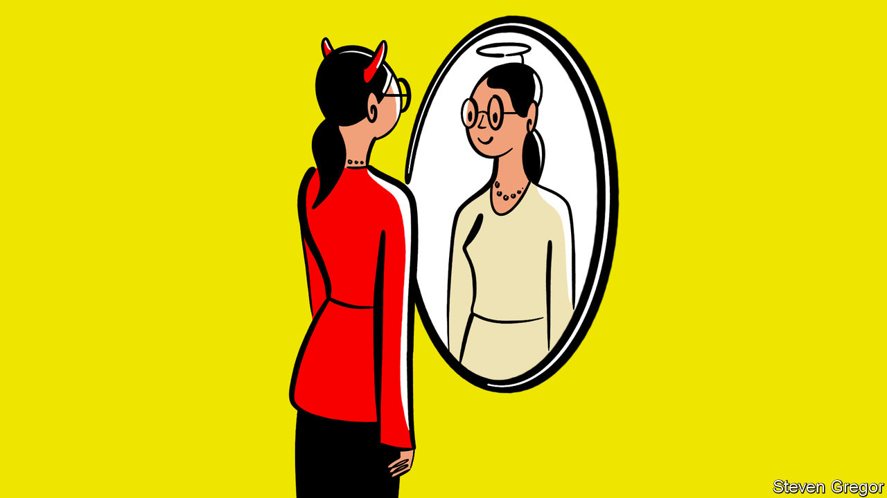

###### Bartleby

# Why employees want to work in vilified industries 

##### Workers for demonised firms are often proud to be on the payroll 

 

> Aug 11th 2022 

“Have you looked at our caps recently?” is the question a worried Nazi soldier puts to his comrade in a comedy sketch performed by David Mitchell and Robert Webb. He has just noticed that their uniforms are emblazoned with skulls; a doubt is nagging away at him. “Hans,” he asks. “Are we the baddies?”

No company employee has concerns of this sort. But some sectors are stigmatised enough to be known as “sin industries”—booze, gambling, tobacco and so on. Other industries have gone from being respectable to questionable: fossil-fuel firms, say. (A few, like cannabis firms, are travelling in the opposite direction.) Nationality now casts shadows in ways it did not before: working for a Chinese company might once have aroused admiration but now provokes suspicion. In an age when everyone is supposed to have a purpose, why would employees who have a choice work for the baddies?

The cynical answer would be pay. There is some evidence to suggest that executives in sin industries demand more money to compensate them for the stigma of working there. A paper in 2014 found that the bosses of alcohol, betting and tobacco firms earned a premium that could not be explained by those companies being more complex to run, less job security or poorer governance. The size of the premium did, however, line up with periods of heightened bad publicity, such as legal settlements in the tobacco industry. The stigma that wreathed these executives was observable in other ways, too: they sat on fewer boards than bosses in more virtuous industries.

Pay is a lever that might work for some positions and some people, but not for all of them. And it hardly satisfies as a psychological explanation. “Yes, I work for a ghastly company but at least the pay is great,” is not the kind of narrative that people like to fall asleep to. Thomas Roulet of Cambridge University’s Judge Business School points out in “The Power of Being Divisive”, a book about stigma in business, that employees of demonised firms are often proud to be on the payroll. 

The most basic reason for that is a classic free-market narrative. If you believe in freedom of choice, and companies having the licence of society to operate, that is justification enough to work there. This may not seem especially purposeful: many employees would regard operating legally and serving customer needs as a requirement rather than a source of pride. But it is a perfectly coherent position. 

Freedom of choice works less well as a rationale if the harm that products do, whether to lungs or to the environment, has been covered up, or if those products weaken consent by encouraging addiction. But firms under fire are practised at turning the negative effects of their products to their advantage. Energy firms argue that the money they make from oil and gas today enables them to fund the transition to low-carbon energy tomorrow. Diageo, a drinks firm, highlights its programmes to encourage drinking in moderation. Tobacco firms peddle cigarettes even as they endeavour to soften the harm caused by smoking: British American Tobacco says that its purpose is to “build a better tomorrow by reducing the health impact of our business”. 

It is easy to scoff at this corporate cakeism. Easy, but unwise. First, hostility itself can sometimes act as a kind of binding agent for employees of stigmatised firms. A study by Mr Roulet found that job satisfaction increased at firms that faced disapproval, provided their employees regarded the criticism as illegitimate. Second, societies’ attitudes can change, sometimes suddenly. The arms industry looks less evil now that its products are helping Ukrainians fend off Russia’s tanks. Dependence on Russian gas has made secure sources of energy, even if they are not low-carbon, seem more attractive. 

Third, employees in vilified industries are often in a position to do valuable things. Swapping from cigarettes to risk-reduction products is a net gain for people’s health. Widespread suspicion of genetically engineered crops ignores the copious evidence that they are safe and useful. And a rapid decline in the number of new petroleum engineers in America will seem less desirable if a shortfall in expertise holds back carbon-sequestration projects. 

There may be a cohort of evil employees who seek out demonised firms, steepling fingers, stroking cats and plotting ways to ruin lives. But the people who work in these industries are more likely to think of their work as important. They may not be wrong. 


