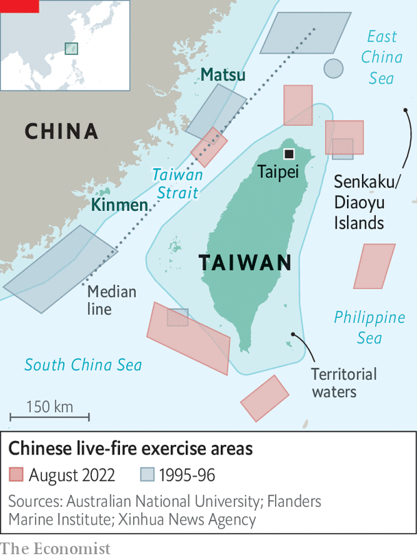

###### Danger ahead

# How the crisis over Taiwan will change US-China relations 

##### The showdown looks set to usher in a perilous new era of hostility 

 

> Aug 11th 2022 

In january 1950, three months after the Communist victory in China’s civil war, President Harry Truman issued a statement. America, he declared, would not intervene militarily to help China’s defeated Nationalists, who had fled to the island of Taiwan. Mao Zedong was already preparing an invasion and probably would have succeeded had the Korean war not erupted in June that year. The conflict prompted Truman to change tack, backing South Korea and ordering the Seventh Fleet to defend Taiwan in a bid to halt the spread of communism in Asia. Four years later, when Chinese forces attacked some of Taiwan&#39;s outlying islands, American officials threatened nuclear strikes on China, forcing Mao to back down again.

With hindsight, that was the first in a succession of military showdowns over Taiwan that have defined Sino-American relations and had consequences for the world beyond. Seven decades later the fourth such crisis is unfolding, this time triggered by a visit to Taiwan from the speaker of America’s House of Representatives, Nancy Pelosi, on August 2nd and 3rd. Ms Pelosi was the most senior American politician to visit the island, which China still claims, since one of her predecessors, Newt Gingrich, went in 1997. Although the crisis is far from over, it already looks set to usher in a dangerous new era of hostility between China and America. 

Ms Pelosi’s visit was a “manic, irresponsible and highly irrational” act, declared China. Its diplomats accused America of violating commitments it made when it first recognised the People’s Republic of China (prc) in 1979. Since Ms Pelosi left Taiwan, China has fired ballistic missiles over the island for the first time, sent military ships and aircraft across the median line of the Taiwan Strait in record numbers, and conducted live-fire drills encircling the island in a rehearsal for a blockade. China has also imposed economic sanctions on Taiwan and cut military and other co-operation with America.

So far China’s response appears calibrated to advertise its profound displeasure and newfound capabilities, while stopping well short of war. Yet these are probably just the opening salvoes. Xi Jinping, China’s leader, appears keen to avoid a direct military confrontation with America. At the same time, he cannot appear timid, having styled himself as a strongman and promised progress towards reunification. On Chinese social media, rabble-rousers are already outraged that China did not shoot down Ms Pelosi’s plane. The stakes for Mr Xi are especially high in the run-up to a Communist Party congress later this year, when he is expected to secure a third five-year term as party leader, violating recent norms. 

China’s countermeasures are thus likely to play out on many fronts, over weeks, months or years. They will probably include more economic sanctions targeting Taiwan’s governing Democratic Progressive Party. There will surely be efforts to deter other foreign politicians from visiting the island, and to woo the last dozen or so countries that have diplomatic ties to Taiwan. Most importantly, though, China is likely to try to establish a “new normal” of military activities around Taiwan, including regular forays into waters and airspace that the island claims and, possibly, further missile tests over the island. China’s Eastern Theatre Command, which conducted the latest drills, said on August 10th that it had completed “various tasks” in the exercises but would continue to monitor the Taiwan Strait closely and conduct regular combat-readiness patrols there. 

Where things go from here will partly depend on what America and its allies do to help Taiwan. America has shown restraint so far but has pledged to resume regular military operations in the area, including transits through the Taiwan Strait. It will probably provide more training and weapons to Taiwan. Some foresee a cycle of action and reaction, with increased risks of accidents and miscalculations. “Historians may very well look back at the summer of 2022 as the moment when us-China relations shifted from competition for relative advantage to overt confrontation, with a much greater risk of crises and escalation,” says Taylor Fravel of the Massachusetts Institute of Technology.

Pelosi plays with fire

The fourth Taiwan Strait crisis began in April, with reports that Ms Pelosi would visit the island. A critic of China’s human-rights record, she no doubt had her legacy in mind: at 82, she is probably in her last term as speaker. A bout of covid-19 delayed her visit. When asked about the trip in July, President Joe Biden said military officials thought it was “not a good idea right now”. A few days later Mr Xi warned him: “Those who play with fire will perish by it.” But to cancel would be to yield to Chinese bullying. And Mr Biden did not want to challenge the prerogatives of Congress. 

In the end, Ms Pelosi’s flight into Taiwan went unchallenged. Welcomed by cheering well-wishers, she met Taiwan’s president, Tsai Ing-wen, as well as Chinese dissidents. Dismissing China’s threats, she echoed American officials in arguing that her trip did not disrupt the status quo, citing Mr Gingrich’s trip and regular visits by congressional delegations.

In fact, the status quo has been unravelling for years. Since taking power in 2012, Mr Xi has stoked a fiery form of nationalism and placed stronger emphasis than any leader since Mao on winning back Taiwan. Without setting a clear timetable, he has said unification cannot be postponed indefinitely. He has linked it to his goal of “national rejuvenation” by 2049, the prc’s centenary. The armed forces have been equipped and drilled to prepare for an assault: Chinese jets and bombers often buzz near Taiwan’s airspace. Some American generals think Mr Xi, now 69, could attempt an invasion in the 2030s—or even this decade—hoping to achieve unification in his lifetime. 

Chinese officials, meanwhile, have become convinced in recent years that America is steadily hollowing out its “one-China” policy. Under that convoluted formula, America recognises the prc as China’s sole legal government and “acknowledges” its position that Taiwan is part of a single China. But America does not recognise the prc’s sovereignty over Taiwan and maintains unofficial links to the island. It is also obliged by domestic law to provide Taiwan with defensive arms and to maintain its own capacity to protect the island. Yet America has long observed “strategic ambiguity”, not specifying whether or how it would intervene in a war over the island. 

China’s concerns intensified after 2016 as the Trump administration expanded high-level official visits and arms sales to the island—including offensive weapons. To China’s frustration, Mr Biden has broadly continued that approach. He has also publicly suggested three times that America would directly defend Taiwan. Last year, he said that Taiwan was independent. His aides walked back all those comments. Chinese officials seethed nonetheless. 

Taiwan, as a self-governing democracy of 24m mostly Han Chinese people, represents a challenge to the giant autocracy next door; especially since its free citizens are richer than their voteless kin across the strait. The island has also drifted further from the mainland politically in recent years, notably since Mr Xi snuffed out civil liberties in Hong Kong, rendering deeply unattractive the “one country, two systems” formula that has governed the former British territory, and which Mr Xi has offered as a template for a peaceful union of China and Taiwan. Although polls show that most people in Taiwan favour maintaining the status quo over declaring independence immediately (which would surely provoke an invasion), only a small minority favour unification, and nearly all reject “one country, two systems”.

The timing of Ms Pelosi’s visit was especially sensitive. Mr Xi has already faced unexpected difficulties this year, in finessing his support for Russia over Ukraine and sustaining his zero-covid strategy despite an economic slowdown. This month, if tradition holds, party bigwigs will meet in the resort town of Beidaihe, where in the past they have had informal discussions about policies and personnel. How much of that still goes on under Mr Xi is uncertain. But he and other leaders must soon make some important decisions, on who will surround him at the top and what priorities to pursue in the years ahead—including with respect to Taiwan. 

Xi’s multi-tasking

Once it was clear that Ms Pelosi’s visit was going ahead, Mr Xi appears to have sensed an opportunity to try to achieve several goals at once: projecting strength at home, reversing the trend of closer American engagement with Taiwan, deterring other countries from interfering, and conducting the largest-ever rehearsal for an assault on the island. At the same time, he appears to have telegraphed his desire to avoid a direct military confrontation with America, for example by not trying to intercept her plane and delaying the live-fire drills until after she had left.

 


When the drills did start, they were calibrated to echo, yet surpass, those that China conducted during the previous big Taiwan crisis, in 1995-96, after the island’s then-president visited America. The six areas marked out for live fire were closer to the island than they were back then, and at some points came within 12 nautical miles (22km) of Taiwan’s shores, overlapping what it claims as territorial waters and airspace (see map). This “encirclement” creates “very good conditions for reshaping the strategic situation in a way that benefits unification,” Major-General Meng Xiangqing, a professor at the People’s Liberation Army (pla) National Defence University, told China’s state broadcaster.

In the first days of the crisis in July 1995, China fired just six missiles, one of which malfunctioned. On August 4th that it fired 11, according to Taiwan’s ministry of defence. Japan said that five landed within its exclusive economic zone (which stretches 200 nautical miles from its shore). Of those, four were believed to have flown over Taiwan. In another first, dozens of Chinese military aircraft and ships crossed the Taiwan Strait’s median line on consecutive days in a simulated air and sea attack.

Joseph Wu, Taiwan’s foreign minister, accused China of using Ms Pelosi’s visit as a pretext to rehearse an invasion plan that also included cyber-attacks, disinformation and economic coercion. The scale and complexity of China’s drills reflect the transformation of the cross-strait military balance over the past two decades, as well as the lessons China drew from the previous crisis, when it could do little to deter America from sending two aircraft-carriers to the region, one of which passed through the Taiwan Strait.

In 1995 China’s defence budget was only twice the size of Taiwan’s, though China had (and still has) close to 60 times as many people. Today China spends roughly 20 times as much as Taiwan. By the Pentagon’s account, the pla has achieved parity or surpassed America in the number of ships and submarines, long-range surface-to-air missiles and conventional cruise and ballistic missiles it can deploy.

Whether all this means it could conquer Taiwan is unknown. A war game conducted in May by the Centre for a New American Security, a think-tank in Washington, found that in a week of fighting, China was able to land troops on the island but could not reach Taipei, let alone achieve a quick victory. The conflict, set in 2027, settled into a protracted war.

Still, the latest drills served as a warning that China has many ways, short of invasion, to harm Taiwan, especially via a blockade. The exercises covered the approaches to three of Taiwan’s most important ports and the airspace that planes use to descend to Taiwanese airports. They “are tantamount to an air and sea blockade”, complained a Taiwanese general.

That is a slight exaggeration, but in a sign of how a blockade might play out, commercial shipping was forced to take longer, costlier routes. Ship-tracking websites showed vessels avoiding the exercise zones. It was a reminder of how China could isolate Taiwan, which imports over 60% of its food and 98% of its energy. 

One effect of the drills might be to spur more consideration about how to help Taiwan survive a blockade, says Lonnie Henley, formerly of the Pentagon’s Defence Intelligence Agency. “Defeating a cross-strait landing operation is hard but relatively straightforward—just sink a lot of ships,” he says. “Defeating a blockade is much more difficult because of the location and terrain. My assessment is that China could keep Taiwan sealed off for many months, perhaps years, with devastating effect.”

The drills also sparked fresh concerns over the vulnerability of Taiwan’s outlying islands, including Kinmen (formerly Quemoy), a cluster just six miles (10km) from China’s coast which came under attack by Mao’s forces in 1954-55 and again in 1958. On the day of Ms Pelosi’s departure, Taiwanese troops on Kinmen fired flares at Chinese drones overhead. The next day Chinese missiles were fired near Taiwan’s Matsu archipelago.

 


China’s next moves will probably depend, in part, on how America and Taiwan respond. If it believes they will continue to challenge its red lines (by expanding official contacts, for example), it may well increase pressure on them, says Bonnie Glaser of the German Marshall Fund of the United States, a think-tank. “In the meantime, the pla will have learned many lessons from their military drills,” she says, predicting more of the same kind of exercises.

“There will be no return to the status quo ante,” says Mr Fravel. He draws parallels with China’s response in 2012 to Japan’s nationalisation of the Senkaku Islands, which China also claims and calls the Diaoyu. Chinese forces started regular air and naval patrols within 12 nautical miles of the islands.

The challenge for America and its allies will be to resist such Chinese efforts without provoking another crisis. They have so far tried to avoid escalation. Ms Pelosi’s flight to Taiwan took a circuitous route that skirted the disputed South China Sea. America does not appear to have sent new warships to the region. The Pentagon also said on August 4th it had postponed a routine test launch of an intercontinental ballistic missile that week. 

 


Looking ahead, though, America will need at the very least to resume regular military activities around Taiwan, including transits through the Taiwan Strait, to maintain credibility among its regional allies. The Pentagon’s under-secretary for policy, Colin Kahl, said on August 8th that the navy would continue such transits in the coming weeks. That could be a flashpoint, especially if China continues its drills around the island. 

America is also likely to strengthen Taiwan&#39;s defences by selling it more offensive weapons, training more of its troops, and lending or giving it cash to buy more kit, including small, mobile arms like those that have proved so effective in Ukraine. “Confrontation will go to a higher gear,” predicted Shi Yinhong of Renmin University in Beijing.

Congress will probably demand more. It is currently considering the Taiwan Policy Act, which would allow the island to join military exercises with America and declare it a “major non-nato ally”, facilitating the provision of more advanced weaponry. It would also authorise “de facto diplomatic treatment for Taiwan equivalent to other foreign governments”. China would almost certainly consider any one of those moves as crossing a red line.

America must somehow tailor its response to avoid putting Taiwan further at risk and to maintain cohesion with allies and partners. The g7 condemned China’s drills, as did Japan and Australia. But South Korea, another American ally, did not. South-East Asian nations have also been reluctant to take sides, just as many were after the first crisis in 1954-55. 

One lesson from previous Taiwan crises is that their consequences are unpredictable. When China began shelling Taiwan’s outlying islands in 1958, America intervened again, breaking an artillery blockade on Kinmen by escorting supply vessels. But as Taiwan’s leadership pushed for a counter-strike, and America considered using nuclear weapons, the Soviet Union threatened to retaliate and America faced a backlash in the West for risking war over a cluster of islands. Nearly four decades later, the crisis in 1995-96 deterred China from military action in the near term, but fuelled anti-unification sentiment in Taiwan and convinced the mainland to accelerate its military modernisation. 

The consequences of the latest showdown may not become clear for years. In the short run there is still hope for a peaceful outcome if each side stages a show of force and then pulls back, claiming victory, as they did in 1996. But over the longer term, with China now determined to consolidate perceived gains around the Taiwan Strait, and America committed to push back, all sides appear to be heading for dangerous waters. ■

