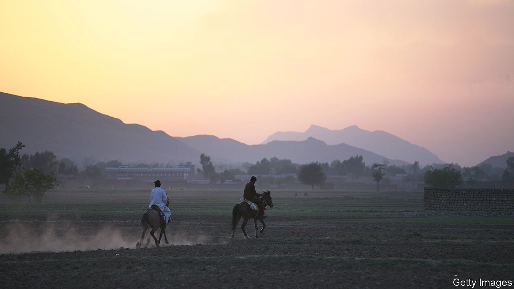

###### New fiction

# A father-son relationship animates Taymour Soomro’s debut novel 

##### “Other Names for Love” is a skilful depiction of family ties and memory 

 

> Aug 11th 2022 

By Taymour Soomro. 

“The father, the son. This is the question, isn’t it?” So says Rafik to his child, Fahad, at the outset of Taymour Soomro’s debut novel. The relationship between father and son is one of the dominant themes of “Other Names for Love”. The fraught dynamic between Rafik and Fahad is also one of the key sources of tension in the book—an accomplished work which spans years and explores desire, inheritance and the power of memory.

Sixteen-year-old Fahad expected to fly to London with his mother for the summer. Instead, his father, a wealthy landowner, has taken him from their family home in Karachi to their feudal estate, Abad. There, Rafik plans to “grow him up” and teach him “how a man should be”. He starts by showing Fahad the lie of his many lands, taking him through fields and villages. Rafik receives a hero’s welcome from everyone he encounters.

Aware that his son could benefit from the guidance of someone his own age, Rafik introduces Fahad to Ali, “a tough, local sort”. Despite their differences, a friendship forms and each comes to help the other: Fahad teaches Ali how to use a knife and fork; Ali gives Fahad lessons in how to shoot and how to speak Sindhi. The pair become more intimate, eventually making their true feelings clear during a passionate encounter in a forest.

Decades later, Fahad is a published writer living in London with his partner, Alex. One day he receives a call from his mother informing him that his father is facing financial ruin. Along with his house and his good name, he is losing his mind, and so Fahad returns to his homeland to offer his services. Rafik tasks him with trawling through his files and writing a book about him. But journeying back to Abad causes Fahad to ruminate on his own story, in particular the life-changing chapter with Ali all those years ago.

“Other Names for Love” revolves around Fahad’s pivotal relationships with strikingly different men. Ali—initially described by sensitive, bookish Fahad as a “savage”—is a well-drawn creation. However, Mr Soomro’s depiction of opposites attracting would have had more emotional impact had he allowed his characters’ romance to develop further.

More successful is the British-Pakistani author’s portrayal of Rafik and his strained connection with his son (Fahad regards his father as “a cannonball, an avalanche, something giant crashing through the jungle”). The power play between Rafik and Mousey, a relative, is convincing, too. Mr Soomro fleshes out Rafik by highlighting a ruthless streak which enables him to get his own way, raise his profile and crush opposition. He leaves his mark on this elegant and entrancing novel, a book which demonstrates that family ties are not always tight bonds and that “one moment in your life can cast such a long shadow.” ■

