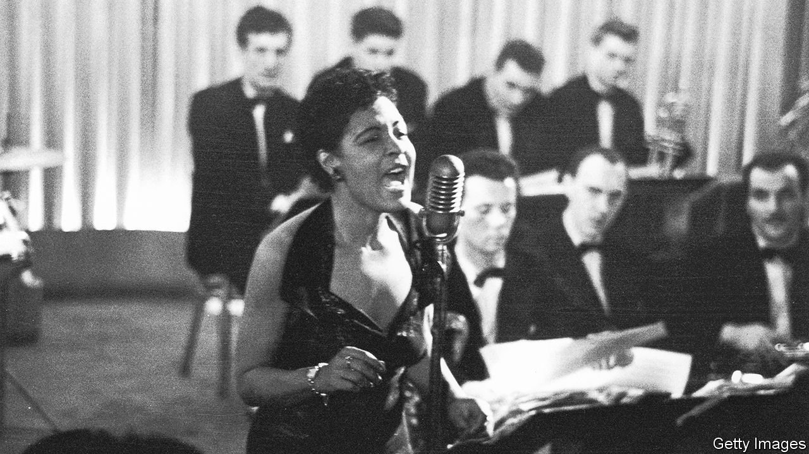

###### Playing fast and loose

# A history of jazz’s relationship with organised crime 

##### T.J. English shows how gangsters nurtured the careers of musical greats 

 

> Aug 11th 2022 

By T.J. English. 

“Strange fruit,” writes T.J. English, is “the seminal jazz song.” This haunting ballad, written by a Jewish high schoolteacher, Abel Meeropol, in 1937 and burned into the collective cultural memory by Billie Holiday (pictured) two years later, portrays the crime of lynching as central to the brutal history of the United States. “It is generally agreed that jazz as a new musical art form began to take shape in the early years of the 20th century. It is not generally commented upon that jazz, in its origins, was a response to the horror and reality of lynching in America.” 

Mr English makes the persuasive argument that the birth of jazz, rooted in the African-American experience, was “nothing less than an attempt to achieve salvation through the tonal reordering of time and space.” But jazz could not scrub off the stain of violence. “Dangerous Rhythms” is not a book about music as an art form; it is instead a nuanced account of how, in the 60 or so years between the introduction of Prohibition and the enforcement of the rico Act—which brought the mafia to its knees in the 1980s—the development of jazz was facilitated by some of the most notorious criminals of the 20th century. 

Music brought business to the mobsters’ speakeasies. The most renowned names in jazz history, including Count Basie and Duke Ellington, are linked with the names of the gangsters who fostered their careers. Louis Armstrong got his start in the seedy clubs of Louisiana: “One thing I always admired about those bad men when I was a youngster in New Orleans is that they all liked good music,” he said.

The criminal underworld was a male-dominated place, yet some female performers learned to navigate it. Mary Lou Williams, a pianist and composer, was managed by Joe Glaser (who also represented Holiday and Armstrong); Glaser had helped run Al Capone’s prostitution scheme in Chicago. Williams was under no illusions when it came to the jazz scene in the 1930s: “Everyone was like a hoodlum.” 

Mr English—a journalist and author who has written several books on gangs in America and Cuba—chronicles the privileges of white supremacy. Black artists found protection where they could in a society built on injustice. The second half of the book turns to the career of Frank Sinatra. His ties with organised crime are hardly a secret, but Mr English lays out those brazen connections with clarity. 

Sinatra became a of the music business, a singular achievement among his peers. Mr English notes that Ol’ Blue Eyes’ fame far eclipsed that of the black musicians who had been pathfinders for his art; Sinatra’s ambition—and his whiteness—set him apart. Though the singer was on “the right side of the civil-rights movement, both in words and deed”, was his great financial success “fair market compensation” for his talent? If financial reward were based solely on ability, Mr English says, “Billie Holiday would have lived atop a mountain comprised of diamonds and rubies.” 

The author writes that “the dirty little secret of the American dream was that violence was an integral part of social advancement.” His book suggests that was true, but it also reveals the way in which violence helped to nurture one of the greatest of all art forms, too. ■

