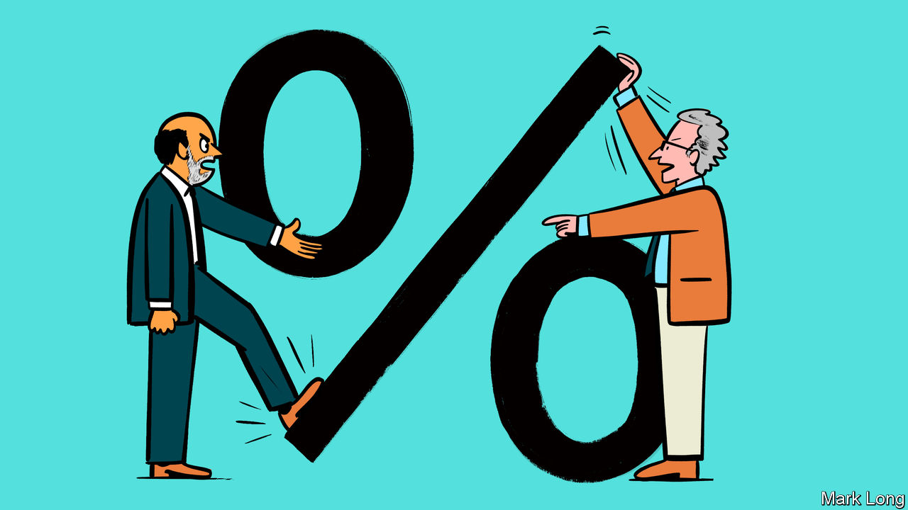

###### Interest rates

# Ben Bernanke and Edward Chancellor square off on monetary policy 

##### Their duelling books reveal the clashes between central bankers and their critics 

 

> Aug 11th 2022 

By Edward Chancellor. 

By Ben Bernanke. 

There is a particular kind of critic of central banks who says that setting interest rates—and especially setting them low—is an unwarranted interference with the free market. In a system of paper (and electronic) currency, however, policymakers have no choice but to set what economists call a “nominal anchor”, a peg that determines the value of money. Decades of theory and evidence lie behind the modern approach of pegging interest rates with the ultimate goal of controlling inflation. Yet nominal anchors are inevitably somewhat arbitrary because paper money has no inherent value. The critics who label as artificial the low interest rates that have prevailed in the world economy in recent decades must therefore answer the question: low relative to what?

“The Price of Time” is the answer of Edward Chancellor, a historian and financier who has written a book by that name. Humans prefer jam today to jam tomorrow. Interest rates are the reward for deferring gratification, for renting out money that could have been spent today. When rates fall too low, grave consequences follow: financial instability, higher inequality and pain for savers. As he makes his case, Mr Chancellor’s panoptic survey of the history of interest, and what classical economists said about it, will not fail to dazzle. The argument, however, is seriously flawed.

To see why, look to “21st Century Monetary Policy” by Ben Bernanke, who led America’s Federal Reserve through the global financial crisis from 2006-14 (and a fool in Mr Chancellor’s narrative). His book is partly a historical account of the past half-century or so of policymaking at the Fed and partly a study of the effectiveness and desirability of unconventional monetary tools, such as quantitative easing, that have grown in importance after the crisis.

For the likes of Mr Bernanke, the ultimate determinant of interest rates is the global balance between savings and investment which, over time, exerts a magnetic pull on central bankers trying to hit inflation targets. Rates have been low in part because desired savings have risen as societies have aged. It was Mr Bernanke who, in 2005, suggested that a “global saving glut” might have been weighing on global rates.

Mr Bernanke’s framework is more compelling than Mr Chancellor’s, as low or even negative interest rates can co-exist with humanity’s natural short-termism. Suppose someone has a wage income of 100 in their working life and zero in retirement. Though they may not target a 50/50 split, they will save to avoid penury. Lots of people building up a nest-egg—even one that is small relative to their working incomes—creates an imbalance that can, as a result of market forces, push rates lower than their discount rates. “Justice is violated when lenders receive little or nothing,” Mr Chancellor writes. He might as well rage against a population pyramid.

Mr Bernanke dispenses with many of the criticisms of low rates with which Mr Chancellor is taken; what his account lacks in vivacity it makes up for with analytical clarity. For example, he gives short shrift to the idea that loose monetary policy prolongs the lives of “zombie companies” whose capital would otherwise be reallocated to more productive endeavours. If interest rates are low because desired saving exceeds available lucrative investment opportunities, then of course capital will flow to less profitable ventures instead. Low rates do not tie up capital, but make things easier for entrepreneurs who wish to borrow. Such an argument might not have the lustre of references to intellectuals such as David Hume or Frédéric Bastiat, but it is coherent.

By contrast, “The Price of Time” reads like a jumbled collection of every criticism to have been levied at low interest rates. Mr Chancellor argues that low rates benefit financial interests, then laments that they damage bank profits. He says low rates hurt retirees by making annuities unaffordable, but also that they benefit the elderly at the expense of the young by pushing up property prices. It is not always clear whether he thinks low rates lead to too little investment, too much investment or investment in the wrong sorts of things. 

Messrs Chancellor and Bernanke do agree that low rates increase financial risk-taking, for reasons that economists do not fully understand. In theory, low rates should make credit cheaper uniformly; in reality, the riskiest borrowers benefit the most. But whereas Mr Chancellor sees this as sufficient reason to raise interest rates even when the economy is weak, Mr Bernanke sees it as an issue that is too little understood to form the basis of a monetary policy. Should the Fed ever raise rates to try to contain financial excesses? “In principle, yes,” says Mr Bernanke. “But in practice, very cautiously and not very often.”

Hence there is an amusing contrast between the books’ assessments of loose monetary policy after the global financial crisis. Mr Chancellor blames it for almost any ill he can identify in the American and world economies. Mr Bernanke regrets not having stimulated more, given how much the economy subsequently undershot the Fed’s employment and inflation targets. Again, it is Mr Bernanke’s account that is more convincing—for the simple reason that critics of loose money in the 2010s repeatedly predicted severe instability that never came. It took the pandemic to cause markets to crash in the spring of 2020.

Central banks’ recent blunder has not been allowing excessive financial vulnerabilities to build. Their misstep has been a failure to control inflation. On this point, readers are likely to find Mr Bernanke’s book unsatisfactory, probably because it was written before the extent of the problem became clear. Readers may scoff when he describes a “burst” of inflation troubling the economy, or labels Jerome Powell, today’s Fed chair who has looked hapless as inflation has risen, a “consummate 21st-century central banker”. Though the lengthy discussion of alternative forms of stimulus may prove relevant again later in the decade, it will seem academic while central banks are desperately raising interest rates to get price growth under control.

Still, at least today’s central bankers now recognise the importance of inflation targets. Mr Chancellor would overturn their primacy in pursuit of amorphous goals. His worldview has much in common with the liquidationists of the 1930s who thought the Depression, in which America’s unemployment rate reached nearly 25%, was a necessary purging of the economy. (At one point he argues the 1930s weren’t so bad after all because productivity growth was high.) By all means enjoy his colourful challenge to conventional wisdom. But when the time comes to appoint a central banker, choose someone like Mr Bernanke. ■

