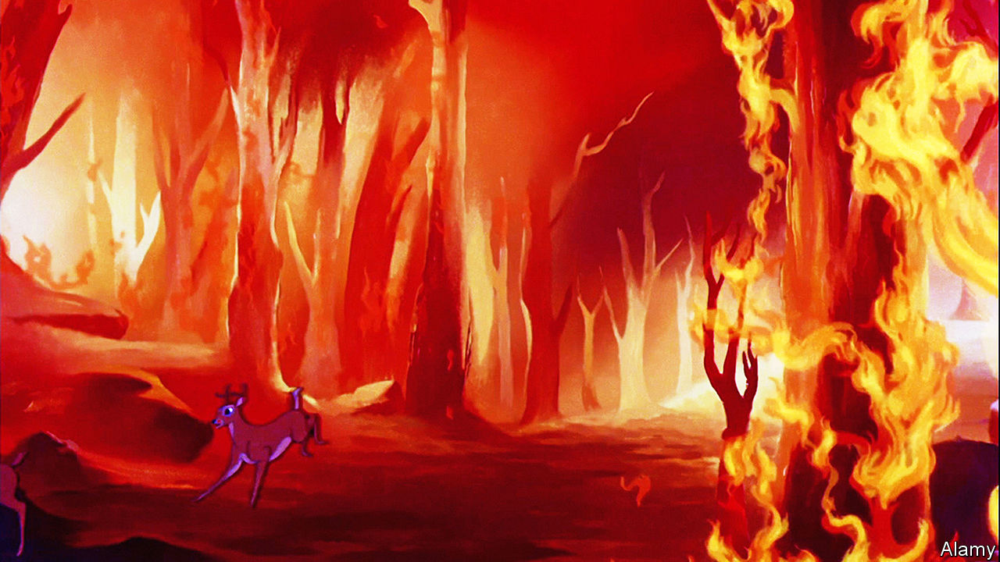

###### Home Entertainment

# “Bambi” offers a horrifying portrait of eco-catastrophe 

##### In the animated film of 1942, careless humans set off an apocalyptic forest fire 

 

> Aug 11th 2022 

What is the most famous scene in “Bambi”? Eighty years on from the film’s premiere in August 1942, there is only one answer: it is the scene in which Bambi’s mother dies. The Walt Disney cartoon—ostensibly about a deer gambolling around an idyllic forest—has traumatised generations of youngsters. What is even more impressive is that the scene doesn’t actually exist. Whatever memory viewers might have, the film doesn’t explicitly show the death of Bambi’s mother. 

About 40 minutes in (no, it’s not in the first ten minutes, although many share that false memory, too), doe and fawn are running from unseen hunters through a snowy meadow. A gunshot is heard. Bambi races back to his shelter in “the thicket”, only to realise, after a second of elated relief, that he is alone. His majestic father then looms over him in silhouette and murmurs: “Your mother can’t be with you any more.” And that’s that. There are no poignant last words, no mourning period or slow recovery. The film immediately cuts to a tra-la-la-ing song about falling in love in the springtime, and Bambi’s mum is never mentioned again. For Bambi, Thumper and their woodland friends, death is just an everyday part of growing up. The film’s viewers may be perturbed by this attitude, but the animals aren’t.

This brisk lack of sentiment is typical of a film which is far bolder than its fluffy reputation might suggest. Adapted from a novel by Felix Salten, an Austro-Hungarian author, Disney’s fifth feature-length cartoon is a gorgeous tapestry of different animation techniques. There is no adventure plot or triumph-over-adversity theme imposed on the art: David Hand, the supervising director, simply made a 70-minute chronicle of a wobbly legged deer’s learning about life and death.

Watching it now, in the middle of a dangerously hot summer, the most horrifying sequence is the one in which a wildfire consumes the forest. In later Disney cartoons, this sort of eco-catastrophe would be caused by lightning (as in “The Jungle Book”) or by greedy hyenas (“The Lion King”). In “Bambi”, however, humans are squarely to blame. Not that any people are depicted: Bambi is warned of a species called “Man”, but, just as Hand omitted the killing of the fawn’s mother, he chose not to show any humans on screen. 

Instead, the flames from an unattended campfire are blown into a tree, and then an unstoppable blaze turns a green paradise into an inferno. No one in particular is responsible. There is no snarling Captain Hook, Maleficent or Cruella de Vil to reassure viewers that only evildoers destroy the environment. Man in general, it seems, is so careless that he would rather lay waste to nature than go to the effort of putting out a campfire.

Again, the film doesn’t have any wailing or gnashing of teeth. No one delivers any speeches about the injustice of it all, and no one expresses the hope that it might not happen again. Wildfires are just one more thing that the animals have got used to. And now humans must get used to them as well: a thought as harrowing as the demise of Bambi’s mother. ■

