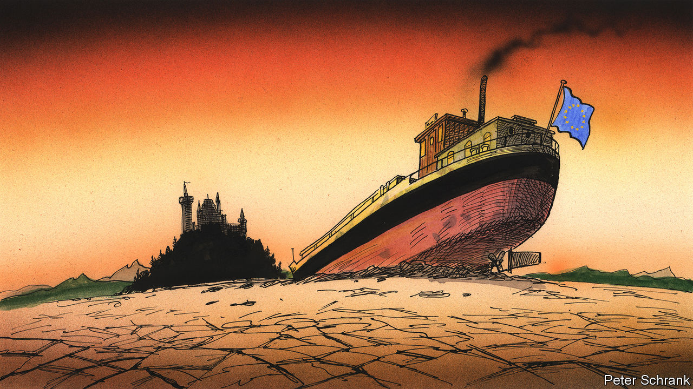

###### Charlemagne

# A changing climate is bad news for a continent that doesn’t like change 

##### A heatwave is wreaking havoc across Europe 

 

> Aug 11th 2022 

Economists visit time-tested haunts when they want to get a feel for how Europe is faring. The bourses of Milan or Paris provide a barometer of investor sentiment. Counting container ships coming into Rotterdam and Marseille gives a clue as to the haleness of trade. Frankfurt, where the European Central Bank sets interest rates, is worth a (brief) visit. Number-crunchers also drop into finance ministries in Athens or Dublin, where national budgets are crafted—and Brussels, where Eurocrats opine on them, before bond vigilantes in the City of London issue their own verdict. A detour via the Champs-Élysées in Paris or the Gran Vía in Madrid to see if shoppers are splurging completes the road trip. 

To that list add Kaub in western Germany. In medieval times the town on the bank of the Rhine began making money from charging barges navigating between the Netherlands and Switzerland. Now a gauge there provides a benchmark for water depth all along the 1,200km-long river. Repeated heatwaves and months of lacklustre rain and snowfall have pushed the measured depth at Kaub down to around 50cm. That is barely a shin’s-worth and just a quarter the usual reading at this time of year. Economists have joined meteorologists in keeping a close eye. Already ships carrying everything from car parts to chemicals up and down Europe’s main industrial valley are having to travel with half loads or less to avoid scraping their hulls on the riverbed. A further decline in water levels—which is all but inevitable as the year progresses—would make the river unnavigable. A lesser snarl a few years back caused German gdp growth to dip noticeably until it was resolved.

For months Europe has braced itself for the coming winter, wondering how to keep homes warm and factories humming without full deliveries of Russian gas. Summer has turned out to be an unexpected challenge. Freakish heat of the sort made likelier by climate change has had the continent sweltering for weeks. The ensuing drought—less than one centimetre of rain fell across France in July, the lowest of any month in over six decades—has worsened many problems Europe already faces as a result of the war in Ukraine and the reverberations of covid-19. Even more uncomfortable than sitting in the blazing midday sun is the prospect of Europe having to adapt to a warmer world. Change is coming, and Europe does not like change.

The immediate concerns are around what is happening to food supplies, energy and the cost of living. European farmers are rarely shy about letting politicians know their gripes: slopping manure across highways and in front of parliaments is a pan-continental tradition. This time they have a point. Crops are having to be picked before they bake in the sun, never mind the measly yields. Limits on irrigation are widespread. The levels of the River Po in northern Italy are so low that saltwater from the Adriatic has crept up its channel, threatening Italy’s breadbasket; an agricultural union has warned that conditions are threatening 30-40% of the seasonal harvest. Swiss farmers are flagging a potential shortage of Gruyère cheese because of reduced milk production. Food prices that should be declining as Ukraine starts shipping at least some of its stored grain may stay high instead.

Europe is rich and can replace what food it cannot grow. The same may not be true of energy. Sizzling heat forced France to throttle some of its nuclear plants: the water drawn from rivers to cool reactors could not safely be returned to those already steamy waterways without parboiling fish. (Amid a shortage of power the rules were relaxed on August 8th.) Norway is worried about low reservoir levels. It has warned that it could cut exports of hydroelectricity to places such as Germany. The power crunch in Europe’s largest economy could be remedied by burning coal—if only barges carrying the stuff could navigate down the Rhine. Partly as a result, energy prices remain stubbornly high.

Adapting in the short term is a question of making do without too much added expense. Problems with Rhine barges, for example, can be alleviated by using lorries to lug stuff instead. But it turns out that this bit of the supply chain has been caught up in the post-covid recovery: there is a shortage of drivers. When it doesn’t rain, it pours. 

Eins, zwei, dry

The threat of climate change to Europeans has until now been just that: a threat. Quite rightly, much effort has been expended on mitigation. Notwithstanding the odd reopened coal-fired power plant in recent months, the eu seems intent on hitting “net zero” emissions by 2050, with a hefty cut by 2030. But if adaptation was discussed in Brussels and national capitals it was largely to help poor countries deal with rising seas or worse typhoons. A cheque could always be written, sympathy expressed for the kind of countries whose economies can still be derailed by the weather.

However, Europe is now the one in a tight spot. Many poor places are growing fast, perhaps the handiest tool for adaptation to any sort of change. Europe is not. Rich peers such as Japan and America have long histories of dealing with natural disasters, whether hurricanes, earthquakes or sizzling sunshine. European homes mostly eschew air-conditioning. At worst they must put up with local floods, occasional wildfires or the nippy winters in Scandinavia. Whereas America is a land proud of its constant reinvention, Europe has a penchant for keeping things the way they are. Green types oppose dredging rivers. Time-old customs are upheld, even as temperatures change. Champagne can only be made in the eponymous region of France, say—never mind that its climate may soon not be as well suited as places farther north.

No economic history of Europe is complete without a mention of its temperate climate, fertile soils and waterways serving as cheap early highways. It was the lucky continent, as these things go. Perhaps not for much longer. A place that mostly has not thought about the weather will need to start doing just that.■


 


