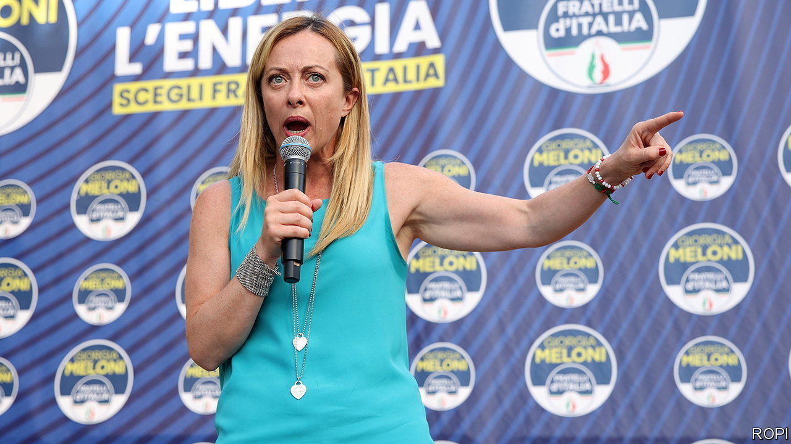
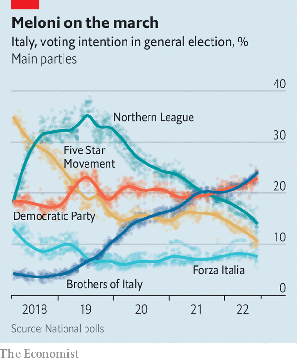

###### Defeat foretold

# Can anything stop Italy’s radical right? 

##### Its opponents are struggling to put their egos aside 

 

> Aug 11th 2022 

Italy’s politics can be bewilderingly complex. Five big parties and many small ones will compete in the general election on September 25th. Before that they will shuffle into an uncertain number of electoral alliances. Yet already the race to replace Mario Draghi’s fallen government is boiling down to one question. Is there anything her adversaries can do to prevent Giorgia Meloni (pictured), leader of the hard-right Brothers of Italy (fdi) party, from becoming the next prime minister?

Ms Meloni’s party is part of an alliance that also includes the nationalist Northern League, Silvio Berlusconi’s Forza Italia party and some smaller parties. Polling currently suggests that this group could win more than 45% of votes, which should be enough for a majority in parliament. On July 27th the alliance renewed an agreement which dictates that, should they triumph, the leader of the party with the most votes will become prime minister. Ms Meloni’s party is polling around ten percentage points ahead of the League and 15 points ahead of Forza Italia.

 


The centre-left Democratic Party (pd), led by Enrico Letta, a former prime minister, is about as popular as the fdi. Both could get around 23% of votes (see chart). But Mr Letta’s efforts to build a broad electoral alliance are in ruins, in part because Italy’s progressives seem incapable of burying their differences. On August 7th Carlo Calenda, a businessman-turned-politician who left the pd to form a centrist group, Azione (Action), said he was pulling out of an electoral pact with the pd that he had sealed with Mr Letta just five days earlier. He said he disapproved of deals that Mr Letta had subsequently made with three other small parties. Mr Letta responded drily, “The only possible ally for Calenda is Calenda.”

The Action party may now link up with Italia Viva, a small centrist group led by Matteo Renzi. Mr Letta has never forgiven Mr Renzi for ousting him from the premiership in 2014 and has not sought to include Italia Viva in his alliance. The absence of Action and Italia Viva means his alliance will sit firmly to the left, which limits its appeal among centrist voters. Polls suggest it could end up with less than 30% of the vote. But Mr Calenda’s antics have diverted attention from the real issue, says Antonio Noto of Noto Sondaggi, a polling firm. “The only centre-left alliance with a real chance of victory would need to take in the Five Star Movement.”

The centre-left under Romano Prodi won general elections in 1996 and 2006, defeating Mr Berlusconi, then the main figure on the right. But Mr Prodi did not have to cope with the Five Star Movement, which was founded in 2009 with the eccentric aim of installing an internet-based system of direct democracy and which continues to defy easy categorisation. Although its support has slumped from the 32% it won at the previous election, the polls still give the Five Star Movement 10% of the vote. Mr Letta has said that its role in bringing down Italy’s most recent government disqualifies it from his alliance. But without its support the Italian centre-left looks condemned to what Mr Noto calls “a defeat foretold”. ■

