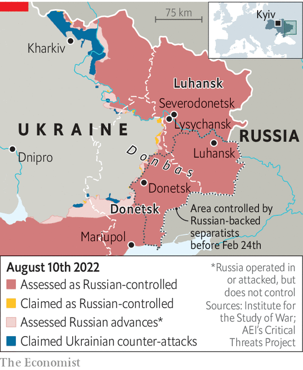

###### Putin’s disposables

# Russia is forcing Ukrainian conscripts into battle 

##### Locals are trying to help them escape 

 

> Aug 11th 2022 

Sasha mostly kept to himself. The 18-year-old engineering student from Donetsk, a city in eastern Ukraine controlled since 2014 by Kremlin-backed separatists, had no patience for politics. “We were not for Russia, and we were not for Ukraine,” says his mother, Natalya. “We were never interested in the war.” Yet on February 23rd—the eve of Russia’s invasion of Ukraine—officials from an army recruitment centre turned up at Sasha’s university. They ordered him to report for duty the next day.

Natalya was told that her son would take part in exercises, then return home. In fact Sasha was sent to the front, near Kharkiv, a Ukrainian city that has been devastated by Russian attacks. Every few days Sasha would call his mother to say he was okay. The last such call came at the start of April. The next came from a prison camp in western Ukraine. Sasha had been captured. 

He is luckier than others. Since the start of the war Russian forces and leaders in the occupied “people’s republics” of Donetsk and Luhansk are said to have mobilised some 100,000 men. Ukrainian officials say 25,000 conscripts from the occupied territories have been killed or are missing in action, an improbably high figure. Russian sources mention about 3,000 dead, an improbably low one. But data suggest that Ukrainians from the separatist republics are dying at a higher rate than troops from Russia. By June 2022 more than half of the original members of the Donetsk militia had been killed or wounded in combat, reckons Britain’s defence ministry.

Ukrainian officials say that conscripts from the “people’s republics” are sent into battle ahead of others, to draw artillery fire and force the Ukrainians to disclose their positions. “It’s very convenient for Russia, because they don’t lose their troops,” says Oleksiy Arestovych, an aide to Volodymyr Zelensky, the Ukrainian president. “It’s Ukrainians killing Ukrainians.” 

Pro-Russian sympathies run deep in Donetsk and Luhansk. Thousands of the men Russia has deployed to the eastern front are loyalists who have seen action frequently since 2014. Many of them have welcomed the chance to fight Russia’s war. But interviews with relatives and activists suggest that most of the new conscripts are unprepared, underequipped and unwilling. “He told me many of them did not know how to use weapons, and nobody wanted to fight,” says Alina, a woman whose brother, a schoolteacher from Donetsk, also ended up in Kharkiv. “Their commanders told them they would be shot if they turned back.” 

 


At the start of the invasion factories in Donetsk were asked to assign half their workers to war duty. Some 80 artists from the Donbas region, half of them musicians from the local philharmonic, were also conscripted. According to a story in , an independent Russian newspaper, most are wounded or dead. Some conscripts have been given weapons and uniforms dating back to the Soviet era, and perhaps even the second world war.

In March groups of women, outraged that their husbands had been sent to the front, repeatedly confronted officials in Donetsk and Luhansk. Their protests escalated when the first bodies returned. Conscription was reportedly paused as a result. But now it seems to be restarting, albeit more cautiously. On August 1st 21 men were enlisted in Donetsk, says Pavel Lisyansky, of the Eastern Human Rights Group, a watchdog. Conscription also seems to have begun in bits of eastern Ukraine that Russia has only recently captured, says Mr Arestovych. That includes the cities of Lysychansk and Severodonetsk, which were taken in June and July.

Protests against conscription in the “people’s republics” have died down. Some of the women involved have been arrested. Russian media claim they were part of a Ukrainian “intelligence operation”, and say they could serve 20 years in prison for treason ( has changed the names of conscripts and their relatives). But locals are using social media to share information that can help men aged 18-55 avoid army recruiters. Natalya considered hiding Sasha, she says, but decided it was not worth the risk. “They told us he would only be away for two weeks.” ■


