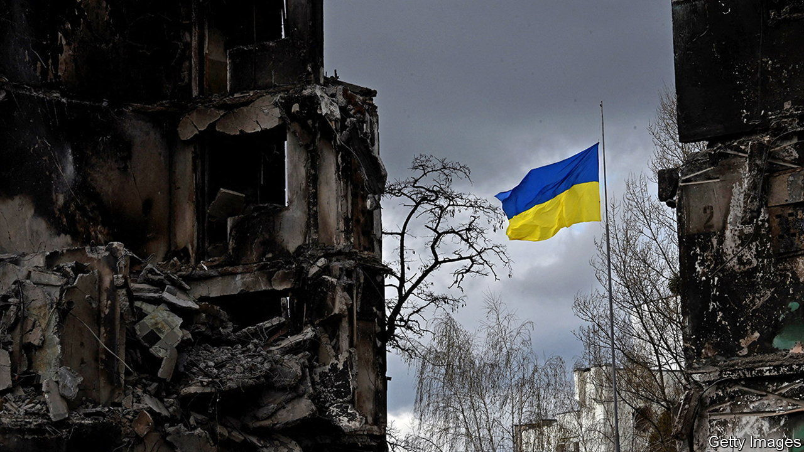

###### Hidden injuries

# Ukraine is on the edge of nervous breakdown 

##### The numbers that need psychiatric treatment far exceed the supply of doctors 

 

> Aug 6th 2022 

Eduard cannot remember exactly how he ended up approaching a Ukrainian military checkpoint and shouting: “Putin is my president.” The fashion designer recalls growing panicked as war raged outside his home in northern Kyiv. He would cry uncontrollably at the news. He became obsessed with Russians, who were then advancing on the other side of a nearby forest. Perhaps he was searching for them when he left his home, in pyjamas, and went to Ukrainian positions in the woods. Instead, he remembers saying he was looking for Katya Chilly, a pop singer, before announcing his support for Russia’s president. The soldiers roughed him up.

That afternoon Eduard was admitted to a psychiatric hospital in Kyiv. Yaroslav Zakharov, a doctor who saw him, says his case is hardly unique. War has affected every Ukrainian. Stress is making people who were already at risk of mental illness more vulnerable. “People like to control things, and war doesn’t let you.” Ukraine’s health ministry is already predicting that 3m-4m people will need to receive drugs to manage mental-health problems resulting from the war. Some 15m will require other kinds of psychological support.

Dr Zakharov’s hospital was busy during a visit when in late July. A soldier had just been admitted, having turned firearms on a colleague on the front line. But things were even worse during the battle for Kyiv in March, when missiles were landing all around the building. The doctors spread resources as best they could. They discharged all but the most dangerous patients. There were tragedies. One of the discharged men, who had a history of mental illness, hanged himself after discovering that his home had been ransacked by Russian soldiers.

Eduard says that many of the patients he met in the hospital were from Bucha or Irpin, suburbs of Kyiv where occupying Russian forces committed atrocities. They included men of all ages and backgrounds. One friendly group got it into their heads that Eduard was God. “They introduced themselves one by one: this is Archangel Michael, and this so-and-so is Archangel Gabriel.” Others were too traumatised to speak, but welcomed Eduard with small gifts: apples, tea bags, coffee, socks. One young patient would bring him one-kopeck coins.

Ukraine’s government has sent mental-health specialists into some of the worst-hit towns. Nataliya Zaretska, a psychologist, has been working in Bucha for three months. She expected her programme to end after six months, but demand is so high that she has opened a new mental-health centre in the town. She works with soldiers who have returned after being tortured in captivity, and locals who have been prisoners in their own homes.

There are few things as dangerous for mental health as feelings of betrayal and disillusionment, says Olena Nahorna, a colleague of Ms Zaretska who is embedded with Ukrainian troops in Donbas. Before the war “a lot of Ukrainians saw Moscow as a neighbour, albeit an eccentric one,” she says. “It was a personal tragedy when that eccentric friend burst into their homes and started killing them.” Those who understood from the start that Russia was an enemy have coped better than others with the horrors of the war, she argues. 

Ms Nahorna identifies one consolation: the national unity forged by shared trauma. Eduard says his experience has brought clarity. “I realise I could be dead, that soldiers might have shot me, and that is a big kick up the backside.” His doctor agrees, but says it is too early to know the extent of his trauma. He says Mr Putin has dropped a delayed-action bomb on the psyche of every Ukrainian.

The doctor, close to tears, says he tried to enlist in the army himself. He was persuaded against it by a former patient now fighting in Donbas. “She told me I needed to take good care of myself, that I would be needed by all of them when the war is over.” She was right.■


