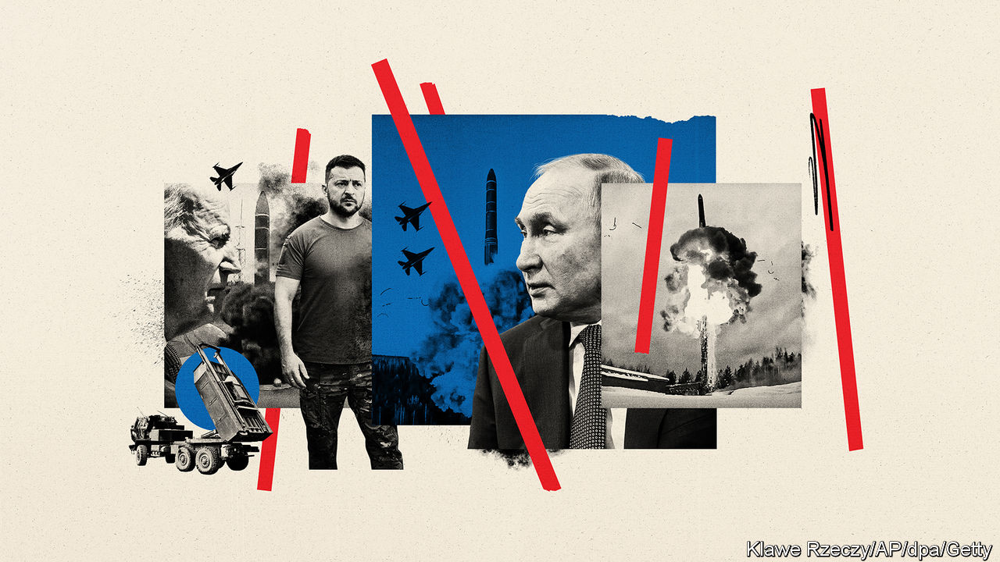

###### The rungs of escalation

# What would push the West and Russia to nuclear war? 

##### Nobody is sure. That is why Joe Biden is careful in sending more potent weapons to Ukraine 

 

> Aug 2nd 2022 

“The word ‘impossible’,” quipped Oleksii Reznikov, Ukraine’s defence minister, “means ‘possible in the future’.” Javelin anti-tank missiles, forbidden by America when Vladimir Putin took the first chunks of Ukraine in 2014, came in a trickle from 2017 and then a flood when he invaded again in February. Stinger anti-aircraft weapons, similarly refused, arrived in March. And the long-awaited rocket launchers have been taking out command posts and weapons dumps far behind Russia’s front lines since June. F-16 fighter jets may come one day.

America and Europe hail Ukraine’s fighting spirit, which raises a nagging question: why are they not sending more weapons, more quickly? The latest $1bn American military package for Ukraine includes munitions for himars but no more launchers beyond the current 16, which many experts think insufficient. Officials’ answers vary: the West is giving priority to weapons that are most urgently needed; it has to train Ukrainians to use and maintain their new kit; and they have to show they can use it effectively in battle. 

The strongest reason for America’s caution, though, is fear of escalation—that Russia might lash out militarily at nato (“horizontal escalation”, in the jargon) or use chemical or nuclear weapons in Ukraine (“vertical escalation”). Either version would almost certainly draw nato into direct conflict with Russia, and President Joe Biden has vowed to avoid “World War III”. 

Ukraine’s looming effort to  is a test. If successful, hawks will see it as proof that Ukraine, given the right help, can win. Doves fret that it could provoke Mr Putin to greater villainy. 

On the day he invaded Ukraine Mr Putin threatened outsiders thinking of intervening with consequences “such as you have never seen in your entire history”. State media in Russia fantasise about nuclear strikes on the West. For now, though, America says there is no sign that Russia has put its nuclear forces on higher alert. America and Russia still  about their long-range nukes. Mr Biden has called on Russia to resume arms-control talks. Russia said sanctions prevent the resumption of on-site inspections. 

Over five months of fighting, the threshold for a direct clash has repeatedly shifted, without dire consequences for the West. “nato has been brilliant at salami-slicing its assistance,” says James Acton of the Carnegie Endowment for International Peace, a think-tank. “It has given the Ukrainians a fair amount of support, but at no time did it present Russia with a point at which they could say, ‘No further’.”

Not all agree. “Every salami-slice means that more innocent Ukrainians are killed,” retorts Ben Hodges, a former head of the American army in Europe. He says the Biden administration “has overstated the risk of escalation”. Russia does not want to take on nato, he says, and a nuclear response is highly unlikely.

Others caution that Mr Putin may escalate rather than accept defeat. Samuel Charap of the rand Corporation, a think-tank close to the Pentagon, says Russia has unused military capacity. The air force could also be committed more fully. The more the West helps Ukraine, the more Russia will raise the stakes. “There is no stable equilibrium,” argues Mr Charap. “We are in a slow-moving, incremental escalation.”

History suggests that countries can go a long way in waging proxy wars against nuclear powers without atomic retribution (albeit with scares). Think of Russia and China supporting North Vietnam against America in the 1970s; or America arming the Afghan  to bleed the Soviet Union in the 1980s.

Russia’s  envisages four scenarios for the use of nuclear weapons: detection of a ballistic-missile attack against Russia or its allies; an attack on them with nuclear or other weapons of mass destruction; actions that threaten its nuclear command-and-control systems; and “aggression against the Russian Federation with the use of conventional weapons when the very existence of the state is in jeopardy”.

The West’s arming of Ukraine falls well short of those red lines. Yet the concept of an existential threat is elastic, notes Bruno Tertrais of the Foundation for Strategic Research, a think-tank in France. Mr Putin has called Ukraine “a matter of life and death”. He has also suggested that a major attack on Crimea, which Russia annexed in 2014, would be similarly grave (explosions rocked an airbase in Crimea on August 9th; ). Others ask, what if Mr Putin regards himself as the state, so that any danger to his regime is deemed an existential threat to Russia? 

A recent rand paper by Mr Charap and others sets out four scenarios of horizontal escalation. The first is labelled “Pathway 0” because the escalation spiral may already be under way: Russia is bound to respond to military and economic losses inflicted on it, if not now then “in due course”. Next is a pre-emptive attack by Russia if it thinks nato is about to intervene, after it deploys missile systems near the Russian border, say. Third is hitting Western military supply lines that support Ukraine. Last is “a dramatic increase in domestic, economic, and political instability in Russia”. 

In most cases Russia’s retribution would probably begin covertly—through cyberattacks, sabotage, assassination and more. The pre-emption scenario is most likely to provoke a military attack, perhaps even a nuclear strike. The scenarios may overlap and “all are more dangerous if Russia is losing,” adds Mr Charap.

In truth, nobody knows where Mr Putin’s red lines lie. Perhaps not even he does. America has stopped talking of helping Ukraine “win” and of weakening Russia. Instead it speaks of ensuring Ukraine does not lose. In the  in May Mr Biden listed many things America would not do. It would not seek to unseat Mr Putin, nor send troops to Ukraine, nor fight against Russia, nor help Ukraine strike at Russia. It would not “prolong the war just to inflict pain on Russia”. Mr Biden warned Russia that using nuclear weapons “would entail severe consequences”. A response would depend on the circumstances, but officials whisper it may involve conventional rather than nuclear strikes. Plainly, Mr Biden does not want to get to that point.

While steering around these self-imposed limits, Mr Biden has left his destination unclear. Sources say officials are conducting war games to decide their ultimate objective. For now the administration speaks in bromides, saying it wants “a democratic, independent, sovereign and prosperous Ukraine”. It does not adopt Ukraine’s demand for the return of all lost territories, including land Russia took in 2014. Intentionally or not, Mr Biden’s policy is likely to generate a long war or a grinding stalemate. This risks the unity and staying power of Western countries if voters revolt against stagflation, energy scarcity and the bill for supporting Ukraine. That may be Mr Putin’s plan.

Yet frustration and uncertainty are in the nature of nuclear dissuasion: America is deterred from intervening directly; Russia from striking at nato. The late Tom Schelling, an economist and nuclear strategist, argued that the brink of war can be unknowable. It is not “the sharp edge of a cliff where one can stand firmly, look down, and decide whether or not to plunge”; instead it is a slippery curved slope where “neither the person standing there nor the onlookers can be quite sure quite how great the risk is.” When the peril is a catastrophic nuclear exchange, who can blame leaders for treading carefully? ■


