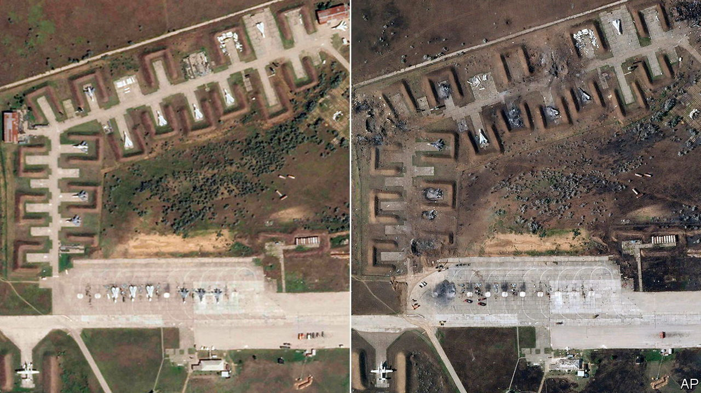

###### Striking back

# Wrecked planes smoulder at Russia’s Saky airbase in Crimea 

##### Ukraine has not claimed responsibility for an attack behind enemy lines 

 

> Aug 11th 2022 

On August 9th explosions lit up a Russian airbase in Crimea, the peninsula in the Black Sea that Russia seized from Ukraine in 2014. At least eight aircraft were destroyed. Ukraine’s government declined to say clearly if its forces had attacked the airbase, which lies more than 100 miles (160km) from the front lines. It is the first such incident to take place in Crimea since Russia’s current invasion of Ukraine began in February.

