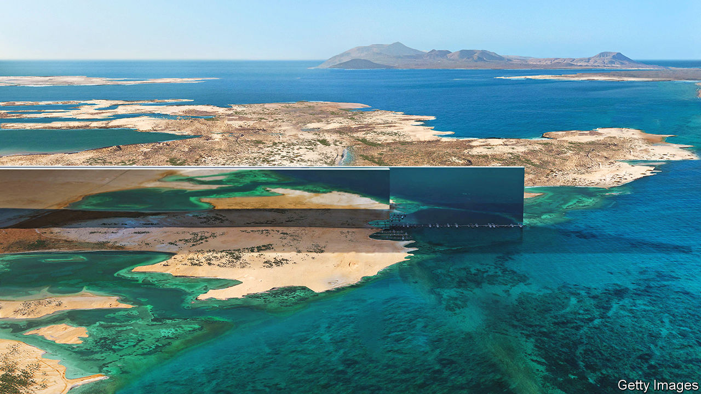
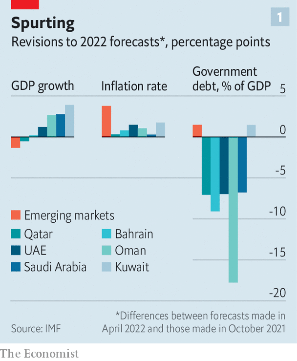
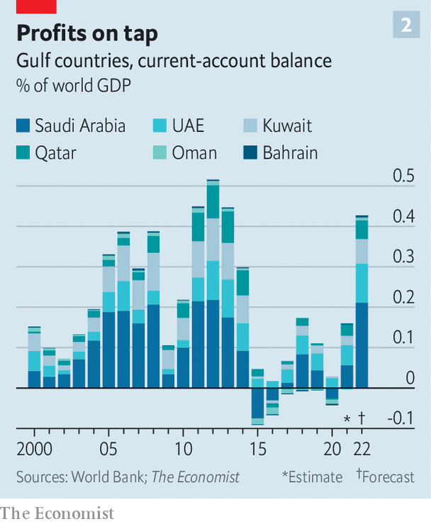

###### Spend or save?

# An oil windfall offers Gulf states one last chance to splurge 

##### Dubai wants jobs in the metaverse; Saudi Arabia a city in the desert 

 

> Aug 7th 2022 

In the north-western corner of Saudi Arabia, not far from the mouth of the Gulf of Aqaba, sits a patch of mostly bare desert—the ostensible location of Neom. This would-be city is intended to be a  and the showpiece of the kingdom’s attempt to diversify its economy away from oil. There has been talk of robots doing menial work, beaches lined with crushed marble and fleets of drones forming an artificial moon. One recent whim is to create the world’s longest buildings; like skyscrapers laid flat, these self-contained ecosystems would stretch for more than 100 miles. Estimates suggest the city could cost as much as $500bn.

When this wild dream was first unveiled in 2017, financing it seemed near impossible. Now a torrent of oil money may allow Saudi Arabia to get things rolling. The world economy’s recovery from covid-19, and Russia’s invasion of Ukraine, have , triggering a staggering transfer of wealth from global consumers to fuel-exporting countries. From January to June, the price of a barrel of Brent crude rose from $80 to more than $120 (it is back below $100 today). The imf estimates that energy exporters in the Middle East and Central Asia will this year net $320bn more in oil revenues than it had previously expected, a figure equivalent to about 7% of their combined gdp. Over the next five years, the cumulative surplus could reach $1.4trn. 

Gulf leaders must now work out how to spend the proceeds of what could be the last big gush of oil wealth. Some promise to pay down debts and save for a post-petroleum future. Yet there will be pressure to share the bounty with the public—and few checks on those who wish to splash out on  or global influence. The impact in diplomatic circles is already visible. On a visit to Jeddah in July America’s President Joe Biden bumped fists with Muhammad bin Salman, the Saudi crown prince. Mr Biden had until recently kept the prince at arm’s length; the current political imperative to bring down petrol prices leaves .

Expensive oil augments the financial power of the Gulf states at home and abroad, opening a gusher of public spending and steering flows of money around the world. The long rise in oil prices in the 2000s helped fuel huge global imbalances, depressed interest rates and attracted a stream of supplicants looking to curry favour. Cheap oil brings shrinking ambitions. When the last sustained period of high prices ended in 2014 it seemed as if the old social contract, which promised hefty subsidies and cushy lifetime gigs in the public sector, would have to change. There was talk of diversification, higher domestic fuel and food prices—even taxes. 

 


A period of rock-bottom oil prices, and the hit from covid, saw fiscal positions deteriorate. This year’s windfall offers an opportunity to strengthen them (see chart 1). Bahrain’s public debt rose to 130% of gdp in 2020, but the country’s budget is based on the assumption that oil will fetch a mere $60 a barrel. High prices may allow it to reduce its debt ratio by about 12 percentage points this year, even though it is the smallest producer in the Gulf Co-operation Council (or gcc, a group that also comprises Kuwait, Oman, Qatar, Saudi Arabia and the United Arab Emirates). Oman’s debt burden is projected to fall by more than 20 percentage points of gdp. 

Other leaders aim to save much of their earnings. Mohammed al-Jadaan, the Saudi finance minister, says his government will not touch its oil bonanza, at least this year. It will put away the money at the central bank, then use it in 2023 to replenish foreign reserves or top up the Public Investment Fund (pif), the sovereign-wealth fund that has become the kingdom’s main driver of investment. Bahrain will use some of its surplus to refill a fund meant to provide for future generations, which it drained during the pandemic.

Yet the pressure to spend will be intense. Gulf economies have not been as squeezed by soaring prices as the rest of the world. The imf expects inflation in the gcc to peak at 3.1% this year, well below levels in America and Europe. Abundant, cheap foreign labour keeps wage costs low. Most countries rely on fuel subsidies to limit inflation. A strong dollar, meanwhile, holds down the cost of imports (five of the six gcc members peg their currencies to the greenback). 

Under the pump

Residents in the Gulf are nonetheless feeling the pinch. The uae phased out its fuel subsidies in 2015, and petrol prices climbed by 79% from January to July, when the government raised them once again, to 4.52 dirhams ($1.23) a litre. That is not bad by global standards, but shockingly expensive for a rich petrostate—drivers in Saudi Arabia pay half as much. In July the uae announced that it would almost double the welfare budget for poor citizens, from 2.7bn dirhams to 5bn. Eligible families will receive stipends for housing and education, plus an allowance to offset higher food and energy costs. 

With just 1m citizens, representing 10% of the total population, the uae can afford to splurge a bit. Satisfying the citizenry will be a bigger challenge in Saudi Arabia, where two-thirds of the population of 35m are nationals. The Saudi government used past oil booms to offer more jobs and higher wages in the public sector. Doing so now would run counter to Vision 2030, an economic-diversification plan meant to shift the kingdom away from oil. Firms already grumble about how hard it is to retain talent. Many young Saudis see private-sector work as a fun distraction until a government job comes along.

Oil wealth offers other ways to shield citizens from cost pressures. In 2016 the Gulf states agreed to introduce a value-added-tax of 5%, and four have done so since (the laggards are Kuwait and Qatar). Saudi Arabia has gone much further. In 2020 it tripled vat to 15%, hoping to offset the fiscal effects of the pandemic and low oil prices. “You have a policy tool you didn’t have before,” says Nasser Saidi, a Lebanese economist who runs an advisory firm in Dubai. “Rather than increase spending or hiring, you could lower vat.” 

Competing with such concerns is the need to think long-term: beyond the boom and, ultimately, beyond oil. At the modernist offices of Bahrain’s sovereign-wealth fund, such thoughts are sobering. “Of course we’re all happy the oil price is high, but the focus needs to stay on the non-oil economy,” says an executive. Working out what that means in practice is no easy task. Some sovereign-wealth managers in the Gulf say their mandates have become almost contradictory. They are meant to husband oil wealth for future generations, but are increasingly asked to deploy capital to fuel non-oil growth, a job that entails plenty of risk.

Gulf countries have not always done a good job of judging which risks to take. The region is littered with failed mega-projects from earlier booms. Saudi Arabia’s gleaming financial district, meant to compete with Dubai’s, was plagued by delays and cost overruns. When it was eventually finished, it sat empty: banks saw no reason to move. The uae spent billions to create artificial islands shaped like a map of the world. More than a decade later, the archipelago is derelict. The uae’s ambitious plans to become a semiconductor-manufacturing hub, and a centre for health tourism, have similarly fizzled out. 

Wild flights of fancy like Neom stand ready to absorb a hefty chunk of the oil money this time round. Saudi Arabia also wants to host the Asian Winter Games in 2029, spraying desert mountains with snow; Dubai has a zany plan to create 40,000 jobs in the metaverse in five years. Even less ostentatious projects may prove wasteful. Saudi Arabia sees tourism as the centre of its post-oil economy, providing at least 10% of jobs and gdp. The oil boom will give the pif billions to throw at resorts, amusement parks and other diversions. Yet Saudi officials cannot point to a proper assessment showing that its hoped-for 100m tourists will in fact choose to visit the kingdom each year. As Ali al-Salim, a Kuwaiti investor, notes: “It’s a pretty fickle business to be the linchpin of your economic plan.”

The Gulf states would be wise to focus on areas where they have clearer competitive advantages. Developing expertise in desalination techniques and technologies, much as Israel has done, could make a virtue of the region’s aridity. Investments in green-energy technologies like hydrogen could offer a source of revenues after the energy transition. Mr Saidi proposes investing in renewables projects and climate-mitigation strategies in Asia and Africa, as a green version of China’s Belt and Road Initiative. “This is a moment when you want to look again at how you provide foreign aid,” he argues. 

Tee off

Certainly, the boom stands to reshape the Gulf’s relations with the rest of the world—as demonstrated by Mr Biden’s trip to Jeddah. Enormous quantities of Saudi money are being spent to burnish the kingdom’s reputation in other contexts as well. The world of golf, for example, is being transformed as liv Golf, a Saudi-backed rival to the pga tour, lures stars with fantastical payouts. The country started hosting a Formula 1 race in 2021. Pop stars including Justin Bieber, Mariah Carey and David Guetta have recently performed in the kingdom.

 


The boom will also have less tangible international consequences. The gcc’s combined current-account surplus this year may run to more than $400bn, or 0.4% of global gdp (see chart 2)—a slightly higher share of world output than the biggest surpluses achieved before the global financial crisis of 2007-09. In past booms oil profits have been recycled into investment flows back to America (through purchases of Treasuries, for instance), funding America’s current-account deficits. 

Yet America has become the world’s largest producer of oil, and big emerging economies have grown richer and developed a thirst for the stuff. Thus the Gulf’s surplus today is matched in part by weaker balance-of-payments positions in big emerging economies. That includes China and India, but also scores of smaller countries, including a few, like Sri Lanka, for which the surge in the cost of imported oil has been crippling. High oil prices have hit the world as a whole harder than they did in the 2000s. This is because they are largely the result of interruptions to supply, especially from Russia, rather than robust growth in global demand. 

More than a few governments have already approached Gulf leaders for money—albeit to meet urgent obligations rather than to greenify their economies. Like China and India, Saudi Arabia and the uae have played a growing role lending to poorer countries over the past two decades, taking over a position once reserved for advanced economies and multilateral institutions like the World Bank. The developing crisis across low- and middle-income economies could give Gulf states significant leverage over less fortunate places, should they choose to wield it.

It may well be the last such opportunity. In poor countries and rich ones, the pain of soaring energy costs adds a new urgency to efforts to reduce dependence on fossil fuels. At the heart of the boom, the feeling is palpable. “There’s a ‘days-are-numbered’ kind of sentiment,” says Mr al-Salim, the Kuwaiti investor. “You look at the state Europe is in, I don’t think they’re going to allow themselves to be this vulnerable years from now.” Which raises a question. Will the Gulf? ■


