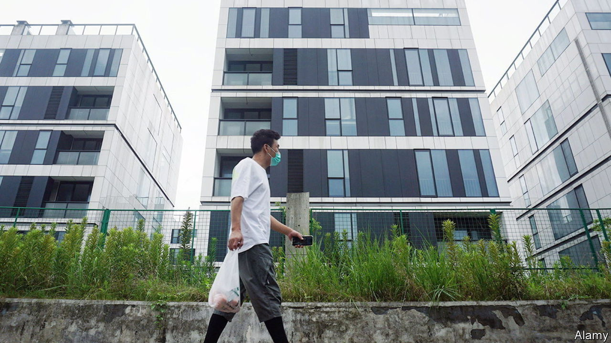
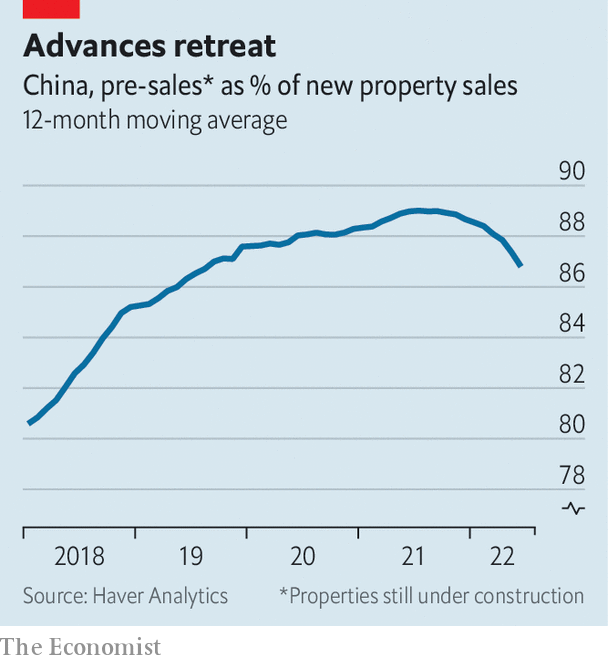

###### A finite problem

# China’s mortgage boycotts are a symptom of a broader crisis 

##### The real threat to developers is falling sales 

 

> Aug 9th 2022 

The german mathematician David Hilbert once imagined a hotel with an infinite number of rooms. Even if all of the rooms were occupied, he pointed out, the hotel could accommodate a new arrival, simply by asking each guest to move into the room next door. One guest would move into a second guest’s room, freeing up a spot for the new arrival. The second guest would move into a third guest’s room, and so on. With an infinite number of rooms, the sequence would never end.

For years, China’s property developers operated along similar lines. They would sell flats far in advance of building them. The money raised for these flats was supposedly reserved for building them, just as each room in Hilbert’s hotel was supposedly reserved for an existing guest. But developers would instead use the money for other purposes, such as buying land. When the time came to pay for construction, they would sell more unbuilt flats and use that money instead. Just as Hilbert’s hotel accommodated each guest in the room next door, China’s property developers built each pre-sold flat with the money from the next pre-sale. As long as there were always new buyers, the sequence could go on.

 


Unfortunately, China’s developers are now running out of rooms. Their sales in the 12 months to June fell by 22% compared with the previous 12 months. Advance sales fell even faster (see chart). This painful brush with finitude has left many developers without enough cash to continue building the flats their customers have already bought. China’s developers have started work on over 6bn square metres of property in the past three years. They have completed less than half that amount. In the past homebuyers could do little about these delays. They had already handed over their money, after all.

But although they have paid their developers, they are still paying their banks. In recent months, angry homebuyers have threatened to stop repaying their mortgages if developers do not resume work on their flats. According to a crowdsourced document circulating online, this mortgage strike has spread to nearly 100 cities and over 320 projects, including a Dragon City, a Peacock City and a Phoenix City. Over 40 of these projects are in Zhengzhou, the capital of Henan province.

How widespread could boycotts become? There are some limits to their growth. Striking mortgage-holders could end up on credit blacklists, damaging their access to loans. And in China, points out s&amp;p Global, a ratings agency, most individuals cannot declare bankruptcy, since “their debts will never be forgiven”.

In a gloomy scenario, mortgage loans worth about 2.4trn yuan ($350bn) could turn sour, reckons s&amp;p Global. That amounts to roughly 1.3% of total bank loans, enough to endanger some smaller lenders, but not enough to pose a systemic threat to the banking system.

The true significance of the boycotts lies elsewhere. They show that Chinese households no longer believe that a flat bought in advance will necessarily be delivered. This loss of faith is not confined to the protesters. It is also showing up in weakening pre-sales, especially for distressed developers. A reluctance to buy new homes poses a bigger threat to China’s economy than the more conspicuous refusal to repay existing mortgages. Weak sales will further squeeze the revenues of developers, adding to construction delays and deepening disillusionment.

How can this vicious circle be broken? In Henan, two state-owned enterprises (a developer and a “bad bank”) have set up a relief fund to acquire distressed projects and see them through to completion. But China’s local governments lack the cash to revive confidence, according to Andrew Batson of Gavekal Dragonomics, a research firm. He believes a credible plan will require the central government to step in. It is understandably reluctant to plough more resources into a sector that already commands too big a share of the economy. But new money invested in stalled projects could yield a double dividend, helping both to build unfinished flats and to rebuild confidence in pre-sales.

In the longer term, China’s developers need a less frenetic business model. They will have to rely less on selling flats in advance and starting the next project before finishing the last. In China, the demand for housing is vast. But it is not infinite. ■


