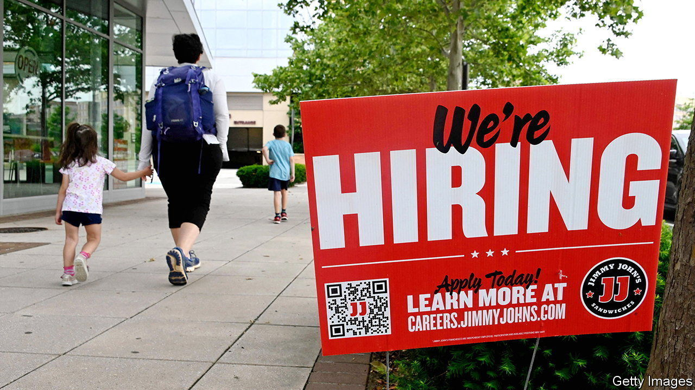
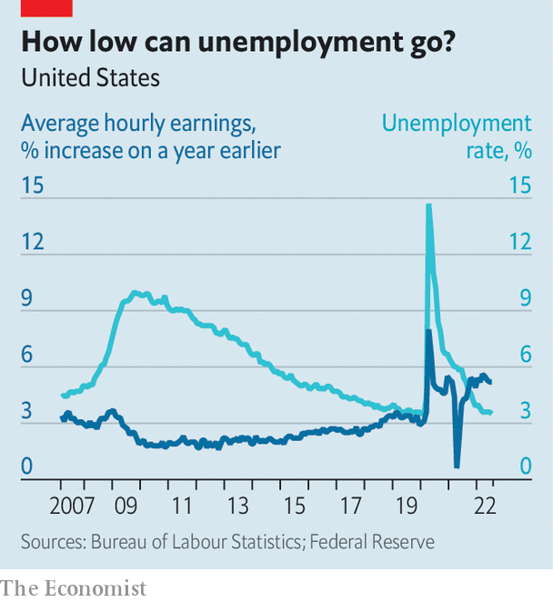

###### Two cheers amid the fears

# For a change, American inflation is lower than expected 

##### But a continued jobs boom points to a need for yet more Fed tightening 

 

> Aug 5th 2022 


What a difference a couple of data points make. Much of the recent talk about America’s economy had focused on the possibility of stagflation, as gdp shrank and prices soared. Suddenly, though, things look rosier. First, on August 5th, statisticians reported that 530,000 jobs were created in the previous month—more than twice as many as expected. Then, on August 10th, they reported that consumer prices in July were the same as in June—the first absence of month-on-month inflation since early 2020. Could the doomsayers be wrong, and America really be about to enjoy both an economic boom and price stability?

Not so fast. It is foolish to rush to any conclusion based on a week’s worth of data, especially amid the lingering covid-19 pandemic and war in Ukraine. Previous bursts of optimism have proved, unlike inflation, to be transitory. Moreover, a closer look at both reports gives as much reason for consternation as for celebration.

Start with the jobs figures. America’s unemployment rate in July fell to 3.5%, matching a half-century low hit just before the pandemic. Normally that would have been greeted with unalloyed joy. But the  is a challenge for companies struggling to hire staff. Wages rose at an annual pace of 5.2% over the past three months, up from 4.7% in June. Meanwhile, the dominant factor in the drop in inflation was the recent fall in oil prices. Once volatile food and energy costs are stripped out, core inflation is still up by 5.9% compared with a year earlier. 

Taken together, the data cast a fresh light on a debate that has raged among economists this year: just how big a trade-off the Federal Reserve faces between inflation and jobs as it tightens monetary policy. Jerome Powell, the Fed’s chairman, has long insisted that present labour-market tightness may mean there is a path whereby companies can reduce their demand for new workers without large numbers ending up on the dole. In other words, the trade-off could be less severe than in previous periods of monetary tightening. 

One way of understanding the debate is to consider the non-accelerating inflation rate of unemployment (nairu), also known as the natural rate of unemployment. It refers to the lowest level of unemployment that an economy can sustain before wage inflation starts to accelerate. Not directly observable, it is based on estimates. The concept of the nairu was once central to economic analysis and to the Fed’s thinking about rates. But it fell out of favour before the pandemic when unemployment dipped below the assumed nairu range of 4-5.5% without any discernible pickup in inflation. In a strategic review published in 2020, the Fed indicated that the concept would no longer figure prominently in its policy decisions.

 


However, the  over the past year, alongside the sharp drop in joblessness, has put the nairu back in the spotlight. There is a good case that it shifted markedly higher early in the pandemic. In mid-2020 unemployment soared to almost 15%. As Brandyn Bok and Nicolas Petrosky-Nadeau of the San Francisco Fed have noted, such a jump would normally have warranted a bigger slowdown in inflation than actually occurred. 

The fact that there was no deflation implies that the natural rate of unemployment probably shifted higher. The researchers estimated that the nairu may have reached 8% in 2020, before edging down to 6% at the end of 2021. Now, the economy may be experiencing the flipside of an elevated nairu: higher-than-expected inflation as unemployment falls.

Structural changes in the economy during covid help explain why the natural rate of unemployment may have increased. From the boom in delivery and warehouse work to the subsequent recovery in restaurant and travel work, employers’ staffing needs have evolved fast. Compounding that has been a change in what people expect from their jobs, epitomised by the shift to more remote working. One normal response from companies has been to offer higher wages.

A gap between the measured unemployment rate of 3.5% and the estimated natural rate of 6% implies that wage growth is likely to remain strong in the coming months. That will feed through into core inflation, even if oil prices continue to fall. A pessimistic interpretation is that the Fed may have to keep raising rates until measured unemployment approaches the nairu. If so, millions of people would lose their jobs.

A more hopeful interpretation is that the gap may ultimately be closed more by the nairu itself falling rather than by unemployment rising. After the Fed’s most recent rate rise in July, Mr Powell laid out this perspective: “Logically, if the pandemic and the disorder in the labour market caused the natural rate to move up, then as the labour market settles down, in principle you should see it move back down.”

It is easy to see why the Fed no longer places the nairu on the pedestal that it once did. Not only is it invisible, it is also unstable, especially when the economy itself is in flux. Yet slippery as it is, it gets to the crux of today’s concerns. Workers may rejoice at evidence of rapid job growth and wage increases. Only when these occur alongside a continued deceleration of inflation will economists’ consternation give way to true celebration. ■


