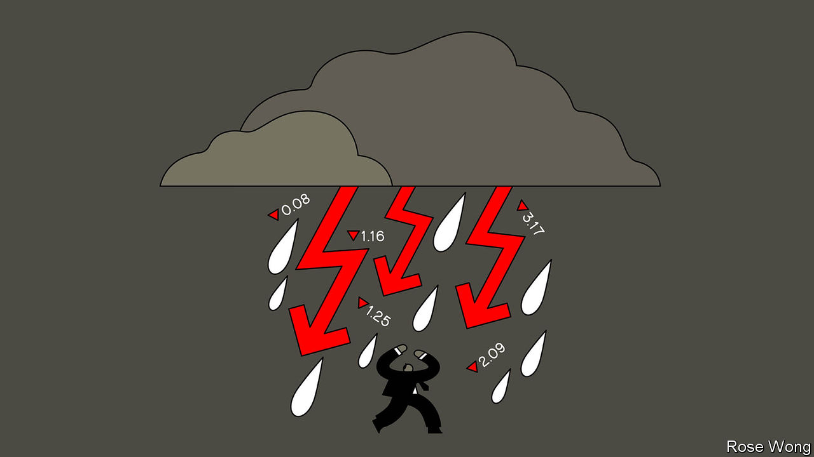
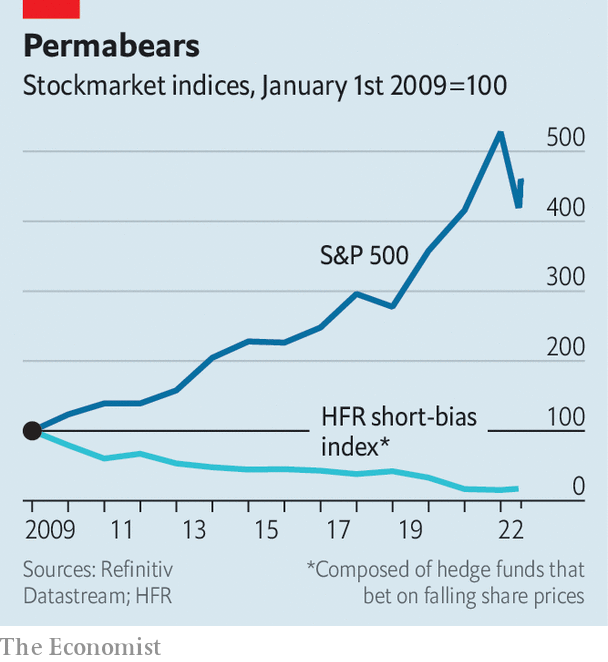

###### Shorts, squeezed

# Short-sellers are struggling despite a bad year for stocks 

##### Why the odds are stacked against those who bet against the market 

 

> Aug 11th 2022 

To napoleon, they were “treasonous”; to Tom Farley, a former boss of the New York Stock Exchange, “icky and un-American”. Short-sellers, who bet against the stockmarket, have always been unpopular—and essential. Today’s big names rose to fame by exposing corporate wrongdoing and irrational exuberance. Michael Lewis’s “The Big Short”, a popular account of the global financial crisis of 2007-09, puts the “misfits, renegades and visionaries” who bet against overvalued mortgage-backed debt at the centre of the story.

 


On the face of it this year ought to be a glorious period for short-sellers. Markets have plunged on fears of persistent inflation. Sagging growth makes it more likely that securities will fall in price rather than be buoyed by a rising tide. Higher interest rates and tighter credit conditions make it harder for poorly performing or outright fraudulent firms to stagger on by loading up on debt. Despite a recent uptick, the s&amp;p 500 index of large American stocks is down by 12%. But the “short-bias index” of hedge funds that specialise in short-selling constructed by hfr, a research firm, has not risen by anywhere near enough to make up for years of poor performance in more difficult conditions (see chart). 

Short-sellers are understandably gloomy. Andrew Left, an outspoken activist short-seller, said in 2021 that his firm would stop publishing “short reports” on companies it thought were overvalued, after 20 years of doing so. Bill Ackman of Pershing Square, who during the financial crisis ran high-profile positions against Fannie Mae and Freddie Mac, two American government-sponsored mortgage-finance firms, announced earlier this year that his hedge fund was quitting the business of activist short-selling. In recent weeks Carson Block, who burst onto the scene in 2011 with a bet against Sino-Forest, a Chinese forestry firm that was felled amid a fraud scandal, publicly wondered whether it was time to throw in the towel. 

What explains the malaise? Some technological changes should have helped short-sellers. The proliferation of alternative data sources and open-source intelligence ought to make it easier than ever to unearth corporate malfeasance. Earlier this year, intelligence agencies and newspapers alike used satellite imagery to follow the build-up of Russian troops on Ukraine’s borders. The same methods could find companies hiding stalled operations, says Dan Nord of Maxar Technologies, a firm that uses satellites to photograph 4m square kilometres of the Earth every day. Whereas distant supply-chain snarls, mothballed mines and shuttered ports would once have been brushed over in company filings, today they can be identified with ever-increasing precision.

Yet other changes have made the lives of short-sellers harder. Thirteen years of almost relentlessly buoyant equity markets, pumped up by low interest rates and a flood of quantitative easing, have left those betting on falling prices bloodied and bruised. Between the start of 2009 and the end of 2021, the s&amp;p 500 quintupled, while hfr’s short-bias index dropped by 85%. Kynikos Capital (since renamed Chanos &amp; Co, after its founder Jim, who predicted the downfall of Enron) managed $7bn at its peak in 2008; today that has fallen to around $500m. Muddy Waters, Mr Block’s outfit, has assets of around $200m.

When compared with the tens of billions managed by traditional “long” funds, that leaves little scope for chunky management fees. And even if a bet is successful, the potential return is capped while the potential loss is not: a stock’s price cannot fall below zero, but it can rise indefinitely. “I can make good money on our short calls,” says Mr Block, “but it’s hardly life-changing money.”

The final, euphoric phase of the recent bull market was accompanied by a stampede of retail investors into “meme stocks”, sometimes motivated by a desire to drive up the price and give short-sellers a bloody nose. Even though interest in meme stocks has slumped along with the market this year, their rise led some short-sellers to decide “this was never going to work again,” says Mr Chanos. “They thought if those stocks could trade there, any stock could trade anywhere.”

At the same time, regulators and enforcement agencies that once used short reports as starting points for criminal investigations are increasingly investigating the short-sellers themselves. A report in 2016 accusing Wirecard, a German fintech star, of fraud and corruption resulted in a four-year investigation by Bavarian state prosecutors and the German financial regulator into the shorts who wrote it. (Wirecard collapsed into insolvency in June 2020.) A recent flurry of subpoenas from America’s Justice Department to short-sellers—including Mr Block’s firm—has left many feeling as if they, rather than the fraudulent companies they try to uncover, are the enemy. 

Some fear that short-selling is just a fundamentally bad business, in which many of those involved are motivated more by the thrill of the chase than the opportunity for outsized profits. When you publish flattering research on companies, says one hedge-fund manager, “generally people like you, because generally people are long. Everyone hates you when you’re short.” That hostility translates into an unwillingness to listen to even the most well-argued short case, making it difficult to realise profits from the position. 

It has a much darker side, too. Mr Left decided his firm would stop publishing short reports after retail traders on social-media platforms shared his personal information online and sent threatening texts to his children. Warren Buffett, notes an industry veteran, shorted stocks early in his career: “He doesn’t talk about it now.” ■


