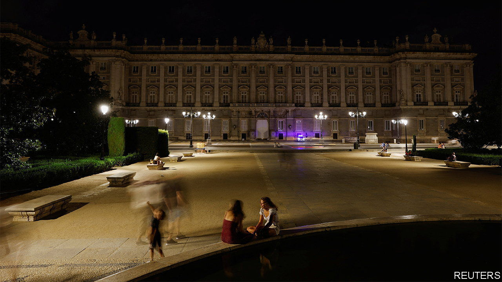
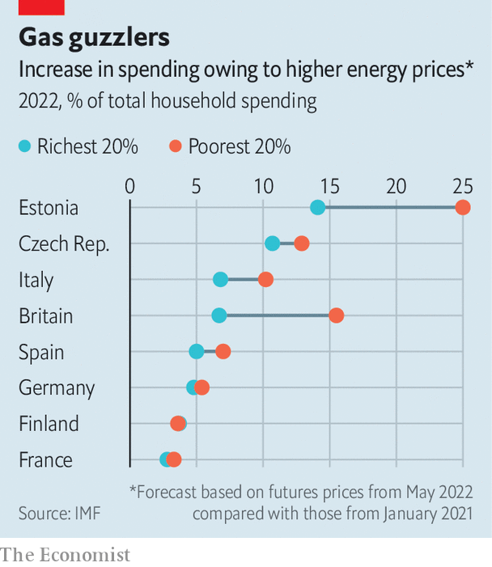

###### Putin’s present

# Which European countries are most vulnerable to surging energy prices? 

##### It’s better to be a consumer in Sweden than Britain 

 

> Aug 11th 2022 

Europe is facing an enormous energy-price shock. But not all Europeans are set to see the same hit to their living standards. According to estimates by the imf, the burden for the average family in Finland will be equivalent to an additional 4% of household spending. The picture is considerably grimmer a two-hour ferry ride across the Baltic Sea. In Estonia households face a hit of around 20%.

 


Between these two countries lie most of the continent’s economies (see chart). On average, Europeans spend a tenth of their incomes on energy. Richer families tend to have bigger houses and cars, but the increase in energy costs that results from this is generally not as big as the difference in incomes. That leaves poorer households spending more of their budgets on energy. The same pattern holds between countries as within them. Europe’s poorer former-communist east is more vulnerable to higher prices than its rich Nordic north. 

Dependence on natural gas is another important factor in assessing vulnerability. Wholesale prices have doubled since Russia’s invasion of Ukraine. Coal prices are also up, but by a slightly more manageable 60%. Meanwhile, the price of renewables is unchanged. Thanks to a mostly unified market for natural gas European countries face similar wholesale prices: power generators that use gas in Bulgaria, on the continent’s eastern flank, pay roughly the same as those in Ireland, on its western one. 

Yet countries differ in their dependence on the stuff. Less than 3% of Sweden’s energy comes from natural gas, with hydroelectricity, wind and nuclear providing the bulk of it. Swedish homes are heated using communal systems, often fuelled by wood chips, or through heat pumps attached to the electricity grid. That puts the average increase in household spending at around 5% of budgets, compared with 10% in Britain, which depends on natural gas.

The pass-through from wholesale to retail prices also differs. In many countries, utilities buy gas on long-term contracts and hedge their exposure to wholesale price increases. Different market structures then mean prices pass to consumers at different frequencies. In Spain, for instance, consumer tariffs are typically updated every month (though it has capped gas costs for power generators). In Poland they are adjusted only twice a year.

Elsewhere, governments have frozen costs. In France, where Électricité de France (edf), a state-owned utility, dominates the market, the government has capped price rises at 4%. Most of the country’s electricity usually comes from nuclear power, but long-delayed maintenance means it is now being imported from neighbours, where it is often generated by burning gas. The government absorbs the costs through its ownership of edf.

Capping price rises reduces the incentive for households to cut their energy use. It also disproportionately helps the rich. A far better option is to target support at the neediest. Yet, according to calculations by the European Central Bank, only 12% of eu states’ spending on measures to limit the impact of higher energy prices has been targeted in such a manner. An unevenly distributed energy shock requires more redistribution in response. ■


