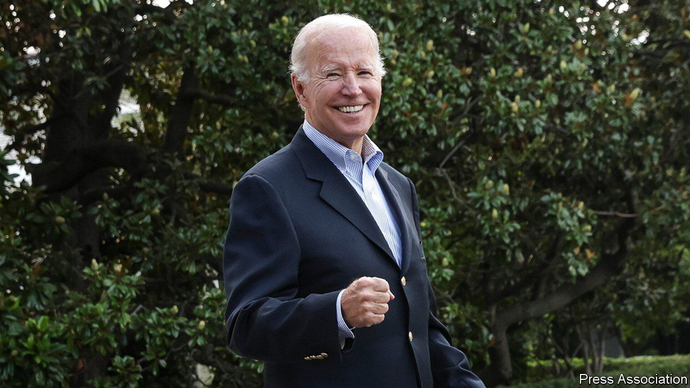
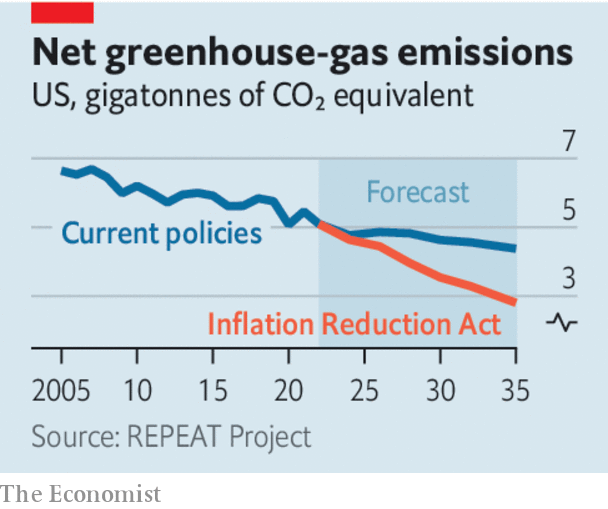

###### The Inflation Reduction Act

# America’s climate-plus spending bill is flawed but essential 

##### The green policies and drug reforms in the Inflation Reduction Act are big victories 

 

> Aug 8th 2022 

After a long path through Congress, a giant tax-and-spend package is on the verge of being . It will be America’s first significant climate law and a cornerstone of President Joe Biden’s agenda. Just weeks ago the bill seemed dead, but a backroom deal brought it back to life. It cleared the Senate along party lines by a single vote. The House looks set to approve it on August 12th, after we go to press (see United States section). As a feat of legislative legerdemain, it is impressive.

What of the law itself? It has many imperfections, most of which stem from  to keep it alive. But it also scores two big achievements—a semblance of health-care sanity and America’s most serious effort yet to face up to . And these easily outweigh the flaws.

The “Inflation Reduction Act” (ira), as it is officially known, will do next to nothing to reduce inflation, especially in the short term. The name of the bill is a transparent attempt to sell it to a public worried about soaring prices. 

 


Moreover, its provisions are a shadow of what Democrats once dreamed of. Last year they sought a $3.5trn package that would have dramatically expanded the welfare state. But they received no Republican support and their ambitions were whittled down by two stubborn senators from their own ranks: Joe Manchin of West Virginia and Kyrsten Sinema of Arizona. 

Some of the ugliest compromises were over taxes. Mr Biden had pledged to raise taxes on big companies and the very rich. This package was the perfect opportunity. One simple idea was to partially reverse Donald Trump’s massive tax cuts from 2017, which would have paid for many climate and social policies.

Ms Sinema, however, rejected all such proposals. So the Democrats settled on a 15% minimum tax on profits reported by corporations with more than $1bn in annual income. Subjecting big companies to a minimum tax is an appealing idea. But levying it on their book incomes, as this new tax will do, makes a messy American tax system even messier.

Despite these drawbacks, the ira should also be judged on two important advances. First, it will enable Medicare, the public health insurance for Americans over 65, to negotiate drug prices for the first time. This will cover just ten drugs initially, starting in 2026. But it is a step towards restraining America’s health-care spending, which, at about 19% of gdp, is nearly double the average of developed countries. The pharmaceuticals lobby, usually a fearsome force, fought against the price negotiations, and lost. With any luck, it will face more such setbacks. 

Second, and most crucially, the ira marks a new chapter for America’s climate policy. By weaving together a vast array of tax credits, loan guarantees and grants, it will encourage people to make low-carbon purchases, such as of electric cars, and encourage businesses to invest in green technologies. Rhodium Group, a consultancy, predicts it will cut America’s net greenhouse-gas emissions by 40% in 2030 from 2005 levels. Without the ira, the reduction would be 30%. The extra reduction is about two years’ worth of British emissions. America will now be working alongside most of the rest of the world in trying to limit global warming—something that would otherwise have been in doubt.

The climate measures are far from perfect. Market mechanisms such as a carbon price or a cap-and-trade scheme underpin the energy transitions under way in many other countries. In America’s current political constellation, they are, alas, non-starters. By the same token, passing any kind of ambitious legislation in that constellation is a triumph. All the more so when it promises real benefits for both America and the world. ■


