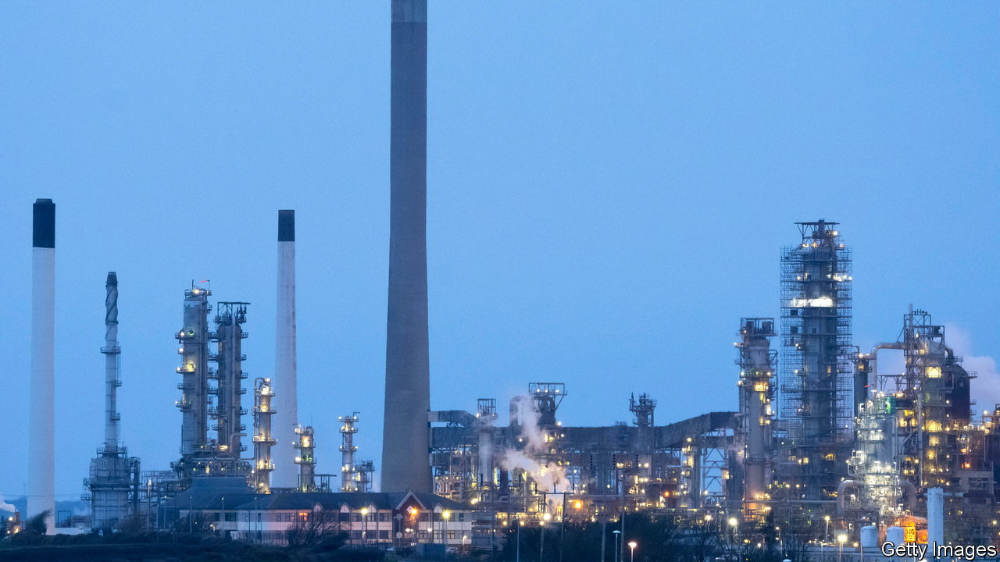

###### Crunch time

# How to help with energy bills 

##### There are better, fairer and cheaper ways than meddling with prices 

 

> Aug 10th 2022 

The energy crisis unleashed by Russia’s war on Ukraine is crushing Europe’s consumers and . Natural-gas prices are eight times higher than they were last summer and traders expect precious little respite over the coming year.  are nearly twice their level in January 2021. The result is rampant rises in living costs. By October a household in Britain could be paying more than £3,500 ($4,200) a year for energy, more than three times last year’s bill, leading the Bank of England to warn of inflation passing 13% before the year is out. Annual consumer-price inflation rates are already in double digits in half of the euro area’s member countries. 

Alas, politicians are botching their response. To stop rising wholesale energy prices passing through fully to consumers’ bills, many have resorted to price caps and energy-tax reductions. Liz Truss, a Conservative politician vying to become Britain’s next prime minister, is talking of cutting payroll taxes. But price ceilings do nothing to reduce energy use and tax cuts will not protect the poorest. With no immediate end to the crunch in sight, it is time for some hard-headed thinking about how to live with higher energy bills.

The cheapest protection is to trade natural gas across national borders, which imf modelling suggests could nearly halve the blow to gdp in the worst-affected countries. Next, within domestic markets, price signals have a vital role to play in curbing demand and ensuring that precious gas gets to where it is most needed. Ceilings on the price of natural gas used by power generators, as in Spain and Portugal, or a cap on household bills, as in France, may serve as emergency measures when a shock is fleeting. But today’s scarcity is likely to be long-lasting. Consumers and businesses need to adapt. 

Hearteningly, there are signs that people and businesses can and do respond to high prices by conserving energy. They are also more resilient than fearful governments might think. In Germany farmers and industrialists are importing more ammonia and other energy-intensive chemicals, rather than relying on dearer domestically produced inputs. Studies suggest that both German households and firms have reduced their consumption of natural gas since mid-2021. 

Sometimes conservation can be galvanised by regulation. Spanish businesses and shops now go dark after 10pm, and the air-conditioning standards for public and commercial buildings are set at a minimum of 27°C, to encourage Spaniards to go shopping in their t-shirts. Likewise, energy companies can help change behaviour by telling people how much energy they use compared with their neighbours. Such interventions are cheap (though some have the drawback of muffling price signals), and can help defuse the incendiary politics of high prices. Affecting rich and poor alike, they are seen as fair. 

But governments also need to protect those most in need, notably poor people, for whom energy bills make up a bigger share of household spending. Politicians cannot stop rising energy prices from making economies worse off, but they can determine who bears the brunt of the shock. Support, in the form of rebates on energy bills for the poorest, or even cash bonuses (as recently enacted in Italy), would help the neediest, while still encouraging consumers to conserve energy where they can. 

Targeting is essential to keep the cost in check. According to the imf, some European governments are on course to spend 1.5% of gdp on energy policies by the end of the year. Measures that protect the poorest fifth of the population would cost only 0.4% of gdp; the poorest two-fifths, 0.9%. Trying to buy support by including everyone is a bad use of public money. 

Windfall pitfall

Who, then, should pay? The crowd-pleasing choice is the energy companies, which are making out like bandits, but general taxation makes more sense. Windfall taxes on energy producers are undesirable if their fortunes follow the boom and bust of the commodities cycle. That only leads to underinvestment—and the next bout of sky-high prices. ■

