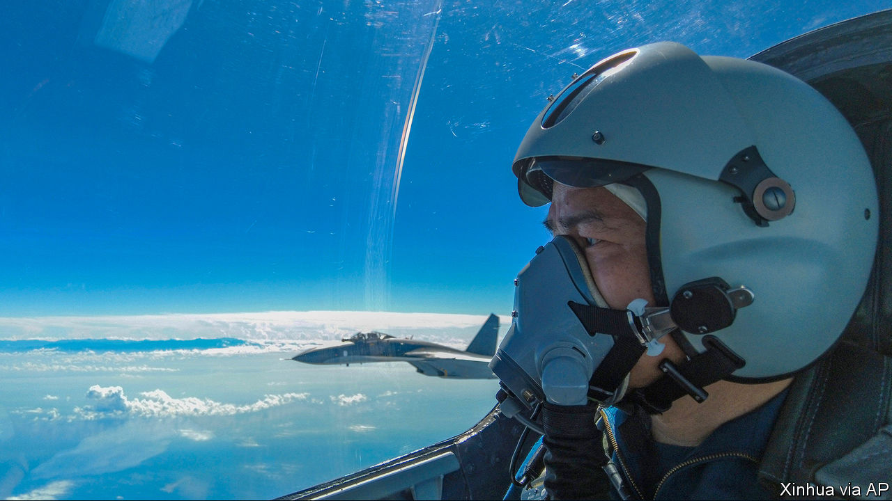

###### Target: Taiwan

# How to prevent a war between America and China over Taiwan 

##### It is becoming ever harder 

 

> Aug 11th 2022 

America and China agree on very little these days. Yet on the subject of Taiwan, at least in one regard, they are in total harmony. The status quo surrounding the self-governing island, which China claims and whose thriving democracy America supports, is changing in dangerous ways, say officials on both sides. War does not look imminent, but the uneasy peace that has held for more than six decades . Ask them who is at fault, however, and the harmony shatters.

That much is clear from the crisis triggered this month by a visit to Taiwan by the speaker of America’s House of Representatives, . She was well within her rights, but her trip was provocative. It infuriated the Chinese Communist Party. One of Ms Pelosi’s predecessors had visited the island in 1997, but China’s top diplomat claimed that American “saboteurs” had wrecked the status quo. , China fired missiles over the island and carried out live-fire drills that encircled it, as if it were rehearsing for a blockade.

Since the previous stand-off in 1995-96, America, China and Taiwan have all grown uneasy with the ambiguities and contradictions—the status quo, if you will—on which peace precariously rests. China, especially, has . If the world is to avoid war, it urgently needs to .

In part this reflects the breathtaking change of the past half-century. Taiwan has blossomed from a military dictatorship into a prosperous, liberal democracy of 24m people, nearly all of them Han Chinese. Its citizens are more than twice as rich as mainlanders. Their success is an implicit rebuke to China’s autocratic regime, and an obvious reason for them to resist being governed from Beijing. Taiwan’s president, Tsai Ing-wen, has made no formal moves towards independence, but the island is drifting away from the mainland. China’s offer of “one country, two systems” has looked empty since the mainland crushed civil liberties in Hong Kong, which was given the same deal. Today very few Taiwanese say they want formal independence immediately, if only because that would surely provoke an invasion. But even fewer favour prompt unification.

America has changed, too. After intervening to protect Taiwan twice in the 1950s, it began to doubt that it was worth defending, but the island’s democratic success and its importance as a source of semiconductors have upped the ante. Today allies such as Japan see resolute support for Taiwan as a test of America’s standing as a dominant and dependable power in the western Pacific. America has made no formal commitment to defend Taiwan directly, adopting instead a policy of “strategic ambiguity”. But amid growing Sino-American rivalry, and with politicians in Washington vying to sound tough on China, there is little doubt that America would join a fight over Taiwan today. Indeed, President Joe Biden has repeatedly said as much—though each time his staff have walked back his remarks.

But no country has done more to wreck the status quo than China. Whether peace lasts is largely up to President Xi Jinping, its strongman. He gives ample grounds for pessimism. As China has grown rich, he has nurtured an ugly, paranoid nationalism, stressing every humiliation it has suffered at the hands of perfidious foreign powers. He has linked unification with Taiwan to his goal of “national rejuvenation” by 2049. China’s armed forces have been building the capacity to take the island by force; its navy now has more ships than America’s. Some generals in Washington think an invasion could occur in the next decade.

Fortunately, China’s actions in this crisis have been muscular but calibrated—designed to show its anger and might, while avoiding escalation. Its forces have been deployed so as not to start a war. America has sent similar signals. It postponed a routine test launch of an intercontinental ballistic missile. And Ms Pelosi’s plane took a circuitous route to Taiwan, to avoid flying over Chinese bases in the South China Sea. 

The danger is that China uses the crisis to set new boundaries for its encroachments into what Taiwan considers its airspace and territorial waters. It could also attempt to impose even stricter limits on the island’s dealings with the rest of the world. 

That must not happen. The task for America and its allies is to resist these efforts without getting into a fight. America could start by re-establishing norms that held before the crisis. It should promptly resume military activities around Taiwan, for instance, including transits through the Taiwan Strait and operations in international waters that China claims as its own. It could continue to expand military exercises with allies, involving them more in contingency planning over Taiwan. Japan was irked when China fired missiles into its vicinity and has indicated that it could intervene in a war, which would greatly complicate a Chinese invasion.

The aim is to persuade China that such an invasion is not worth the risk. It makes sense to use the Taiwan Policy Act (tpa), now before Congress, to provide more training and weapons to Taiwan. But Taiwan needs a better strategy based on small, mobile arms like those Ukraine has used so well, not the costly kit favoured by its generals. The island should become a “porcupine” that would be hard for China to digest. Like Ukraine, Taiwan must also show more willingness to defend itself. Its armed forces have long been plagued by corruption, waste and scandal. 

Sometimes a public stand-off with China makes sense. More often it causes a lot of trouble for very little gain. The g7 condemned China’s missile-lobbing, as did Japan and Australia. But South Korea did not and South-East Asian countries have been loth to take sides. Even as it condemns China’s aggression, the Biden administration should stress that it does not support formal independence for Taiwan. Congress should avoid symbolic moves that will bring few real benefits to the island, such as renaming Taiwan’s representative office in Washington, currently in the tpa. Why not pass a trade deal instead?

War is not inevitable. For all Mr Xi’s ambition, his priority is to keep a grip on power. If the invasion of Ukraine teaches one lesson, it is that even a supposedly easy victory can turn into a drawn-out struggle, with ruinous consequences at home. America and Taiwan do not have to prove that a Chinese invasion would fail, just cast enough doubt to persuade Mr Xi to wait. ■


