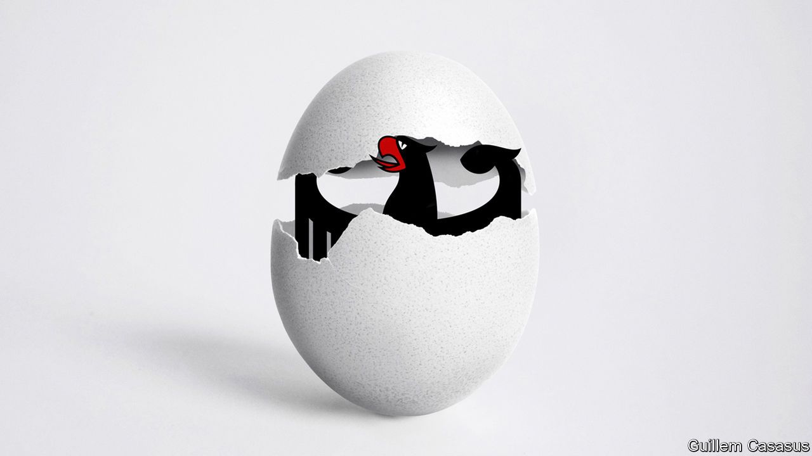

###### The new Germany

# Thanks to Vladimir Putin, Germany has woken up 

##### Less starry-eyed policies on security and energy should help it lead Europe 

 

> Aug 11th 2022 

To borrow a phrase from the late Emperor Hirohito, the war in Ukraine has developed not necessarily to Vladimir Putin’s advantage. It has sent Finland and Sweden bolting for the . It has deepened Ukrainian nationalism, strengthened the democratic alternative Ukraine offers to Mr Putin’s own tyranny, and led customers for Russia’s energy to look elsewhere. It has also prodded a sleepy giant, Germany, rousing a country that has been both Russia’s best partner and its worst enemy. Mr Putin’s warmongering may prove to be the catalyst that turns Germany into his own nightmare: a stronger, bolder, more determined leader of a more .

Germany badly needed that prod. Complacent and just a little self-satisfied, it was  how fast the world was changing around it. Now, however, a remarkable opportunity is within its grasp, as Germans experience a rare thing in a democracy: a consensus about the need for broad, sweeping change to the economy and security. 

The clouds were long gathering. Yes, Germany boasts an enviable record as Europe’s strongest economy, most stable polity and, Germans like to think, most responsible citizen. But Germany’s dependence on cheap Russian fuel, carefully cultivated by Russia, has been exposed by the Ukraine war. Germans are not only vulnerable to the Kremlin’s energy blackmail, but have also been bankrolling Mr Putin’s invasion. 

That wretched situation was a product of another of Germany’s failings: a reluctance to question rosy assumptions rooted in its own happy recent history. Comforting notions, such as that trading with Russia would tame its belligerence, a theme beloved of Angela Merkel, a long-serving chancellor, allowed Germany to turn a deaf ear for too long to pleas from allies for more robust investment in its own and Europe’s defence. 

Germany has shied away from other challenges, too. Its economy remains over-reliant on the export of traditional engineering products where there is little room for growth, and over-reliant on one country, China, as a source of inputs and a market for its goods. Partly because of strict rules on public spending, Germany has underinvested in infrastructure; all too often its trains do not run on time. The public and private sectors are held back by the slow digitisation of services as well as a shortage of skilled workers—a harbinger of a demographic danger, as over the next decade more Germans will retire than enter the workforce.

Now a new Germany is hatching. Three days after the invasion, Olaf Scholz, then a new chancellor heading an untested coalition, gave his much-applauded speech to the Bundestag, signalling a break with the country’s post-war tendency towards pacifism. He has set the agenda for years to come.

The good news is the country’s challenges are manageable. Take energy. When Mr Putin invaded, Germany relied on Russia for 55% of its gas. Doomsayers warned that supplies would be choked off, German factories would close and families would shiver in their kitchens. In fact, even as Russia’s share of the German gas market has halved, stores of gas for winter are building at a normal pace. Industry says it can cut back use more than expected. Faced with higher prices and conservation campaigns, households will do the same. Germany is restarting mothballed coal-fired power plants. It will invest in renewables. It should (and probably will) extend the life of three nuclear plants that had been rashly scheduled to close. It should also lift a ban on fracking that has put its hefty reserves of shale gas out of reach. 

With enough determination, other troubles have fixes, too. Mr Scholz has pledged to boost defence spending by a third—though the core budget this year is flat. New outlays will fund a sweeping equipment upgrade. He has also promised a less starry-eyed approach to foreign affairs, sending heavy weapons to Ukraine in defiance of the old pacifist taboo. His government has initiated a thorough review of relations with China, and is soon to issue a national-security strategy. Tellingly, that is Germany’s first such effort at framing its own geostrategic goals. 

Digitising and greening its industry and adding high-end services to the mix will be harder. The myriad companies in its could remain the bedrock of Germany’s economic strength if they embraced the digital challenge. Luckily, business leaders and Mr Scholz’s government both appear pragmatic. Immigration rules are being tweaked to entice more skilled workers into the country. Germany is also much more open towards deficit spending, not only at home but in Europe, too. 

Its solid relations with Europe are another advantage, the result of decades of nurturing allies, including an occasionally obstreperous America. In the future, as firms look for ways to make their supply chains more robust, reliable Germany will be an attractive place to invest.

Dangers still lurk. Turkey or a second Trump administration could “defect” from the nato alliance. Germany would then face a far more burdensome security challenge as the alliance’s second-biggest, but militarily most underpowered, member. Ramping up spending should be just the first step in a radical overhaul of a squeamish and bureaucratised army that is poorly geared to defend the more exposed countries on nato’s periphery.

Germany has wisely and consistently put Europe at the centre of its concerns. But in the face of political challenges to the eu from Poland, Hungary and, potentially, a new right-wing government in Italy, Germany has a vital role to play in holding the project together. On this, and matters such as a deeper single market, Mr Scholz should get off the back seat and sit up front.

Which came first, the eagle or the egg?

The greatest danger, though, is that this moment is lost and Germany slips back into caution and stasis. Comprehensive change takes years and Mr Scholz is not especially popular. 

Ukraine will be an early test of Germany’s mettle. Though Mr Scholz’s tough stance against Mr Putin still convinces most Germans, support has been softening and the cost of the war has yet to hit heating bills. If Germany were to abandon Ukraine, that would be a tragedy, for Germans as well as Ukrainians. This is a conflict over the future of a continent. It is also an opportunity for Germany to reclaim its place at the heart of Europe. ■


