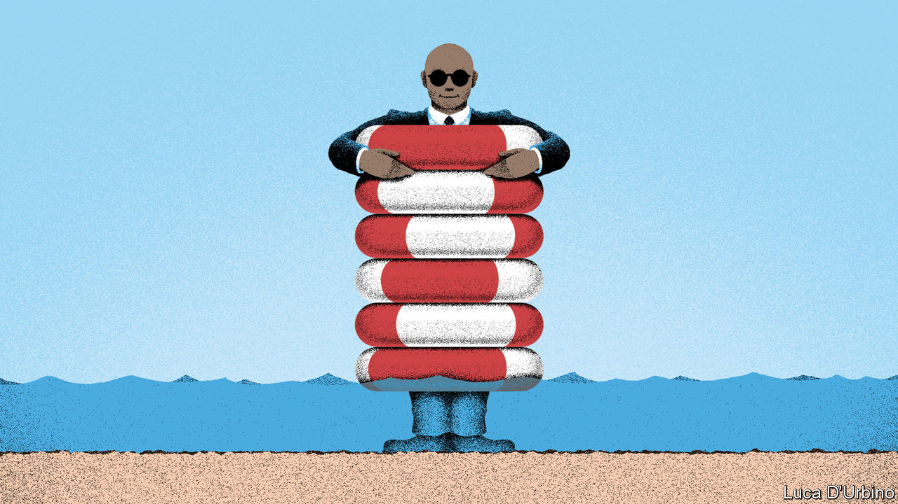

###### Lifelines of credit

# The unexpected lesson of Ghana’s 17th IMF bail-out 

##### It pays to ask for help early and often 

 

> Aug 11th 2022 

Even after Ghana threw off the colonial yoke in 1957, its first president, Kwame Nkrumah, complained that it was not truly free. Rich countries still held it back, he said, and  was a “neocolonialist trap”. His spirit lives on. Ghana’s current finance minister likens imf programmes to the way Israelites were treated in ancient Egypt. 

All told, Ghana has spent 22 of the past 35 years under the fund’s supervision. In July it asked for a new bail-out, . You might think that a country that keeps asking for money is a mess. But Ghana is one of the most prosperous in the region, and a lively democracy to boot. Its problem is that its politicians, starting with Nkrumah, have been addicted to spending. The latest crisis follows a surge of borrowing and an economic crunch, which have priced Ghana out of credit markets and raised the risk of default. Given that it is only three years since Ghana completed its previous imf programme, this suggests woeful economic management. 

Yet Ghana routinely notches up impressive economic growth. At $6,178, its gdp per head (adjusted for purchasing power) is nearly twice the west African norm. One reason it has succeeded despite its recklessness is because, largely, it has gone to the imf early and often.

Asking for help early can nip problems in the bud. Bail-outs can be smaller and the spending cuts required to put public finances on a sound footing can be less painful. When Ghana entered its 16th programme in 2015 it needed less than $1bn (2% of gdp) from the imf to regain access to credit markets. When the country later issued a foreign-currency bond, investors bid for five times more than was on offer.

There are few downsides to going early. The fund’s lending is usually dirt cheap (in many cases no interest is charged), and its involvement gives investors confidence to resume lending and investing. Waiting too long before calling for help, by contrast, usually multiplies a country’s misery. Zambia, which failed to engage with the imf and defaulted in 2020, now needs an imf package worth about 7% of gdp. And because its debt is unsustainable, it needs its debt restructured with its many creditors before the imf is allowed to lend it more. Other countries are taking note. Bangladesh has pre-emptively asked the imf for $4.5bn, while insisting that its economy is not in bad shape.

Ghana also illustrates the advantages of asking often. Its rulers tend to borrow and spend profligately before elections, and then ask the imf to soothe the post-poll hangover. The fund’s help is typically conditional on painful reforms that politicians know are necessary but dare not enact under normal circumstances. Such reforms are often only feasible if politicians can blame the imf for them.

In an ideal world they would be honest with voters and embrace fiscal rectitude. In the real world the benefits of sensible reforms outweigh the harm unfairly done to the fund’s reputation. The fund, for its part, has grown better at sparing essential social spending, such as on health and education. Activists are cottoning on. Bright Simons of Imani, a think-tank in Ghana, used to protest against the imf. Now he campaigns for African countries to think of it like the family doctor. They should use its cheap loans as “preventive care”, asking for them “frequently and proactively”, before they need to be carried on stretchers into intensive care. He is right. ■

