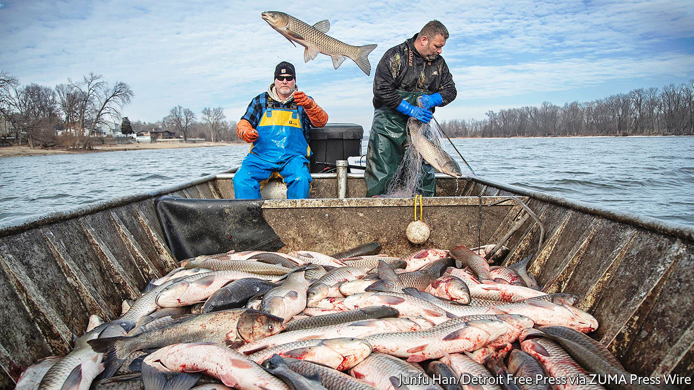
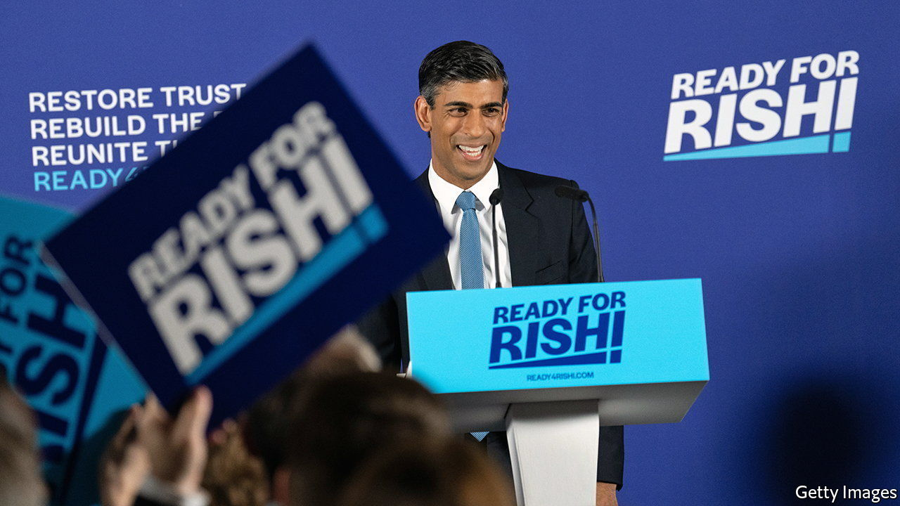

###### On ESG investing, currency conversions, carp, hydrogen, alien life

# Letters to the editor 

##### A selection of correspondence 

 

> Aug 11th 2022 


Equitable social goals

esg (environmental, social and governance) investing should focus just on emissions, you say, concluding that esg investment is an outdated and flawed idea (“”, July 23rd). esg exists because efforts to price the planet’s boundaries and social institutions have been too little and too late to make a difference. Companies and investors alike have spent the best part of 20 years worshipping at the altar of carbon markets only to find that politics gets in the way of a sufficient price. As a result, investors have had to evaluate emissions (and other esg factors such as board competency, transition plans and stakeholder impacts) and trade on the risk of future prices and regulation to prepare for the economic transition ahead. 

esg provides a framework to assess the interconnectedness of these issues in a way that better reflects policy and economic realities. For example, the economic transition required to reduce emissions is also an inherently social transition. Take the  protests in France, where an increase in fuel duty, nominally with the aim of curbing carbon emissions, led to months of disruptive civil unrest. No government, investor or business can consider pathways for policy reforms without considering their wider ramifications and the volatility that may result for markets. The e, s and g must be solved together.

nathan fabian

Chief responsible investment officer

Principles for Responsible Investment


cdp runs the global disclosure system to help firms reduce their environmental impacts. I agree that it is often hard to link products to progress towards a sustainable, equitable economy through esg investing. That is because many of its aspects are seen through a de-risking lens, or as a niche overlay to mainstream investment products, rather than to align economic activity with what our planet can sustainably provide. 

Therefore, I am deeply concerned by the suggestion to reduce esg to emissions alone, which ignores wider environmental impacts such as water security, biodiversity and deforestation. Focusing on emissions alone will not help us to build resilience to the climate shocks coming our way. Without biodiversity humans cannot eat or make medicines. Indeed, we cannot solve the climate crisis, as at least a third of all scientifically required emission reductions are linked to forestation and the water cycle. More than half of the world’s gdp relies on nature and its services. Losing it is an existential threat. Companies and financial markets are finally waking up to this reality and we must use this momentum to regulate and standardise more, not less. 

An established accounting framework for emissions already exists, and if companies generally do a poor job of reporting emissions in their value chain (scope 3) this is where the focus for improvement should lie. 

nicolette bartlett

Chief impact officer

cdp


The principal issues under the e that the vast majority of people face are coping and adapting to adverse climate-change related events. But adaptation is very much a social agenda, the s in esg. This is particularly important as the poor will suffer most from climate effects. The entire continent of Africa contributes 3.8% to global emissions, for example, and the poorest 50% of the global population are estimated to contribute around just 7% of emissions. The s imperative goes beyond climate adaptation. Social inequities and inequality lead to unrest, conflicts and political instability. Governance, the g in the investment framework, is also vital. It should ensure that organisations perform ethically, are effective and can efficiently achieve their planned outcomes. 

However, we agree with  that, in general, the way esg is applied is highly problematic. Rather than attempting to boil esg factors down into a single rating, investors crave a more nuanced approach. For example, an esg scorecard that illustrates performance across a manageable number of categories is not a new idea, but one that is worthy of further development.

Is the current approach to esg investing broken? Probably. But the answer is not to discard or replace the underlying principles with a reductionist alternative. 

sophie sirtaine

Chief executive

Consultative Group to Assist the Poor

 

The impending transformation of esg is coming through impact investing, in which I have been intimately involved for over 20 years. I estimate that more than $2trn of global capital is invested according to impact principles. These principles rest on transparency. The International Sustainability Standards Board, the Securities and Exchange Commission and the European Union are pushing for the standardisation of physical-impact measurements. Big data, artificial intelligence and machine learning are enabling us to measure and value physical impacts and integrate them into financial analysis and the valuation of companies.

This evolution is exemplified by the efforts of the Impact Weighted Accounts Initiative at Harvard Business School. It has published, in monetary terms, the environmental and social impacts of thousands of firms, allowing for a comparison between their different impacts and profits. Its analysis shows that a correlation exists between the higher level of pollution companies create and their lower stockmarket value relative to their less polluting competitors.

Integrating standardised impact measurement into mainstream investment practice, in the same way we did with risk measurement in the second half of the 20th century, is the path that leads esg beyond greenwashing. By elevating esg to a discipline focused on measuring business impacts alongside profits, we turn esg into impact investment. Doing so revolutionises the ability of market economies to deliver solutions to our great challenges alongside rising prosperity.

sir ronald cohen

Chair

Global Steering Group for Impact Investment


So-called “engagement” strategies, whereby investors own high-emitting companies in order to change them for the better, are not only devilishly difficult, but also beset by potential conflicts of interest. A fiduciary investor owning the likes of ExxonMobil, for example, could hardly be an effective advocate for the rapid curtailment of its oil and gas production, or for badly needed public policies that would price carbon emissions, or boost substitutes, any of which could tank Exxon’s stock. The line between engagement and complicity is a fuzzy one, if it is there at all. Or is investor engagement just another “greenwashing” to justify the opportunity to capture some juicy returns?

Also, the key goal of divestment strategies is not to drive up the cost of capital of high emitters. Instead, the idea is to decrease the number of stakeholders in such enterprises to weaken their political power, so that proper pricing and regulation can be put in place. One need only look to the decline of the tobacco lobby, and the end of tobacco advertising, to see how things might proceed if fewer had a vested interest in continued profits from high-emitting enterprises.

Deep-pocketed investors interested in saving the planet might best be served by donating to politicians and organisations that might actually act to raise carbon prices, or accelerate the adoption of electric vehicles.

james jampel

Founder and co-chief investment officer

hite Hedge Asset Management


 


The Great Lakes

Although we appreciate the attempt by Illinois to slim down the invasive carp population, putting it on consumers’ plates will not fix the massive threat to the Great Lakes and its $7 billion fishing industry (”, July 9th). The state must keep its eye on the long game and focus on building protections at Brandon Road Lock and Dam near Chicago that are essential to keeping the fish from reaching Lake Michigan.


Congress and the Biden administration ought to be applauded for their proper focus: They made a historic investment earlier this year to fully fund the federal share of design, engineering and year-one costs for construction of the Brandon Road project. But with construction lasting years, not months, we need sustained momentum to get this barrier built.


It is now the turn of Illinois to sign an agreement with the US Army Corps of Engineers by the end of the year to keep the project on schedule. Illinois must also collaborate with the other Great Lakes states to fund their share of construction. Too often, states and taxpayers are left with the onerous task of controlling a costly invasion that’s already happened. We can see this threat coming. Prevention is the only option for the Great Lakes.

JOEL BRAMMEIER

President &amp; CEO

Alliance for the Great Lakes


 


A helping hand for hydrogen

Your article on hydrogen is one of the more nuanced, and indeed accurate, of those that I have read on Britain’s hydrogen strategy (“”, July 30th). Rightly, you recognise that the challenge is as much a question of demand as supply. The sector is presently enveloped by an economic Scylla and Charybdis, whereby low supply hobbles demand and vice versa.


I would challenge the idea, though, that there simply is not enough green power to generate green hydrogen. It’s really a question of ambition and approach. I know of one developer proposing the installation of sufficient floating offshore wind capacity to generate at least 1.5GW of green hydrogen capacity.


To attract the investment into the necessary infrastructure, we must find a way to accelerate the award of leases for large floating offshore wind farms and grant contracts for differences to ensure ambition can marry with the opportunity to achieve our climate goals. Any strategy is open to a charge of imperfection, but with exclusive development and offtake rights, underpinned by ambition, we can help an emergent sector achieve the necessary scale.

Gavin Watson

Partner

Pillsbury


 


Preaching to the converters

Sometimes  can take its obsession with clarification a little too seriously. When Sajid Javid spoke of his father arriving from Pakistan “with £1 ($1.20) in his pocket”, I died a little inside (“”, July 16th). Surely your newspaper could have discarded precision for prosody on this occasion? 

adrian fogarty 


 


On another planet

Reading about the latest advances in astronomy (“”, July 16th) ignites the age-old question of whether we will make contact with intelligent life. Not to burst anyone’s bubble, but as Arthur C. Clarke humbly observed: “I’m sure the universe is full of intelligent life. It’s just been too intelligent to come here.” 

dave glantz


