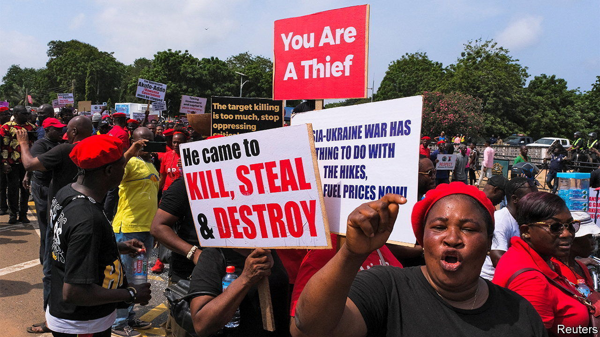
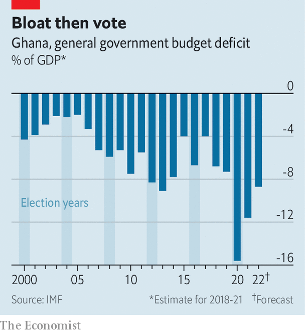

###### Seventeenth time lucky

# Ghana, an oft-lauded African economy, is back for a 17th bail-out 

##### But success and failure may be flip sides of the same coin 

 

> Aug 5th 2022 

Enu, a shopper at Kaneshie market in Accra, the capital of Ghana, peers into a small bag of scrabbling crabs with disappointment. “Before, if I buy two cedis’ worth, it can make my stew for me,” she says. “Now, no.” As shoppers moan about inflation, traders grumble about slow sales. Many blame the government. “The finance minister, if I catch him, me, I will beat him,” declares Esther, a yam-seller with a twinkle in her eye. 

Fully 87% of Ghanaians think the country is going in the wrong direction, according to a survey in April by Afrobarometer, a pollster. The economy is a big reason. Annual inflation hit 30% in June, its highest for 18 years. This year the central bank has increased interest rates by 4.5 percentage points, to 19%, but the cedi has nonetheless fallen by 28% against the dollar.

The government has been slow to face up to the crisis. “We are not going to the imf, whatever we do, we are not,” declared Ken Ofori-Atta, the finance minister, in February. “We are a proud nation.” On July 1st the government ate its words, asking the imf for help escaping the pit of debt it has dug itself into. Last year 44% of its revenue went on foreign loans. The unsustainable borrowing, naturally, has scared off lenders, leaving it with few options.

This is familiar territory for Ghana, which has been nannied by the imf for 22 of the past 35 years. The new programme will be its 17th since independence in 1957 and comes little more than three years after it graduated from its previous one. All of this might suggest Ghana has made a dog’s dinner of managing its economy. Yet its people are the richest in continental west Africa, measured by gdp per person. What’s more, politicians regularly and peacefully hand power over at elections. This makes it a model for how a country can develop and democratise, despite its macroeconomic turbulence.

The government insists that today’s crisis is not its fault. “We were on a very positive trajectory” before the pandemic, says Mr Ofori-Atta. Russia’s invasion of Ukraine and a surge in global inflation compounded the harm, he adds. 

Yet Ghana was vulnerable well before covid-19 struck. The imf had already warned that it was at a high risk of debt distress before President Nana Akufo-Addo took office in 2017. Despite this, his government kept on borrowing. Ghana’s public debt rose from 56% of gdp in 2016 to 63% on the eve of the pandemic in 2019. 

When covid hit, many African governments had little choice but to borrow and spend to support their economies. Ghana did so more than most. Its budget deficit of 16% in 2020 was the second-highest in sub-Saharan Africa, far above the regional average of 6%. This may have helped avoid a recession, but Ghana’s debt is now a thumping 84% of gdp, reckons the imf. 

Mr Ofori-Atta suggests that it is racist to criticise Ghana’s deficit. Rich countries spent far more in absolute terms, he observes. “Do they have a right to do that more than we do because we are African?” He glosses over the fact that rich countries could safely spend more because they raise far more tax than Ghana does. 

Borrowed dime

Ghana’s take in taxes is worth only about 12% of gdp, well below the average of 15% for Africa. It is also perennially vulnerable to foreign-currency shortages because it depends largely on volatile commodity exports—chiefly gold, oil and cocoa.

 


Moreover, many worry that Ghana does not always spend its money wisely. Emmanuel Gyimah-Boadi, the co-founder of Afrobarometer, who is based in Accra, argues that a good deal of spending before the general election in 2020 was aimed at helping Mr Akufo-Addo win a second term. This would fit a pattern. Before almost every election in recent decades the ruling party has tended to splurge (see chart). 

Graft is another recurring worry. Pollsters from Afrobarometer regularly ask Ghanaians how many people they think are involved in corruption in various institutions, such as the police or religious leaders. When they most recently asked this question in relation to “the president and officials in his office”, more than half of respondents answered “most” or “all”. 

Rich as Ghana is relative to its hard-up neighbours, many Ghanaians reckon they would be richer still if the economy had been managed better. Yet there may be more than meets the eye to Ghana’s unorthodox and imperfect model of big spending interspersed with imf programmes. Deficit-financed investment can pump up growth for a while. Indeed, some of the borrowed cash has gone into roads, hospitals and free secondary schooling. This may not have boosted growth enough to pay back the debt, but it still brings benefits. The spending has also improved social cohesion, says Mr Ofori-Atta. That is not to be underestimated given the strife in many of Ghana’s neighbours. 

Perhaps one explanation for Ghana’s ability to make a success of failure has been its readiness to turn to the imf before the economy has suffered catastrophic harm. Politicians then blame the fund for prescribing austerity that they know is needed, but would not dare to impose without the cover of an imf programme. 

Ghana’s reputation for peace, democracy and, at times, rapid economic growth has helped persuade creditors and donors that the country is a worthy candidate for debt relief when crises hit, argues Bright Simons of Imani, a think-tank in Accra. Its star image has also brought creditors back after its crises, even when it has not mended its ways, allowing its unorthodox growth model to roll on. 

Now the government will find out if it has run out of road. Mr Ofori-Atta does not rule out another debt restructuring, but nonetheless promises that Ghana will soon resume borrowing from private creditors. Yet each bail-out dims its star. That may be why the government is so determined to blame covid for its current pickle. Mr Ofori-Atta also blames rating agencies for forcing Ghana back to the imf: his ministry says they have an “institutionalised bias against African economies”. 

Even if Ghana’s odd model has had its benefits, many Ghanaians are tiring of the cycle of pork-barrel politics followed by imf interventions. Almost half of Ghanaians are dissatisfied with the way democracy works, by far the highest share since Afrobarometer began polling in 1999. Adia, who runs a tiny shop an hour outside of Accra, was once a “full supporter” of Mr Akufo-Addo. But she no longer believes in him or the system, she says, as she pounds fufu, a starchy staple. On the next election day her plan is simple. “I will pound fufu,” she says. “After eating the fufu, I will lock my door and sleep.” ■

