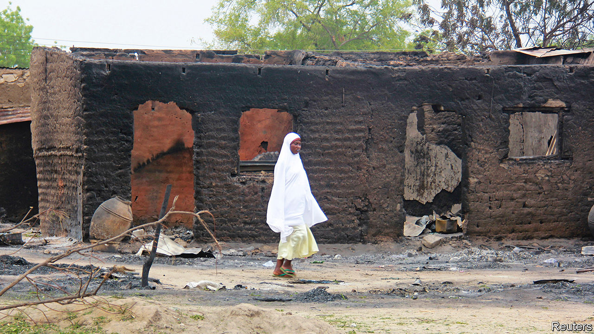
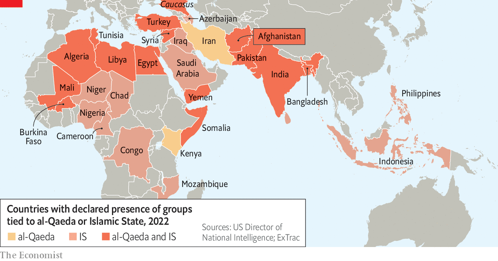

###### Far from dead, liable to spread

# How al-Qaeda and Islamic State are digging into Africa 

##### The terrorist group’s African franchises are now punchier than those in the Middle East 

 

> Aug 11th 2022 

Thirteen years have passed since al-Qaeda’s last big plot against America, a botched effort to blow up New York’s subway in 2009. The war in Afghanistan is over. Americans and Europeans are preoccupied with other crises, from Ukraine to Taiwan. But the two Hellfire missiles that killed Ayman al-Zawahiri, al-Qaeda’s leader and Osama bin Laden’s successor, on a balcony in Kabul on July 31st were a reminder of his group’s staying power.

Mr Zawahiri would not have dreamed of watching the sunrise from the luxury of Kabul’s diplomatic enclave, had the Taliban not conquered Afghanistan last summer. His safe house was owned by the Haqqani network, a group with ties to Pakistani intelligence. Siraj Haqqani, its leader, is both deputy head of the Taliban and interior minister of Afghanistan. No wonder that Mr Zawahiri, whose communications were once so patchy that many thought him dead, felt secure enough there to release a stream of videos on topics from Syria’s civil war to pro-hijab protests in India. 

In one sense Mr Zawahiri’s tenure, from 2011 to 2022, was a failure. His group mounted few big attacks in America or Europe for a decade. Nor did it topple any supposedly “apostate” Arab regimes like Saudi Arabia’s or Egypt’s. The rise of Islamic State (is) in Syria and Iraq, which had split from al-Qaeda and in 2014 set up a media-savvy caliphate that held territory for several years, made Mr Zawahiri’s outfit look like an also-ran. 

It is not. “The al-Qaeda terrorist infrastructure we faced in 2001 is long since gone,” said Ken McCallum, head of mi5, Britain’s security service, last year, shortly before Kabul fell. But that infrastructure shows signs of revival, according to a un monitoring team. Al-Qaeda has an “advisory” role with the Taliban, it notes. Al-Qaeda in the Indian Subcontinent (aqis) has 180-400 members, many of whom recently fought alongside the Taliban.

“We don’t have evidence that there is any nascent international attack capability that is starting to blossom in Afghanistan,” says Edmund Fitton-Brown, the un team’s co-ordinator. But he notes that Mr Haqqani, as interior minister, oversees citizenship, passports and travel. “This could be a longer game plan” that could lead to fresh acts of terrorism by the likes of al-Qaeda anywhere, planned in Afghanistan.

 


That will depend on whether the Taliban rein it in, fearful of the consequences of another attack mounted from Afghan soil. But what already distinguishes al-Qaeda’s position today, compared with 2001, is the breadth of its activity. In recent years the movement has become remarkably decentralised (see map). 

The Sahel, a vast, poorly governed stretch to the south of the Sahara desert, is now the world’s terrorism hotspot, accounting for more than a third of all terrorism deaths in 2021. It is home to Jama’at Nasr al-Islam wal Muslimin (the Support Group for Islam and Muslims, or jnim), a coalition affiliated to al-Qaeda. Last year it was the world’s fastest-growing jihadist organisation, measured by the increase in the tally of attacks and deaths. 

In Mali nearly 2,700 people were killed in conflict in the first six months of this year, almost 40% more than in all of 2021. Last month jihadists attacked a military checkpoint 60km from Bamako, the capital; a week later they hit the country’s main military camp on its doorstep. In Niger, deaths in conflict have fallen slightly but will probably exceed 1,000 in 2022. In Burkina Faso in the first half of the year about 2,100 people have been killed. Djibo, a town in the north, is often cut off from Bamako by jihadist roadblocks.

Crossing the continent

Al-Qaeda is also finding fertile ground in east Africa. Al-Shabab, its affiliate, controls large parts of rural Somalia. General Stephen Townsend, America’s commander for Africa until August 9th, told the Senate in March that al-Shabab is “the largest, wealthiest and most lethal al-Qaeda affiliate in the world today”. It has “grown stronger and bolder over the past year”. In May it overran an African Union base, killing more than 50 people and stealing weapons. In July a force of 500-800 al-Shabab fighters penetrated a security zone maintained by Ethiopia, then crossed 150km into that country with the aim of setting up a base in the Bale mountains.

is has also spread from its core territory in Iraq and Syria to an array of local conflicts. Its rivalry with al-Qaeda in Syria has abated; both groups struggle to survive there, though thousands of is sympathisers still lurk among Sunnis aggrieved by the Shias’ new dominance in Iraq. And it keenly recruits, funds and influences jihadists in Africa and Afghanistan. 

In Nigeria, for instance, Islamic State West Africa Province (iswap) has replaced Boko Haram as the main jihadist group. One of its offshoots, Islamic State in the Greater Sahara (isgs), has mounted indiscriminate attacks in Burkina Faso, Mali and Niger. An is-linked group has wrought havoc in northern Mozambique. Back in Afghanistan, most of the 700 people killed since America left a year ago have died at the hands of is’s local branch, is-Khorasan.

This alphabet soup of local groups can be confusing. The links to their parent organisations are often fuzzy. isgs, for instance, is really a form of “major gang criminality”, argues General Marc Conruyt, who led French forces in the Sahel until a year ago. It wraps itself in a jihadist flag but does not have a clear political project. 

Most of the groups that make up jnim are run by Malians, with local agendas in mind. Among the coalition of groups in jnim, the one perhaps most closely tied to “core al-Qaeda”, as the leadership is known, is al-Qaeda in the Islamic Maghreb. Yet even it largely ignored Mr Zawahiri’s entreaties to attack Americans rather than local security forces.

The disconnect between the jihadists’ core and periphery may be partly due to counter-terrorism successes. Al-Qaeda’s affiliate in Syria, then known as Jabhat al-Nusrah, was unable to communicate with Mr Zawahiri for three years, between 2013 and 2016, says Tore Hamming of the International Centre for the Study of Radicalisation at King’s College London. It reached out to other al-Qaeda leaders in Iran but “basically ran its own business”. The same is probably true of some African affiliates. In the case of is, many affiliates even collect money and send it to the central leadership, not vice versa, adds Mr Hamming. 

This decentralisation may help keep al-Qaeda and is alive. America has now assassinated both of al-Qaeda’s leaders, the first five heads of is in Afghanistan, and successive is leaders in Syria, most recently in February. Yet this relentless decapitation seems to have made little difference. 

The two organisations look more diffuse, however, and Mr Zawahiri’s successors are unlikely to reverse this trend. Sayf al-Adl, al-Qaeda’s heir apparent, and Abdul-Rahman al-Maghrebi, its next most senior figure, both live in Iran, where they are kept on a tight leash by Iranian intelligence. Their freedom to travel, communicate and command may be less than Mr Zawahiri enjoyed for most of his tenure. 

Does this centrifugal tendency among jihadists spell more or less danger for the West? Some argue that the violence they perpetrate in places like the Sahel and Afghanistan is dreadful for the locals but a sideshow for the West. “These are areas of limited interest to the United States,” says Daniel Byman of Georgetown University. The centrally run jihad of the 1990s against the West that culminated in 9/11 has, in this view, reversed. “Al-Qaeda has become a local group that doesn’t really prioritise external attacks,” says Mr Hamming.

Western intelligence agencies are less sanguine. The un monitoring panel reckons that jihadists in the Sahel and elsewhere must be crushed, or “one or more of them will incubate an external operational capability for al-Qaeda or a related terrorist group.” Complacency would be unwise. ■

