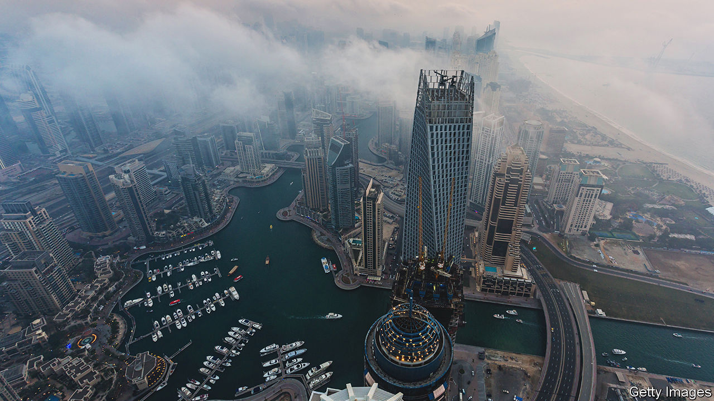

###### Joule in the rain

# The Emirates hope to jolt clouds into sharing their bounty 

##### No one is entirely sure whether it works 

 

> Aug 11th 2022 

Especially in the summer months, life in Dubai can feel like a denial of nature. The malls, the hotels, even the swimming pools are frosty. But the air outside is baking, with temperatures above 40°C and humidity so thick it fogs glasses and seeps from air-conditioning vents.

The United Arab Emirates (uae), a seven-member federation of which Dubai is part, wants to put some of that humidity to use. The country has one of the world’s keenest cloud-seeding programmes, flying some 200 missions a year from an airfield in Abu Dhabi, the capital. Every week or two, planes zip into the clouds to try to squeeze out a shower. Lately they have been joined by experimental drones: if nature will not share rain of its own accord, the uae hopes to jolt it into compliance.

Cloud-seeding has been practised for almost a century. South-East Asian countries use it to clear dry-season haze; ski resorts in America to help carpet the slopes with snow. China tried it during the summer Olympics in 2008. Officials wanted to cajole clouds into casting out their contents before they reached Beijing—and ruined the festivities.

In the early days planes would dump dry ice into clouds. Today they carry chemicals, usually silver iodide or other salts. They are meant to attract water droplets, in the hope they become heavy enough to fall to earth as rain. Whether this works is not clear. A study partly funded by America’s National Science Foundation found that cloud-seeding boosts snowfall under the right conditions. Studies in America, Israel and elsewhere were inconclusive.

The uae hopes it works. One of the driest countries on earth, it sometimes has less than 100mm (four inches) of rain a year. There are occasional rainy days in winter and brief downpours in summer that break the oppressive humidity. But nature does not provide enough water for a population of about 10m people that is still growing. Most drinking water comes from the sea. So much so that 14% of the world’s desalinated water is produced in the uae.

Climate change might supply a bit more water from the heavens. Over the New Year weekend, parts of the uae logged as much as 142mm of rain, more than a year’s worth, in just three days. Locals saw it as an auspicious start to the year: the Prophet Muhammad considered rain a blessing.

Summer has also brought unusual weather, less cheerfully. Fujairah, on the east coast, saw a freak storm in July that flooded houses and washed away cars. Seven people died. Scientists say climate change may have played a role.

Still, even a rainier uae will not be rainy enough. Last year the government started fiddling with drones. Instead of dropping chemical payloads into clouds, they deliver an electric shock. The jolt, in theory, could cause droplets to clump together: the same result as old-fashioned cloud-seeding, but without the chemicals.

The uae insists the chemical version works, even if other researchers are less sure. For Dubai’s residents, however, the programme has become something of a running jest. A day at the beach ruined by a freak storm is not simply bad luck; it might merit a complaint to the government. ■

