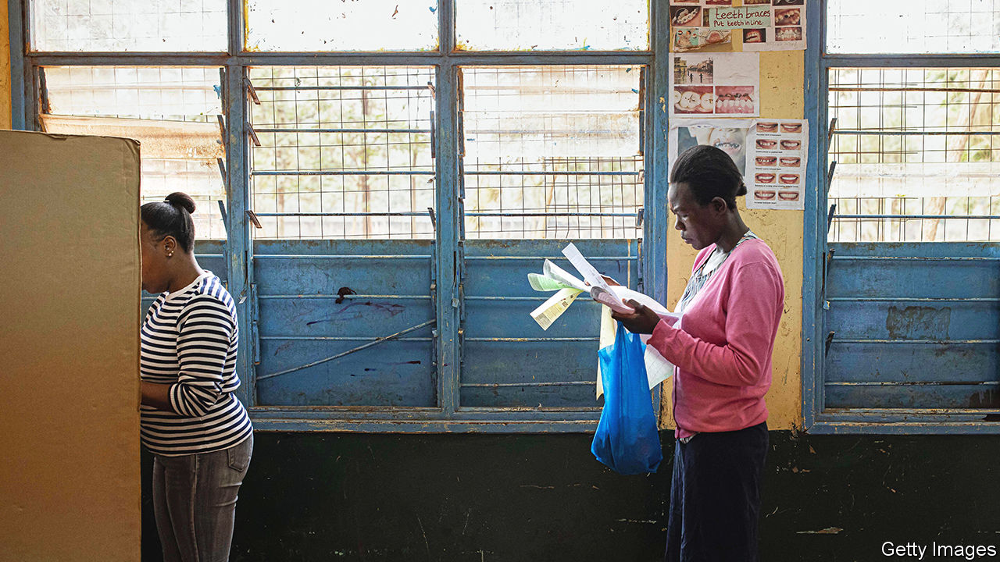

###### Too close to call

# Why Kenya’s election is going down to the wire 

##### It was Raila Odinga’s to lose 

 

> Aug 11th 2022 

Elections in kenya tend to veer between emotional extremes. The one in 2002 was joyful as voters swept an opposition candidate to the presidency for the first time. A disputed poll in 2007 was horrifying: perhaps 1,400 people were killed in its aftermath. The latest, on August 9th, has unexpectedly turned into a nail-biter.

Opinion polls in the days before the election suggested that Raila Odinga, a veteran opposition leader making his fifth run for president, would stroll to victory with a lead of six to eight points over William Ruto, the deputy president. Cynical sorts, influenced by Kenya’s history of iffy elections, reckoned that even if Mr Odinga lost, the establishment would fiddle the count in his favour. Both assumptions seem to be wide of the mark.

In 2017 the electoral commission muddled things so badly that the Supreme Court ordered a re-run. Chastened, it has conducted this vote admirably. Mindful that delays arouse suspicion, the commission published screenshots of results forms filled in by no less than 81% of its 46,229 voting stations within seven hours of the polls closing. This step has allowed for much greater public scrutiny of the counting process. It will surely make it harder for the loser to cry foul. 

Although the official result could yet trigger violence, the smoothness of the process so far bolsters Kenya’s reputation as east Africa’s most robust democracy. As strongmen elsewhere butcher constitutions to remain in power, Uhuru Kenyatta has become Kenya’s third president in a row to respect a two-term limit. 

Despite Kenya’s improving electoral performance, its political system seems to be ailing, corroded by a self-serving and unaccountable ruling class. If anyone had seemed to stand valiantly outside it, Mr Odinga was the man. In previous elections he ran as the main opposition candidate, being beaten into second place each time in contests that did not always look free and fair. This time he changed his tactics by allying himself with Mr Kenyatta. 

It seemed like a winning strategy. Mr Odinga, in effect, gained the benefits of incumbency. The harassment his supporters once experienced at police hands was visited on his opponent’s instead. Above all, the president’s endorsement was expected to give him the support of the Kikuyu, Kenya’s largest ethnic group. 

Mr Kenyatta holds the most famous Kikuyu surname. His father, Jomo, was an anti-colonial hero who became Kenya’s first president. Yet for all his pedigree, the president has singularly failed to deliver to Mr Odinga the Kikuyu vote. Provisional results suggest that he has won a measly 20% of the vote in Kikuyuland. 

Mr Odinga’s failure to win over the Kikuyu, which has turned what should have been a coronation into a tight race, is not the only surprise in this contest. Perhaps more startling is the success of Mr Ruto in winning votes in Kikuyuland, seeing that the International Criminal Court in The Hague charged him with instigating attacks in which hundreds of Kikuyus were killed after the elections in 2007. (Mr Ruto has denied wrongdoing and the court has since suspended its prosecution.)

Mr Ruto’s success among the Kikuyu can be attributed partly to the disappointment many feel about how the president acquitted himself in office. In particular, Mr Kenyatta has struggled to shake off perceptions that he faced a conflict of interest since his family has huge commercial interests, encompassing everything from dairy farming to tourism and banks. “We are ruled by the richest man in the country and yet we are still poor,” says Mwangi Githinji, a lorry driver in Gatundu, the Kenyatta family’s home town.

If Mr Ruto wins it will signal a momentous shift in Kenya’s politics, which have long been sullied by ethnicity. Mr Ruto has campaigned to persuade Kikuyus to forget about the past by tapping into fresh grievances. Presenting himself as the champion of the poor, he won support from have-nots across the country. For the first time, a Kenyan election has been fought—and may indeed be won—as much on class as on ethnic lines. ■

