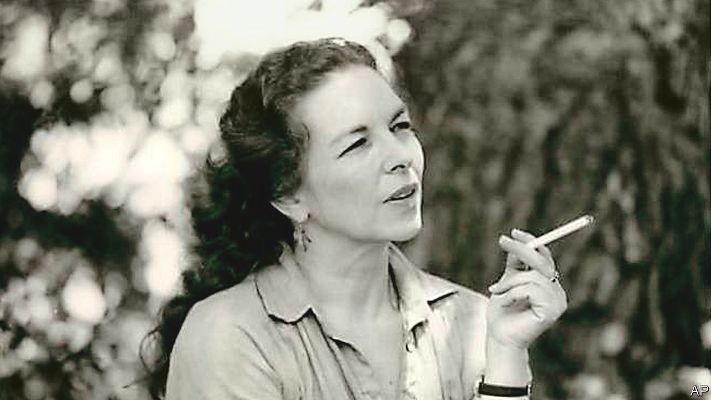

###### The doors of perception

# Ann Shulgin pioneered the use of psychedelics in therapy 

##### The experimental drug researcher died on July 9th, aged 91 

 

> Aug 11th 2022 

The first time she tried a hallucinogen, she was nearly sick. The taste of that witch’s brew—the thick, brown ooze that you get when you mash the peyote plant down—was so bad that she retched the moment it hit her tongue. My God, it was awful. For a long time all she could do was to sit on her bed and try not to vomit. Then the walls of her bedroom started to shimmer. Then time stilled. Then—if there even was a “then” anymore—the dust motes, floating in the air above her, started to sing. It was Ann Shulgin’s first taste of hallucinogens, but not her last, for in her long life she would have around 2,000 psychedelic experiences. 

The aim was clear. Not merely to open the doors of perception—to see a world in a grain of sand and heaven in a wild flower—but to step through those doors, and learn. William Blake had done it with poetry. Aldous Huxley, whose writing she loved, had done it with mescaline. She did it that first time with peyote. Later, when she met her beloved husband—the chemist and “Godfather of Ecstasy”, Alexander “Sasha” Shulgin—she did it with more or less anything he made in his lab. And he made a lot: mdma, pma, pmma, mescaline. Though she never liked the stoning drugs. And if you couldn’t make love on a drug, as she later said, stretching out her wrinkled hands, then “there’s something not quite right.”

Many thought there was something not quite right with all this anyway. Later, when the moral panics got going, and everyone started to agonise over ecstasy, people got so uptight about what they did. It didn’t belong in a decent society. But, she would point out, psychedelic experiences weren’t so strange. People experienced altered states in everyday life. You can have a complete psychedelic experience just by falling in love, “no question.” 

Which, she felt, was nice. Because no one can legislate against that. And falling in love, as she liked to point out, “is also potentially very dangerous”. You could die from it. All those murders. 

Though there were other ways to die from love, as well she knew. She had been in her mid-20s at the time and working in the University of California medical centre as an administrator. Living in the lonely grey world of those who have left one home and not yet found the next. Dinners in cafeterias. Books as best friends. Soul in stasis. Then one day, in the cafeteria at work, a man had appeared at her table, a doctor. He had pale hair and a nice laugh and—and even at her age she sensed this was rare—didn’t mind being told that he was wrong. 

Though he didn’t respond that well when things actually went wrong. A few months later there was a pregnancy. It was the 1950s, and he was married, and ambivalent. So when, at two months, she felt the contractions begin, she coped with the miscarriage alone. She squatted on the toilet, alone. She went to lie on the bed, alone. She woke, alone, in a pool of her own blood. Later, in hospital, she would be told that she had lost six pints of blood. She was struck by that: didn’t humans only contain nine? When, lightheaded with blood loss, she saw her reflection in the mirror in hospital she giggled: grey-green, what a funny colour for a face to be. 

She finally met Sasha in her 40s, after three previous marriages, and was impressed. He had an Old Testament mane of hair, and he smelt of carnations and cut grass. He invented drugs, he explained, and had taught at the University of California. When she asked him if the drugs he made were safe, he told her straight: no drug is ever safe. Nothing is. Did she really want to give it a try? 

They took their drugs with care. They didn’t go “banging about” on a Saturday night. They took them calmly, on Sunday mornings, often at his house, often with friends, always with rules. There must be no other drugs in your system; no violence; if there was a problem, a hand should be raised. She knew things could still go wrong. One time, she had wept and wept. And that first time, before Sasha, she had felt a rapidly widening hole, a void, open in her body, just above the navel, below the ribcage. That had been odd.

Their trips, like Huxley’s, were recorded. When, on a bright May morning in 1953 Huxley had swallowed four-tenths of a gram of mescaline, he had been watched by a researcher who had recorded his responses to the drug. He had seen books glow like rubies; a slow dance of golden lights; flowers shine with eternal life. When the researcher asked Huxley how he felt about time, he had replied with clarity: “There seems to be plenty of it.” 

She had been so pleased to see that Sasha had Huxley on his bookshelves, too. Like Huxley, they approached psychedelia scientifically, documenting delirium according to Sasha’s homemade scale. “Plus-one” was the beginning of a trip; it often involved a touch of nausea. Plus-two: visual enhancement. Plus-four was godlike. Plus-four offered, as Sasha’s notes to one drug put it, “a tinge of omnipotence, blended with a modest amount of omniscience.” Then, as if in proof of the “modest”: “I forget what the third omni- is, but it’s present also.” 

They married and kept experimenting. It wasn’t just fun. Take a psychedelic, and you might become aware of yourself as a glowing thread in a tapestry and “all those…clichés”. But for her, mdma was more: it was “an insight drug”. That was its major function. As a lay therapist, she offered it to her patients: it offered insight without self-hatred. 

Creating a new drug was, she thought, like composing new music; though not everyone liked the sound of that. In 1994 the Drug Enforcement Administration raided their home. They had violated regulations; they were to be fined $25,000; their life was turned upside down. She took a little insight from this, too, chiefly that drugs officers were heavy-footed. To Sasha’s disgust, they had stomped on some peyote cacti. “Not what I call good manners.”

Later, the mood changed. Others started to follow what she had done. Universities and psychiatrists started to research the benefits of mdma in therapy. She started to be called a “pioneer” and people started to write papers on how psychedelics can increase “brain connectivity” and “neuroplasticity”. But she would always put it more simply: they allowed you to love yourself. ■

