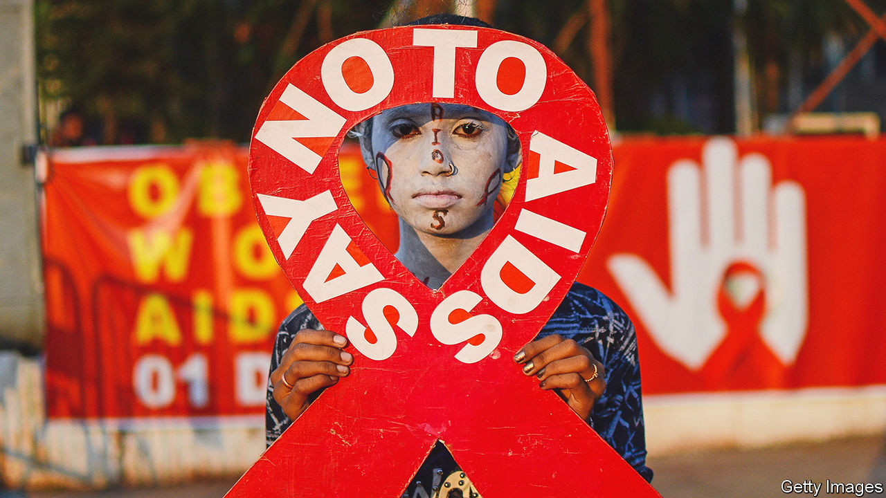
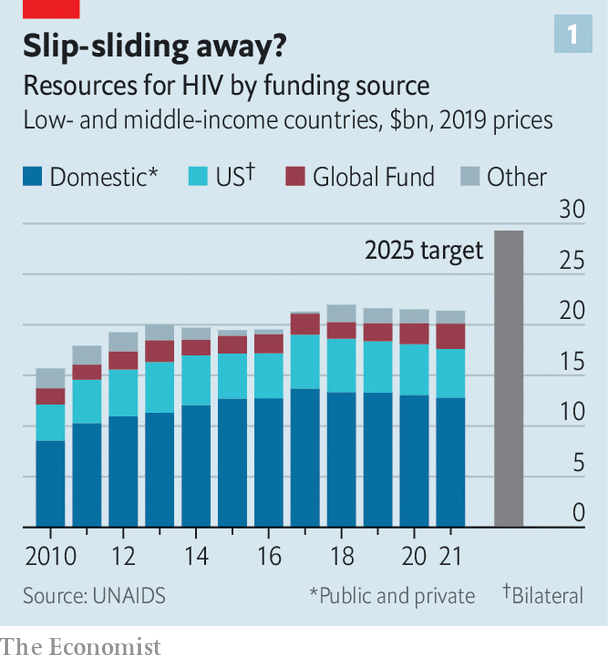
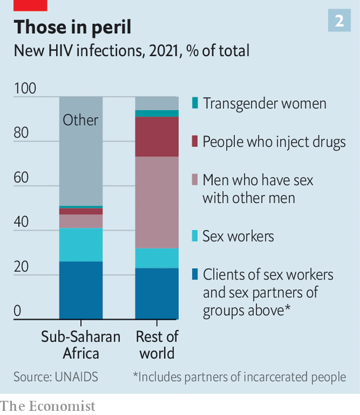

###### The 24th International AIDS Conference

# Despite setbacks, HIV can be beaten 

##### But doing so will take patience and money 

 

> Aug 2nd 2022 

It is a tribute to human ingenuity and determination that aids no longer makes headlines. That is because hiv, the virus which causes it, is on the run. According to the latest update by unaids, the un programme that keeps tabs on such matters, deaths from aids-related illnesses have been falling since 2004 and new infections since 1996. Indeed, the fact that the number of people living with the virus (currently about 38m) continues to rise is actually good news. It means they are being kept alive by antiretroviral drug therapy (art), rather than dropping out of the statistics by dying. But hiv still kills in numbers that would never be off the front pages if a war, rather than a virus, were the cause. So far, it has ended the lives of some 40m people, with 650,000 of those deaths having happened in 2021.

There is, moreover, a feeling of nervousness among doctors and activists alike. Funding directed at the problem in poor and middle-income countries has shrunk since 2018. And the year-on-year fall in new infections in 2021 was the smallest since 2016. This may be a blip. Covid-19 has changed immediate medical priorities in many countries, to the detriment of hiv control. But if blip turns to slide, things could go wrong quite fast in some places, particularly in Africa.

Balanced against that, though, the scientific news about aids is positive. New treatments—and particularly new preventions—are being developed and deployed, and an unexpected side-effect of covid has been a novel approach to vaccination that seems well-suited to tackling hiv as well.

To discuss these matters, exchange intelligence and make battle plans, a crowd of researchers, clinicians, activists and patients recently gathered under the auspices of the International aids Society (ias). This latest meeting, the 24th, was held in Montreal—a venue legendary in the field of aids. This was the place where, in 1989, activists and patients gatecrashed what had, until then, been a purely scientific gathering, and created the productive hybrid that these meetings have now become.

The aids establishment, activists and scientists alike, love a slogan. One of the first, “3 by 5”, captured the aspiration, promulgated by the World Health Organisation (who) in 2003, to put 3m people on art by 2005. This was followed in 2014 by the unaids target of 90-90-90: the intention that, by 2020, 90% of those living with hiv would know their status, that 90% of that 90% would be taking advantage of treatment, and that 90% of those thus on treatment would have the virus suppressed within their bodies.

U=U

The slogan , though, is “u=u”, dreamed up by the Prevention Access Campaign, a group of activists. This is not a mathematical identity. The two us stand for different things: “undetectable” and “untransmittable”, respectively. But it is this equation, above all, which makes attempts to stop hiv spreading realistic—for the idea it encapsulates is that someone for whom art has suppressed viral load to the point that it is undetectable cannot then pass the virus on.

This may not sound surprising, but it was, until quite recently, hotly contested. Only with publication in the 2010s of well-controlled studies which proved the point has u=u, known more formally as “treatment as prevention”, been universally acknowledged. The point, though, is obvious. Find, identify and treat every case of hiv infection on the planet and that would be the end of the pandemic. The latest un aspiration, announced in 2021, is not quite that ambitious. It is to achieve 95-95-95 (and a whole lot of other targets, many of them social, rather than strictly medical) by 2025. That, though, is ambition enough. 

As Paul DeLay, who helped make the relevant calculations, explained, modelling shows that reaching those various targets will be needed to achieve the wider un goal of ending aids as “a public-health threat” by 2030. The un defines this as a reduction in new incidences of, and mortality from, hiv by 90%, compared with 2010. More specifically, the idea is to drive countries below an incidence-to-prevalence ratio (ipr) of 0.03. The ipr is defined as the number of new infections occurring per year, divided by the number of people living with hiv in a given population. If this value is below 0.03, the epidemic will start contracting of its own accord. At the moment, according to unaids, of 117 countries with a published estimate, 31 have an ipr below that value.

 


None of this comes cheap, though. It is the additional targets beyond 95-95-95, including such things as more-granular data collection and more effort to reach particularly vulnerable populations, rather than a simple desire for extra “business as usual” money, that has so massively put up the amount of cash unaids reckons will be needed in three years’ time (see chart 1). 

At the moment, there is some way to go to reach even the headline goal of 95-95-95. According to a unaids update the numbers last year were 85-88-92. But even if the deadline slips, as it did for both 3 by 5 and 90-90-90, provided the political will to get there is maintained and the money continues to flow there is no obvious reason why this goal should not eventually be met.

Moreover, other pharmaceutical tools than art are now available to assist. The most promising is pre-exposure prophylaxis (prep), which involves giving drugs that ward off infection to those who feel they may need them. prep is an idea that has long been discussed, and the best established version, a daily oral preparation called Truvada, has been available for a decade. But in the past two years prescriptions for Truvada and its generic equivalents have taken off, with 1m new recipients in 2020 and 800,000 in 2021, according to unaids. 

Admittedly, as Anthony Fauci, President Joe Biden’s chief medical adviser and a doyen of the field of aids, pointed out in his pep talk to the meeting, those figures are still far short of the tens of millions of people who could benefit. But even tens of millions might seem small beer compared with the world’s population. For the truth is that aids is not an equal-opportunity killer. Some people are at vastly greater risk than others.

 


This was highlighted in the unaids report (see chart 2). Even in sub-Saharan Africa, the part of the world where hiv is most widespread, about half of new cases are in recognised risk groups (sex workers and their clients, gay and bisexual men, transgender women, injecting drug users, and the partners of all of these groups). In the rest of the world that figure is 94%.

The most at risk

A consequence of this is that those most at risk often know who they are and so will come forward for prep—or, if they do not, can be sought out and offered it. And since some of those most at risk are also in a position to infect many others, breaking the chain of transmission here is a winning strategy. 

Moreover, as technologies tend to, prep is getting better. Besides Truvada and its generic equivalents, and a closely related product called Descovy, two other approaches are now available. 

Remembering to take a pill every day is a nuisance, so there is considerable interest in an injectable form of prep called cabotegravir. This approach, approved by America’s Food and Drug Administration (fda) in December 2021, requires a jab only once every two months.

The third prep offering, recommended in 2021 by the who, is also long-lasting. It is the dapivirine vaginal ring (dvr), a flexible device made of silicone impregnated with a powerful antiviral agent. This needs replacement but once a month. Unlike Truvada and Descovy, and cabotegravir, all of which have drug companies behind them (Gilead Sciences for the first two and ViiV Healthcare for the third), the dvr is the product of a charity, the International Partnership for Microbicides, founded in 2002 by Zeda Rosenberg and still run by her.

art, too, now offers an alternative to daily pill-popping. Cabenuva, a combination of cabotegravir and a second drug, rilpivirine, was approved by the fda for use as a monthly injection in January 2021, and in some circumstances that approved interval has been raised to two months.

And then there is that idea borrowed from the response to covid: deploying mrna vaccines against hiv. 

The search for an hiv vaccine goes back almost as far as the identification of the virus itself. The result has been diddly squat. An important reason is that, unlike viruses that have been successfully vaccinated against in the past, hiv plays cat-and-mouse with the body’s immune response, as each tries to out-evolve the other. Mimicking this process with a vaccine is difficult. But mrna offers a way to do so. 

Molecules of mrna carry the plans of proteins, or fragments thereof. In the case of those used in an aids vaccine, these are bits of the viral envelope. These plans are then read by body cells and turned into envelope fragments which go on to stimulate an immune response. Crucially, mrna is easily tweaked to generate novel versions of these envelope fragments. That, researchers hope, will allow a series of vaccinations to mimic the process of co-evolution and thus coax the immune system towards producing the desideratum of an hiv vaccine: so-called neutralising antibodies which disable the virus.

There are, then, plenty of tools both around already and in the pipeline. But they need to be deployed correctly. Here, Dr Fauci had some troubling news. These were data on art compliance, and they showed that in America people adhere properly to their regimes only about 40% of the time, suboptimally about 20% and poorly about 40%. That emphasises that however good a drug is, it is no good if people don’t take it or take it badly. People, as well as immune systems, often need to be coaxed into doing the right thing.

As barriers to compliance, or seeking treatment in the first place, Dr Fauci mentioned things ranging from simple forgetfulness, via housing and food insecurity, to stigma (always a problem with hiv, given prejudiced social attitudes towards the ways it is spread), misuse of alcohol and illegal recreational drugs, and even “pill fatigue”. On top of these, in countries less favoured than America, one might add poor education—particularly, in many places, of girls—criminalisation of (as opposed to prejudiced attitudes towards) homosexual behaviour, criminalisation of sex work, and poor medical infrastructure. 

Such things are, indeed, among the cost-raising non-medical targets of the un’s 2025 goals. But many of them will require either political action that is unlikely soon, or behavioural changes in people beyond those infected or in imminent risk of infection. That is a tall order and, it might be argued, one which risks detracting from focused and measurable targets for pill-popping. In the end, though, closing the gap between those on treatment (some 29m) and those who would benefit from being so (a further 10m) depends on it.

A game of hide and seek

All of the art in the world is not, however, the same as a cure—even though a compliant user of art has almost the same life expectancy as an uninfected individual. Others are working on trying to cure those already infected. There is no lack of ideas, but the problem is that hiv’s life cycle, a part of which involves copying its genes into the nuclear dna of cells it infects, means it can lie dormant in those cells indefinitely. Antiretroviral drugs can deal with it when such a cell awakens. But they can neither cleanse dna so hijacked nor recognise and kill cells so afflicted. 

In a session held before the main meeting began, Sharon Lewin of the University of Melbourne, who is the incoming president of the ias, outlined the options. These include “shock and kill”, which would activate dormant carrier cells, exposing them to attack by drugs; recruiting the immune system in novel ways to attack dormant cells as they wake up; gene therapy that modifies immune-system cells collected from a patient to introduce a genetic change that protects them from hiv infection and then re-transfuses them back again; and similar therapy that works directly on cells in the body to excise hiv dna from their chromosomes. 

All of these approaches have their drawbacks. Progress is slow. Unlike antiretrovirals, which are small, easily synthesised molecules that can be stored without difficulty, any practical therapy that might result from them is likely to be fiddlesome and expensive, at least to start with. But maybe not for ever. art itself started life as regimens which required multiple doses a day and cost thousands of dollars a year. Now, a single, daily pill costing 25 cents will do the job. Technology, once invented, always gets better. You just have to come up with it in the first place. ■


