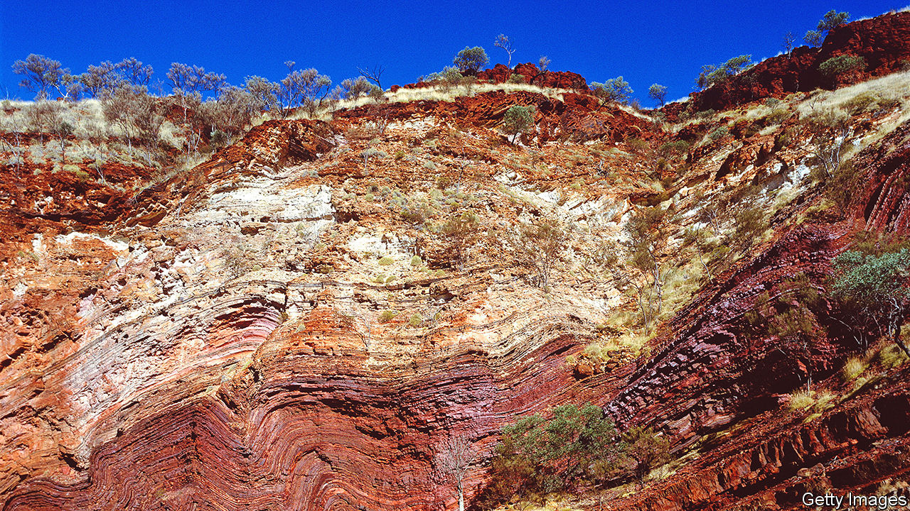

###### Forming Earth

# Earth’s continents may owe their existence to bombardment from outer space 

##### Rather than forces within 

 

> Aug 10th 2022 

The earth is a poor archivist. The rigid tectonic plates of its outer layers are continuously in motion, sliding over one another to swallow almost all records of the past, melting them into the mantle and then casting them anew. This makes it difficult to reconstruct the 4.5bn-year-old  formative years. 

A particular problem is the crucial biographical detail of how the first continents came to be. Studies of ancient rocks suggest that fragments of solid crust existed as far back as 4bn years ago, when  was mostly covered in water, but their genesis remains disputed. While plate tectonics are the dominant mechanism for generating new continental crust today, in the distant past Earth’s subsurface temperatures are widely thought to have been too hot to allow plates to form.

A paper published this week in  attempts to resolve this conundrum. Tim Johnson of Curtin University, Australia, and his colleagues argue that the planet’s transformation was not triggered by forces from within, but from outer space—in the form of collisions from meteorites that disrupted the surface, causing fragments of the crust to melt in the presence of water, cool and resolve themselves into buoyant patches of land that would later act as nuclei for new continents.

Dr Johnson’s thesis is not new, but the lack of direct evidence means it has never taken root. The more popular explanation for the first continent formation points the finger at plumes of hot matter rising from the Earth’s mantle to the surface, much like bubbles in a lava lamp. Then, if sufficiently hot, their underside would melt to produce buoyant granite, leading to the first continental plateaus. 

The new study offers evidence that sits uncomfortably with this theory. Dr Johnson and his colleagues looked at the Pilbara craton, an approximately 3.5bn-year-old slab of north-western Australia, roughly the size of Germany, which represents one of the few remaining scraps of the early Earth’s continental crust.

The team traversed the craton to collect zircon crystals, a mineral with two properties ideally suited to the task. First, their content of radioactive uranium decays to lead at a rate that can be used to calculate their age. And second, the isotopes of oxygen found within their structure are representative of the environment in which they grew. Zircons whose ratio of oxygen-18 to oxygen-16 is 0.5% higher than found in seawater, for example, would have originated far below Earth’s surface. Those with values closer to those found in seawater formed much nearer the crust.

Analysis led the researchers to conclude that the oldest crystals on the Pilbara—those formed around 3.5bn years ago—must have originated close to the surface. This favours impact formation, as zircons transported by mantle plumes would have more profound origins. “Giant impacts plus water is a really good way of making a continent,” says Dr Johnson.

The textbooks will not be rewritten overnight. Marion Garçon, a geologist at Clermont-Auvergne University in France, finds the evidence of impact formation plausible on a local scale, but says more evidence will be needed to extrapolate it planet-wide. Fortunately, this can be done. Ancient continental fragments exist in other parts of Australia as well as Canada and South Africa. Analyses of their constituent zircons could well provide valuable supporting evidence that Earth’s continents owe their existence to bodies from outer space. But the authors will also need to explain why zircons previously found at other, even older, sites do not display the same telltale signature of impact.

This work could be significant in other ways. While the rate of asteroid collisions experienced by early Earth generally declined over time, it may have spiked some 3.9bn years ago during a postulated event known as the Late Heavy Bombardment (lhb). What are taken by some as signs of the lhb pockmark the static surfaces of Mars and the Moon. Earth’s constant ructions, however, will have destroyed any signs of it. If Dr Johnson is right, then the formation of the continents could be the first earthly evidence of one of the solar system’s most dramatic moments. ■


