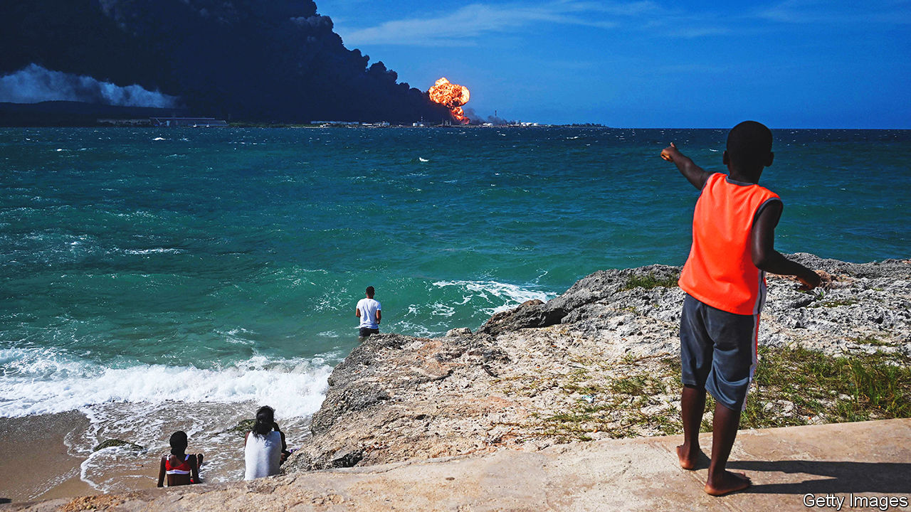

###### Caribbean conflagration

# Human error may have played a role in Cuba’s oil-terminal fire 

##### It will exacerbate the island’s fuel and power shortages 

 

> Aug 11th 2022 

Lightning hit a storage tank at Cuba’s main oil terminal in Matanzas, starting a fire that spread to three other tanks. One firefighter died and 14 are missing. The lightning rod had not been maintained, say reports in independent media. The fire contributed to a water shortage that forced the shutdown of a nearby power plant. Cuba was already suffering from fuel shortages and blackouts, which had triggered protests. 

