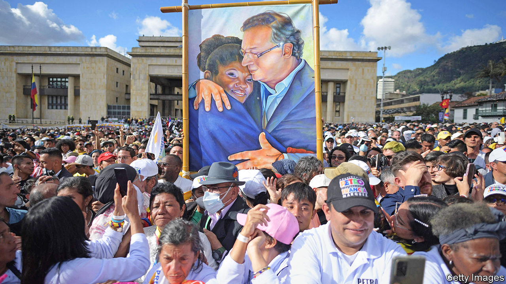
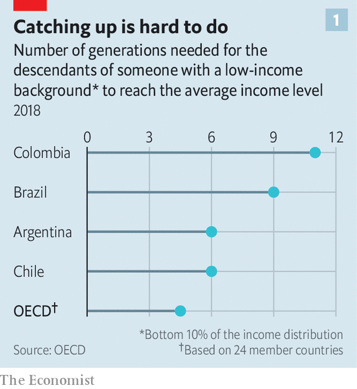
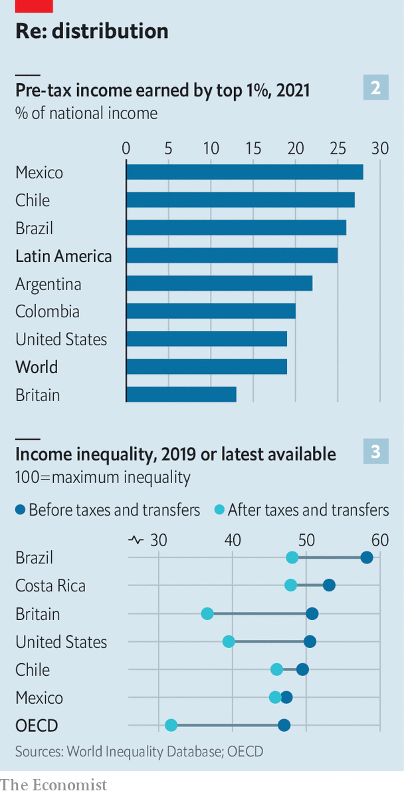

###### The jet set and the rest

# Inequality in Latin America is fuelling a new wave of populism 

##### Voters are once again turning to politicians who promise radical change 

 

> Aug 6th 2022 

On august 7th Gustavo Petro was sworn in as Colombia’s president. He is the first left-wing politician to hold that office. Together with his vice-president, Francia Márquez, a human-rights activist and environmental lawyer (and the first Afro-Colombian to have the job), Mr Petro campaigned on promises to redistribute wealth from Colombia’s richest to its poorest, to expand public education and to scrap all new oil exploration in the country. “We will cease to be one of the most unequal societies in the world,” his programme declared. The radical message worked: in June’s election he was backed by 11m people, or 50.4% of voters. 

 


It is not surprising that many Colombians are fed up. The country’s Gini coefficient, which measures how income is distributed in a country—zero implies that it is shared equally and 100 implies that one person scoops up all the nation’s income—is, at 54, higher than almost anywhere else in the world. At current levels of social mobility, it would take a whopping 11 generations for the descendants of parents in a typical poor Colombian family to reach the country’s average income, according to the oecd, a club of mostly rich countries. That is more than double the average in the oecd (see chart 1). “Equality is possible if we are able to generate wealth for all,” declared Mr Petro at his inauguration. 

 


Colombia’s inequality, though unusual by , is only slightly more severe than in other parts of Latin America. The region is the world’s most unequal, along with sub-Saharan Africa. Figures from the World Inequality Database, overseen by Thomas Piketty, an economist, provide estimates of top incomes based on tax data. They show that the richest 1% of Latin Americans capture 25% of their countries’ national incomes, compared with 18% in the United States (see chart 2). In much of the region the rich have recently become relatively richer. In Mexico the share of income earned by the richest 1% rose by more than ten percentage points between 2000 and 2019. 

Across much of Latin America income inequality fell during the 2000s, thanks largely to high commodity prices and rapid growth that allowed governments to institute relatively generous social programmes. But a subsequent decade of low growth, coupled with the pandemic, reversed many of these gains. The Inter-American Development Bank says that Gini coefficients rose by 6-8% in Colombia, Peru and Bolivia between 2019 and 2020. Losses of jobs and incomes have been bigger among the poorest households. According to the Economic Commission for Latin America and the Caribbean (eclac), a un agency, the number of people who are extremely poor—meaning they are unable to buy enough basic food—rose by 5m from 2020 to 2021, to 86m. 

Even before covid-19, the region’s yawning inequality contributed to huge and, at times, violent protests in Chile and Colombia. This summer the biggest demonstrations in more than 30 years took place in Panama, one of Latin America’s most stable countries. Inflation was the trigger but inequality was one of the protesters’ main grievances. 

Its significance is also increasingly evident at the ballot box. Along with Mr Petro several  have been elected in the past year. In March Gabriel Boric, a 36-year-old former student leader and protester, was inaugurated as  in 50 years. Last year , a former rural schoolteacher and union leader, became president of Peru. And Luiz Inácio Lula da Silva, a left-wing former president of Brazil, is the favourite to win back his old job at elections in October. 

One of the causes of Latin America’s inequality is lack of competition. The region is dominated by huge, well-connected, often family-owned business groups in sectors with needlessly high barriers to entry. Many fantastically rich people benefit from highly uncompetitive markets. 

For example Carlos Slim, Latin America’s richest man and one of the world’s wealthiest billionaires, made his money by dominating Mexico’s telecommunications industry in the 1990s. A report by the oecd in 2011 found that his company, América Móvil, controlled 80% of the fixed-line market and 70% of the mobile-phone market, and that profit margins were nearly double the average in the oecd. It estimated that between 2005 and 2009 the lack of competition cost Mexico $129bn, the equivalent of nearly 2% of gdp per year.

Measures intended to help poorer workers in fact lock them out of formal work. Expensive levies to fund health and unemployment insurance, along with mandatory social-security benefits, can amount to as much as 47% of the average cost of hiring someone in Argentina and Brazil. In Colombia almost 20% of firms say that labour regulations are a major obstacle to creating new jobs, significantly higher than in most developing countries. The minimum wage there is higher relative to the median income than in most oecd economies. The result is that just 40% of Colombian workers have formal jobs, one of the lowest shares in the region. Across Latin America, only around half of workers have a formal job; in some countries, such as Bolivia and Peru, scarcely one-third do.

Taxes do little to reduce inequality. Tax revenues make up only 22% of gdp in Latin America, compared with 34% in the oecd. In richer countries with better tax collection, inequality decreases after taxes and transfers redistribute income to the poorest. But in Chile and Mexico, almost no change occurs (see chart 3). Taxes also focus on goods and services instead of income, hitting the poor hardest. Across the region money raised through personal income taxes comes to only 2% of gdp, compared with 10% in the United States, for instance. El Salvador does not have taxes on property or inheritance; Guatemala’s top rate of income tax is a paltry 7%, despite several attempts to raise it. Many people and companies do not pay what they owe: according to the latest estimates by eclac, Latin America lost revenues worth around 6% of gdp in 2018 to tax evasion and avoidance, the equivalent of $325bn.

Governments have taken some steps to address these problems. In 2013 Mexico overhauled its telecoms sector to spur competition. By 2017 prices in mobile broadband had fallen by 61%. Chile beefed up its antitrust regulator in 2016. Since the mid-2000s, several countries have set up independent commissions to tackle corruption, which accentuates perceptions of unfairness. In Guatemala the findings of one such body led a  in 2015. Yet reform is not easy. A score of judges and prosecutors investigating corruption in Guatemala have been forced into exile since 2018. 

The feeling that democracies are rigged in favour of the rich and powerful undermines both democracy and economic reform. According to a survey conducted last year by Vanderbilt University in Tennessee, over 90% of Paraguayans and Colombians believe that the rich sometimes or always buy elections. An average of three-quarters of respondents to Latinobarómetro, another regional survey, believe that governments cater to “powerful groups”. 

These inequities, both real and perceived, have paved the way for politicians such as Mr Petro and Mr Boric. As candidates, both made big promises, such as, in Chile, forgiving student debt and making public transport free or, in Colombia, giving every unemployed person (11% of the workforce) a state job if they could not find one in the private sector. These implausible promises were part of their appeal. “Economic benefits have gone to the same people for so long. We are exhausted,” says Angela Martínez-Lighton, a 33-year-old activist who voted for Mr Petro.

It remains to be seen whether Mr Petro and Mr Boric become more pragmatic when faced with the realities of office. Both have already tried to calm market jitters by appointing sensible finance ministers (Mr Petro’s has already ruled out making the state the employer of last resort). And both want to pass tax reforms that aim to place a greater burden on rich individuals while also protecting growth. 

Mr Petro has proposed a reform that seeks to increase revenue by nearly 2% of gdp next year in part by raising rates paid by the top 2% of income earners, imposing a wealth tax (starting at 0.5% on assets of around $700,000) and taxing exports of oil and other commodities. Mr Boric hopes to increase the share of tax revenue by four percentage points to 31.7% of gdp by 2026, slightly below the oecd average. He would increase personal income taxes for the top 3% of earners and introduce Chile’s first wealth tax, of 1% for people with more than $5m in assets. 

Things could go awry. Chile’s new tax-reform proposal levies hefty fees on the mining industry, which could discourage investment in copper mining, a mainstay of the economy. The war in Ukraine, and rising interest rates in the United States, have put Latin America’s economies in a tight spot, making it harder for governments to keep their promises. Mr Boric’s approval rating has sunk from 50% when he took office in March to 37%. Mr Petro will hope his honeymoon lasts longer. ■

