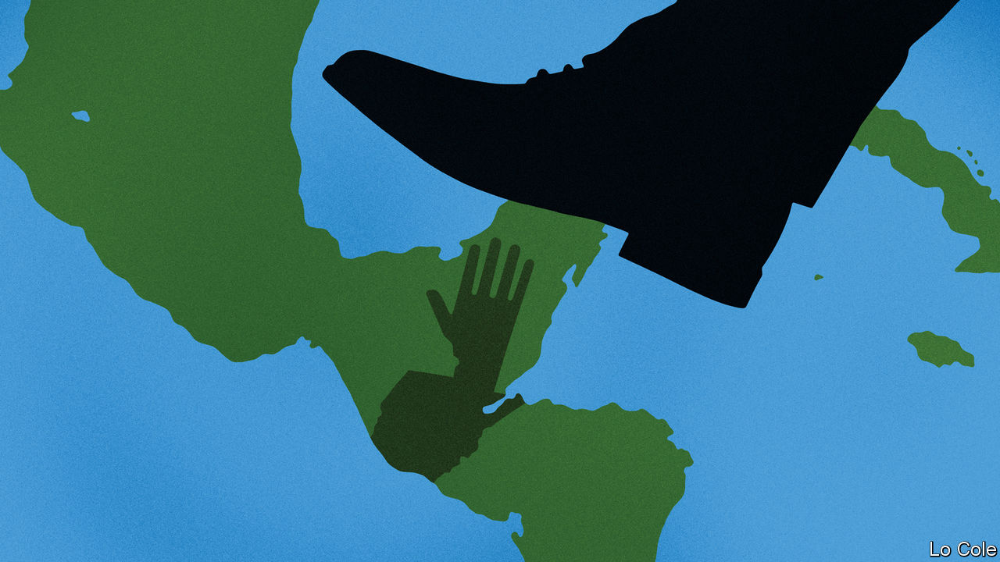

###### Bello

# The drift to authoritarianism accelerates in Central America 

##### Guatemala arrests a crusading journalist 

 

> Aug 11th 2022 

For more than 30 years José Rubén Zamora’s newspaper has crusaded against corruption in Guatemala, making many enemies along the way. On July 29th police raided Mr Zamora’s home and arrested him. This week he appeared in court on charges including money laundering and blackmail. According to Rafael Curruchiche, the anti-corruption prosecutor, the publisher was not arrested for his journalism but for his “business activity”, for allegedly trying to swap some $40,000 in cash for a cheque from a former banker accused of corruption who is now collaborating with the authorities. Mr Zamora says he is a victim of “political persecution”. Many Guatemalans believe him. His arrest is another milestone in the country’s seeming return to authoritarian rule.

For much of Mr Zamora’s career Guatemala, with 17m people, saw halting democratic progress. A long civil war between leftist guerrillas and military dictatorships, which caused some 200,000 deaths, ended with a peace agreement in 1996. The economy has grown steadily. But roughly half of Guatemalans, many of them indigenous, live on less than $5.50 a day (adjusted for local purchasing power), and the country has the world’s fourth-highest incidence of child malnutrition. Its biggest export is people: the 1.5m or more Guatemalans who live in the United States sent back remittances equal to 15% of gdp in 2020.

Reformers blame many of the country’s ills on the corruption of an entrenched power structure, “a political-criminal network of big business, organised crime and politicians who become businesspeople”, as Bernardo Arévalo, an opposition legislator, puts it. That network was placed on the defensive after a reforming president invited the United Nations in 2006 to set up an anti-corruption commission known as cicig. Working with invigorated local prosecutors and judges, cicig secured the conviction of a former president. Another president, Otto Pérez Molina, a retired general, resigned in 2015, after big street demonstrations persuaded Congress to lift his immunity from prosecution. He has spent the years since then in preventive detention on charges of customs fraud. 

But cicig overreached. Headed most recently by Iván Velásquez, a Colombian prosecutor who this week became his country’s defence minister, it sought criminal charges against Mr Pérez’s successor, Jimmy Morales, for a campaign-finance transgression of which he said he was unaware. Mr Morales refused to renew cicig’s mandate. It departed in 2018.

The government of Alejandro Giammattei, a conservative who won in 2019, has gone on to assault the Guatemalan judiciary. The government’s allies in Congress have hobbled the Constitutional Court and installed a pliant attorney-general, Consuelo Porras. Two dozen prosecutors and judges as well as several journalists have been forced into exile; others have been arrested. “The political class has united behind impunity” for corruption, says Daniel Haering, a political scientist in Guatemala City.

Many in Washington worry about the weakness of democracy and the rule of law across Central America, a big source of migrants. Under Daniel Ortega, Nicaragua has become a dictatorship. El Salvador’s wildly popular strongman president, Nayib Bukele, has taken control of Congress and the judiciary and has locked up some 45,000 suspected gang members. Honduras’s former president, Juan Orlando Hernández, is in jail in New York, facing charges of drug-trafficking; the country’s outlook under a new left-wing government is uncertain. Joe Biden’s administration has named and sanctioned 36 Guatemalans, mainly officials and business people, as “corrupt and undemocratic actors” in Central America. They include Ms Porras and Mr Curruchiche, who both deny wrongdoing. Yet American pressure has so far proved ineffective.

The worry now is that next year’s general election will be rigged. In 2019 the Constitutional Court blocked the candidacy of Thelma Aldana, a popular former attorney-general who collaborated with cicig and who might have won. With an approval rating of just 19% in a recent poll by cid Gallup, Mr Giammattei, who is constitutionally barred from running again, is one of Latin America’s least popular presidents. But his supporters dream of installing an ally by blocking more candidates this time, reckons Mr Haering. They may manage it. The opposition is divided and the streets are quiescent. Guatemala’s political class includes many more like Mr Giammattei.


 


