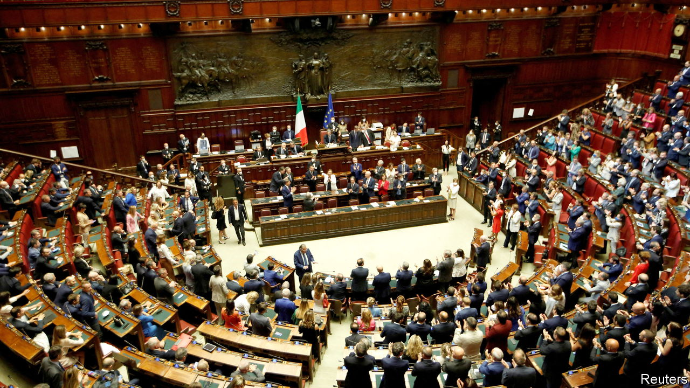

###### The Economist explains

# What do caretaker governments take care of? 

##### Their powers vary—and some perform virtually all the duties of permanent ones 

 

> Aug 10th 2022 

INTERIM GOVERNMENTS are all the rage. They can be found in Afghanistan, Britain, Bulgaria, Israel and Italy. In democratic systems, administrations of this kind usually appear after an elected government has collapsed. Their task is to ensure that the seats around the cabinet table are kept warm until a new government is formed, normally after an election. Elsewhere, interim governments may be sworn in after a coup, or other violent political upheaval. What do stop-gap executives achieve?

Sometimes the interim government is the previous government. Mario Draghi’s cabinet in Italy has not changed an iota since July 21st, when his resignation as prime minister was accepted by Sergio Mattarella, the president. Contrast that with the team formed by Galab Donev, the acting prime minister of Bulgaria, sworn in on August 2nd to steer the country to its latest snap election. Although some of its members served as deputy ministers in the previous government, almost all are new to their current roles. Boris Johnson’s government in Britain fits somewhere between these two extremes. Mr Johnson will remain as prime minister until  as Conservative Party leader is chosen next month—but because so many of his ministers  in the days leading to his resignation, his cabinet is notably different. The Taliban administration in Afghanistan is a third kind of stop-gap administration—a false one. It declared itself a caretaker government after seizing power last year. But it looks anything but temporary—and certainly has no plans for an election.

Just by keeping the show on the road, stop-gap administrations serve an important purpose. Usually, however, they are inhibited by constitutional restrictions that prevent them from legislating. Britain’s lack of a written constitution raised concerns about what Mr Johnson might get up to as , especially since he had clung so doggedly to office. In the event, he has been conspicuous largely by his absence. 

In Italy, interim governments are charged with taking care of “current business”. But defining what that means is, by convention, left to the president. Given the entwined emergencies assailing the country—inflation (notably of energy and food prices) and the war in Ukraine—Mr Mattarella opted for an exceptionally broad definition, empowering the government to deal with all national and international crises, a resurgence of the pandemic should it materialise, and the reform obligations Italy has incurred in return for its share of the EU’s recovery fund. That covers virtually everything it was doing before the prime minister resigned. Mr Draghi’s team of “caretakers” has since endorsed a new arms shipment to Ukraine, and approved a €17bn ($17.3bn) package of measures to combat the cost of living crisis.

But even Mr Mattarella’s interpretation of caretaking pales beside that of Jeanine Áñez, who declared herself president of Bolivia after the resignation of  in 2019. Though notionally in office only to see the country through to new elections, Ms Áñez severed relations with Venezuela, expelled its diplomats and gave the police and armed forces freedom from prosecution over their actions in suppressing anti-government demonstrations. She also pressed terrorism and sedition charges against Mr Morales. (She is now in jail charged with sedition herself.)

Interim executives signal instability. They flourish in countries like Italy and Israel that have a . Linguistically fractured Belgium offers perhaps the most extreme case: between 2007 and 2020 it was governed for a total of 1,485 days (the equivalent of more than four years) by caretaker administrations. Interim governments can be a good thing. But they are not a good sign. ■


