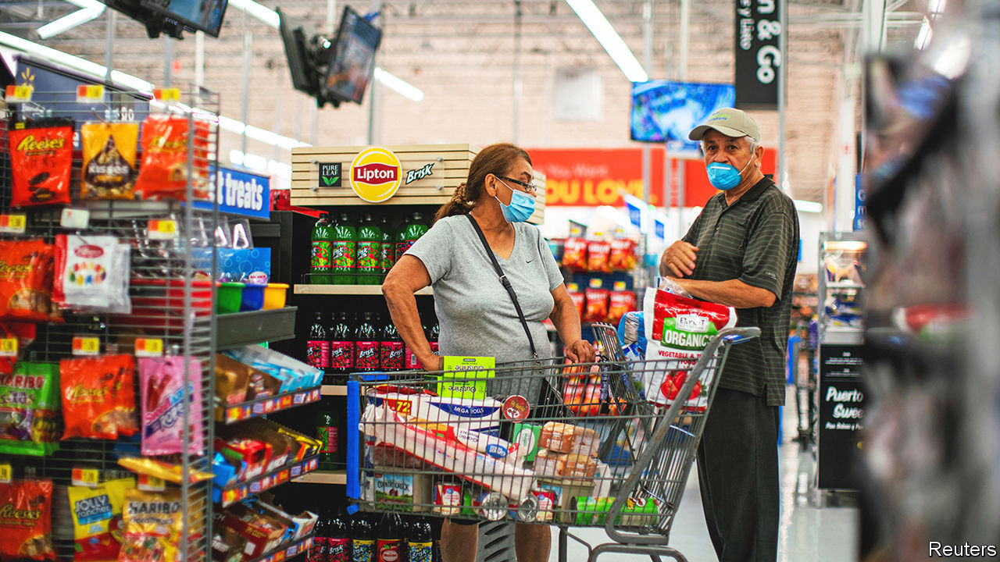

###### The world this week

# Business 

#####  

 

> Aug 11th 2022 

America’s annual rate of , measured by the consumer-price index,  to 8.5% in July, from 9.1% in June. Petrol prices explained the dip. The average price of a gallon of car fuel is now just under $4; in mid-June it was around $5. The economy is also cooling, shrinking by 0.9% at an annual rate in the second quarter after a contraction of 1.6% in the first. The labour market is still red hot, however. Employers created 528,000 jobs in July, many more than had been expected. 

The deputy governor of the , Sir Dave Ramsden, said that interest rates would probably have to go up again to tame inflation. The bank recently lifted its benchmark rate by half a percentage point, to 1.75%, the biggest rise since 1995. The move was criticised by some for increasing the possibility of recession, but the bank faces a tricky balancing act. Not all inflation is within its control. One forecast reckons the average annual  will jump to over £4,400 ($5,320) early next year. 

The plunging value of investments at its two tech-focused Vision Funds pushed  to a ¥3.2trn ($23bn) quarterly net loss, a record for the Japanese conglomerate. The rout in tech shares was not all to blame. The weakened yen led to a ¥820bn foreign-exchange loss. “The world is in great confusion,” said Son Masayoshi, SoftBank’s boss. SoftBank later said it would reduce its stake in Alibaba, which it has held for 22 years, from 23.7% to 14.6%, which should raise around $34bn. 

 reported a net loss of $43.8bn for the second quarter, reflecting this year’s broad decline in stockmarkets. However, operating income, which excludes the effects of market vicissitudes on Berkshire’s share portfolio, surged to $9.3bn. 

Inflation hasn’t put people off visiting  theme parks, which notched up their best-ever quarter in sales. Customers are also signing up to Disney+ in droves. The streaming service added 14.4m users over the past three months, bringing the total to 152.1m.

Last year’s thing

The share price of Novavax plummeted after it forecast a slowdown in revenue because of falling demand for its . Moderna recently wrote off $500m-worth of vaccines that have gone unused. 

 sold almost $7bn-worth of the stock he holds in Tesla, leaving him with a stake of around 15%. Mr Musk sold $8.5bn-worth of his shares in April, as he pulled together financing for his takeover of . He now wants to walk away from that deal. Mr Musk may well keep the proceeds from his latest sale of stock in reserve in case a judge forces him to buy the company. Meanwhile, the war of legal words between Mr Musk and Twitter continued, with the platform describing his reasons for terminating their agreement as “implausible”. 

A former employee of Twitter, who worked for the company between 2013 and 2015 overseeing media tie-ups in the Middle East, was found guilty of . The man, reported to hold American and Lebanese citizenship, struck up a friendship with an aide to Muhammad bin Salman, the kingdom’s de facto ruler, and repeatedly divulged the personal information of anonymous Saudi dissidents who use Twitter. 

The declining value of cryptocurrencies lay behind a $1.1bn net loss at , America’s largest digital-currency exchange. Bitcoin is now trading around $24,000. That is up from $19,000 in mid-June, but still down by 50% since the start of the year. 

An easing of covid quarantine rules for travellers to Hong Kong helped boost revenue at  in the first half of the year and narrow its losses. The airline has urged the city’s government to end restrictions completely. Still, Cathay is in much better shape than in recent years, when it became entangled in rows over democracy protests and endured severe pandemic curbs on flying. Its share price is up by a third this year, the best performance of any big airline. 

 bought , the company that makes the Roomba robot vacuum cleaner. The Roomba collects data not just dirt, which is the acquisition’s real value to Amazon. It maps the layout of a house and furniture as it busily picks up dust, information that can be added to a user’s shopping profile (customers can opt out of the mapping system). Questions about privacy have already been raised. 

Arrivederci

It emerged that  has pulled out of Italy, seven years after opening branches in the home of pizza. It had been pushing its Texas bbq and pineapple-topped offerings in 29 locations, but quicker than you can say  Italian pizza chains signed up to Deliveroo and other apps to offer their own home-delivery services. 

