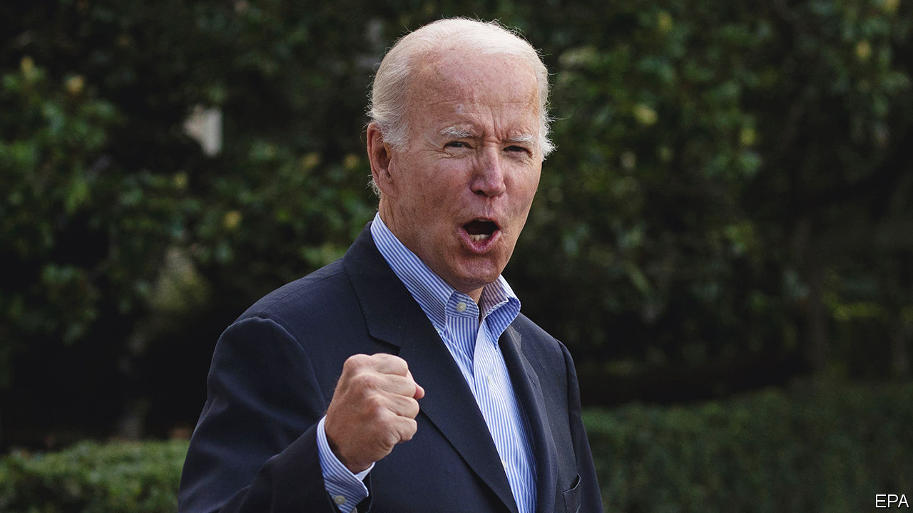
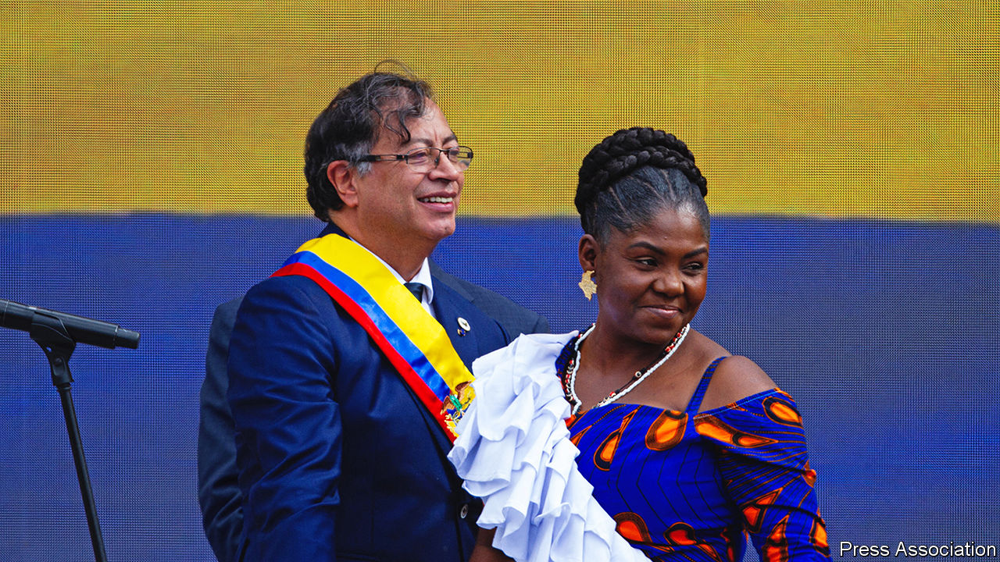

###### The world this week

# Politics 

#####  

 

> Aug 11th 2022 

After months of gridlock, America’s Senate  focusing on climate change, health care and tax reform. In a big advance for Joe Biden’s green agenda, families and companies will be given incentives to buy electric cars and energy-efficient appliances, and clean-energy generation will be expanded. On health, the government will be allowed to negotiate lower prices with drug firms, which will benefit the elderly. The tax reforms include a 15% minimum corporate tax based on income reported to shareholders. Named the , it is anything but. Still, it is a win for Mr Biden, a year after the demise of his larger $3.5trn spending bill.

Nowhere to hide

The fbi searched Mar-a-Lago,  in Palm Beach, apparently looking for documents he took from the White House. Mr Trump complained: “Nothing like this has ever happened to a President of the United States before.” (Which is true.) Republicans vowed to investigate the investigators, should they win the mid-term elections in November. Democrats were torn between applauding the investigation and fretting that it might make Mr Trump look, to his fans, like a martyr.

Indiana’s legislature approved a near-total ban on , making it the first state to do so since the Supreme Court struck down , which had created a federal right to abort. However, other Republican states are hesitating to enact similar bans, which are often unpopular. 

For three days the  air force hit members of Palestinian Islamic Jihad in , killing two of its commanders and, according to Palestinian sources, leaving at least 42 other people dead, including 15 children. Israel, which suffered no losses from hundreds of missiles fired by the jihadists, said it was acting pre-emptively to forestall planned attacks. Hamas, the Islamist group that controls Gaza, kept out of the fray. Egypt helped secure a ceasefire. 

 voted for a new president. The race . William Ruto, the deputy president, squared off against Raila Odinga, an opposition leader running for a fifth time. Mr Odinga sought to assemble an old-fashioned ethnic coalition; Mr Ruto made extravagant promises to Kenya’s have-nots.

Antony Blinken, America’s secretary of state, outlined the Biden administration’s new strategy for engaging with , which will focus on promoting democracy. Speaking in Pretoria, South Africa’s capital, he argued that poor governance and a lack of democracy make countries vulnerable to extremist movements and foreign influence. 

A nationwide curfew was imposed in , after demonstrations in Freetown, the capital, against high food and fuel prices turned violent and morphed into wider anti-government protests.

 


Gustavo Petro, a former member of the m-19 guerrilla group, took office as  first left-wing president. His vice-president, Francia Márquez, is the first black person to hold the job. At his inauguration Mr Petro urged armed groups that control parts of the country to negotiate with the government and called for an end to the war on drugs. (Colombia is the world’s largest producer of cocaine.) He also sent a bill to Congress that would raise taxes on the rich.

Firefighters took five days to control a blaze at  largest oil-storage terminal in Matanzas, on the country’s northern shore. At least one person died and 14 are missing. The fire, triggered by lightning, destroyed four tanks. It caused a water shortage that led to the shutdown of a power plant nearby. Even before the disaster Cuba was suffering from fuel shortages and blackouts.

The fallout from the , a former prime minister, continued to rock Japanese politics. Kishida Fumio, the current prime minister, drew flak for his party’s dealings with the Unification Church, a religious group that raises money energetically from its adherents. (Mr Abe was murdered by a man with a grudge against the church.) Ministers with ties to the church, including Mr Abe’s brother, were dismissed from the cabinet. 

At least eight people were killed amid the worst rainstorm to hit  in 80 years. Some districts in the South Korean capital registered 50cm (20 inches) of rain in a day. 

James Marape won re-election as prime minister of  after an election  and widespread fraud. Mr Marape has an 18-month grace period before he can face a no-confidence vote. 

 ended its military drills around , but vowed to keep patrolling the Taiwan Strait. The exercises followed a trip to Taiwan by Nancy Pelosi, the speaker of America’s House of Representatives. She is the highest-ranking American official to visit the island, which China claims, since the 1990s. After Ms Pelosi left, China fired missiles over Taiwan and encircled it, as if practising a blockade.

Volodymyr Zelensky said that Ukraine’s war with Russia could not end until , which Russia annexed in 2014, is liberated. The Ukrainian president was speaking after explosions rocked a Russian air base in Crimea, destroying several military planes. Russia blamed exploding ammunition. Ukraine did not claim responsibility. Russian holidaymakers, who are still being allowed to travel to Crimean resorts, fled from beaches nearby.


The flow of  to Europe was disrupted once again. This time shipments of oil through the Druzhba pipeline to the Czech Republic, Hungary and Slovakia were halted, ostensibly because of a row over payment.

Wheat tolerant

More ships laden with  and sunflower oil set sail from Ukraine under a deal guaranteeing safe passage that was brokered by Turkey and the un. Two were bound for Turkish ports, the others for China and Italy.

The British government published its legal case against plans by  first minister, Nicola Sturgeon, to hold a second referendum on independence. Its case reiterates that Scotland does not have the power to call a vote. Ms Sturgeon hopes to get round this by claiming that the vote will be advisory. The British Supreme Court will hear arguments in October. 

A British ultramarathon runner ran the width of , the first person to do so in under 24 hours. Robert Pope, 44, started his 211km (131-mile) run with a glass of Guinness in Galway, and finished it with another pint of the black stuff in Dublin. 

