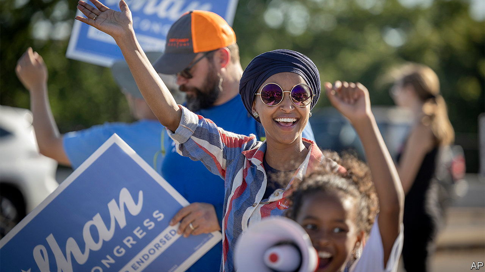

###### Cops, robbers and votes

# Crime and policing continue to split Democrats in Minnesota 

##### Ilhan Omar, a progressive darling, almost comes unstuck 

 

> Aug 11th 2022 

Since entering Congress in 2019, Ilhan Omar has become one of the best known and most divisive figures on the American left. Ms Omar represents Minnesota’s fifth district, which covers the city of Minneapolis and some of its suburbs. She came to America from Somalia as a refugee, and is one of only three Muslims in the House of Representatives. During her few years in Congress, she has picked fights with Donald Trump, who has questioned her citizenship; the American Israel Public Affairs Committee, a lobbying group that accused her of anti-Semitism; and fellow Democrats including Nancy Pelosi, the House Speaker, who condemned her for equating American misdeeds abroad with those of the Taliban. All of this Ms Omar has survived and, to some extent, thrived on.

But on August 9th it was a local fight that came close to undoing her: one over policing and crime, hot issues in the primary race for nominee of the Democratic Farmer-Labour Party (dfl), Minnesota’s Democratic-Party affiliate. When protests erupted in Minneapolis in 2020 after the murder of George Floyd, a 46-year-old unarmed black man, by a local police officer, Ms Omar backed nine of the city’s 13 council members in calling for the police department to be abolished. She argued that “you can’t really reform a department that is rotten to the root”.

Ms Omar has maintained that stance—even after a referendum in Minneapolis roundly rejected a proposal last November to replace the police with a new department of public safety. Her primary rival for the dfl‘s nomination, Don Samuels, is a 72-year-old former council member who, unlike Ms Omar, has almost no digital presence. Mr Samuels ran on a tough-on-crime message and, to the surprise of many, came within two percentage points of unseating her.

The tight race was just one indication of how crime and policing continue to unsettle Minnesotan politics more than two years after Mr Floyd’s murder. Minneapolis has long been one of America’s most left-leaning cities. But since the spring of 2020, violent crime has soared. In 2021 it recorded 93 murders in a population of just 425,000, double the number in 2019. Other rates of violent crime, including carjackings, have risen even faster.

Meanwhile the police, having lost many officers to early retirement, is now 100 shy of the legal minimum required by the city’s charter (Mr Samuels had led an effort to sue Minneapolis over this). Taken together, this helps explain the result of the referendum pushed by the council. Unusually among American cities, the council then held more sway than the mayor; it was subsequently stripped of many of its powers.

The dfl is now split on the issue of crime. Ms Omar won the party’s endorsement. But Mr Samuels was backed by Jacob Frey, the mayor of Minneapolis (who opposed the referendum), as well as several suburban mayors and various trade unions, which are influential in the state. Moreover, the race for the fifth district was not the only one in which crime was a central issue. For the first time in two decades, voters were asked to pick candidates for the district attorney of Hennepin county, which covers Minneapolis and a large chunk of its suburbs. The dfl-backed candidate, Mary Moriarty, is a former public defender whose campaign focused on holding the police accountable. She won 36% of the vote in the primary on August 9th, a substantial plurality. Yet all six other candidates ran on a tougher message.

In November’s general election, Ms Moriarty will face Martha Dimick, a black former prosecutor and judge from north Minneapolis, a largely black area. Ms Dimick says that police reform is vital, but that Ms Moriarty is too divisive to achieve it, and has lost sight of what the city needs most: a response to violent crime. “We are going to do something with these children that are running around carjacking everybody with guns,” she says. Like Mr Samuels, Ms Dimick has the mayor’s endorsement.

Last month the Biden administration said it had set aside funds to hire 100,000 police officers across America. The plan was immediately denounced by some on the left, including the American Civil Liberties Union, an advocacy group. As long as worries about crime stay high, it seems bound to keep dividing Democrats. ■


