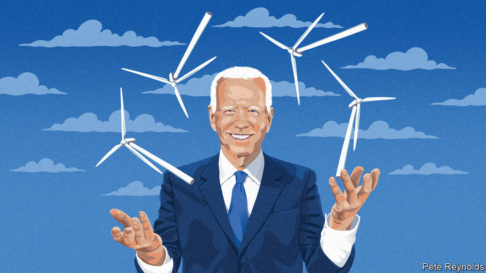
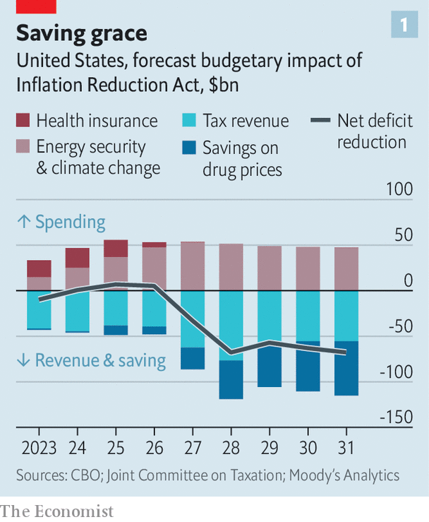
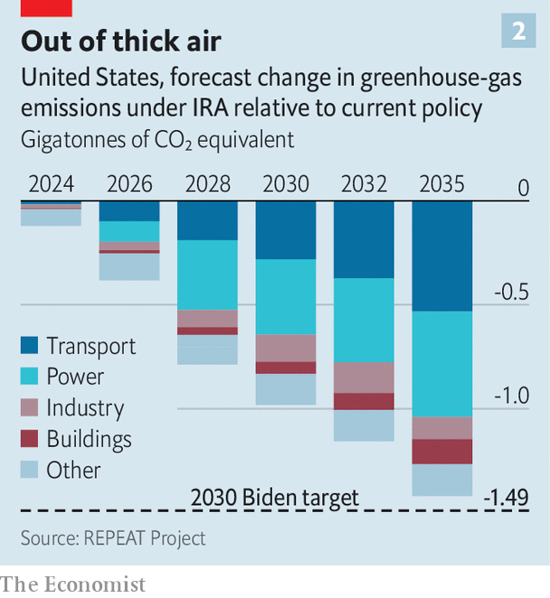

###### And now for my next act

# Joe Biden’s signature legislation passes the Senate, at last 

##### The Inflation Reduction Act is weakened by big compromises, but is still a big deal 

 

> Aug 9th 2022 

“This has been decades in the making, and it will reshape the decades ahead.” That is how Fred Krupp, a longtime champion of congressional action on climate change as head of the Environmental Defence Fund, a green group, describes the Inflation Reduction Act (ira). Mr Krupp and his fellow advocates have watched every bold American climate proposal of the past few decades flop. Now they have real grounds for optimism.

On August 7th the Senate passed the ira; the House of Representatives is expected to follow suit within days. Once law, the act will shower $369bn of subsidies and tax credits over the course of a decade on renewable energy and electric vehicles, hydrogen hubs, carbon capture and storage, and more. It is the largest package of climate spending in American history.

For months President Biden’s landmark policy proposal, initially known as Build Back Better (bbb), looked doomed to fail. Only a year ago Democrats had hoped to pass a package of climate and energy policies, health-care reforms and social programmes costing $3.5trn over a decade. It stalled in Congress due to intransigence from the right (not one Republican senator voted for the ira on August 7th) and was whittled down by old-style centrist Democrats, in particular Joe Manchin, a senator from West Virginia. Last month Mr Manchin appeared to scuttle bbb altogether.

Then came the shock. On July 27th he and Chuck Schumer, the Democratic leader in the Senate, revealed that secret negotiations had led to  on a slimmer version of bbb that would tackle the climate and health care, and jettison much of the rest. Besides providing green subsidies, the ira will reduce the cost to the elderly of some prescription drugs, and raise taxes on some big American firms.

The ira is a big deal, even if each of its victories was clinched only with big trade-offs. Start with the portion that involved some of the largest compromises: tax reforms. In Democrats’ original conception of bbb, tax provisions were nearly as important as spending commitments. The goal, on which Mr Biden campaigned, was to raise taxes on big companies and the very wealthy. But that ran into opposition from Kyrsten Sinema, a Democratic senator from Arizona, who refused to back a bill that would lead to higher tax rates. 

So the party settled on a workaround: a new 15% minimum tax on book income reported by companies with profits of more than $1bn. Many tax experts are highly critical of this new levy. Book income is conceptually different from income as reported to tax authorities; taxing two separate statements of income will add complexity to America’s overburdened tax system.

 


Still, the tax reform deserves praise for raising much-needed revenue. Non-partisan analysis suggests it will cut the federal budget deficit by a cumulative $300bn over the coming decade (see chart 1). The exchequer may raise twice that amount from both the reform of drug pricing and imposition of the 15% tax.

That points to a second reason to applaud the ira. For decades the only corporate lobbying group in Washington more powerful than Big Oil has been Big Pharma. During his term Mr Trump surprised many by vowing to rein in drug prices, but largely failed. Despite attempts by congressional leaders in both parties to tackle runaway drug prices, the industry undermined every big reform. No longer. 

The ira gives Medicare, the giant government health scheme for the aged, the power to negotiate the price of some high-cost drugs for the first time. If drug prices for Medicare rise faster than inflation, firms will now be forced to issue a rebate. The law will cap co-payments and eliminate co-insurance costs for Medicare recipients, and extend some health-care subsidies. Tricia Neuman of the Kaiser Family Foundation, a health-care think-tank, says it is “hard to overstate” the significance of the drugs provisions: in overcoming fierce industry opposition, achieving the first big Medicare reform in over a decade and lowering the cost of pricey drugs. 

The vote heard round the world

The third reason is perhaps the most powerful: at the heart of the ira is a bold attempt to turbocharge America’s clean-energy transformation. True, the bill is all carrot and no stick: it lacks a national plan for carbon pricing or a mandated cap on greenhouse-gas (ghg) emissions. But an exception to that is a fee that will be levied on methane emissions from oil and gas operations. Lindsey Griffith of the Clean Air Task Force, an advocacy group, expects this relatively high fee will be “critically important” in mobilising the energy industry to tackle emissions of methane, a potent greenhouse gas.

Crucially, the ira replaces the stop-go tax credits, which have hitherto hobbled the development of renewable energy, with tax credits that offer ten years of policy certainty. Christopher Seiple of Wood Mackenzie, a consultancy, estimates that the ira will boost total spending on renewables by $300bn by 2035 compared with current policies, to $1.2trn. Well-crafted subsidies for  will extend the life of many plants, which produce carbon-free energy and a fifth of America’s power.

 


The upshot will be a significant reduction in climate-related emissions. Mr Biden had made a bold promise to reduce America’s ghg emissions by 2030 to half their level of 2005. The ira alone will not fulfil that, but it will help America get most of the way there (see chart 2). Modelling by the Rhodium Group, a consultancy, finds that business-as-usual would have reduced annual emissions by a quarter to 35% in that timeframe. The new law should reduce them by about a third to 44%.

Perhaps most encouragingly, the ira should be politically durable. Paul Bledsoe of the Progressive Policy Institute, a think-tank, reckons the ten-year tax credits are so popular with firms and investors that they are “very unlikely” to be repealed even if Republicans control the White House and Congress come 2024. The bill’s reforms enjoy broad support from voters of both parties, polling suggests; in the long run it is expected to lower households’ energy bills.

If the ira kickstarts a clean-energy revolution at home, abroad it already signals that America takes seriously its leading role on the climate. For years, says Mr Krupp, the country was seen as “all talk and no action”. It looked set to show up empty-handed to the un’s next climate summit, in November in Egypt. Now, hopes Heather Zichal of the American Clean Power Association, a trade group, this will be “the vote heard round the world”. ■


