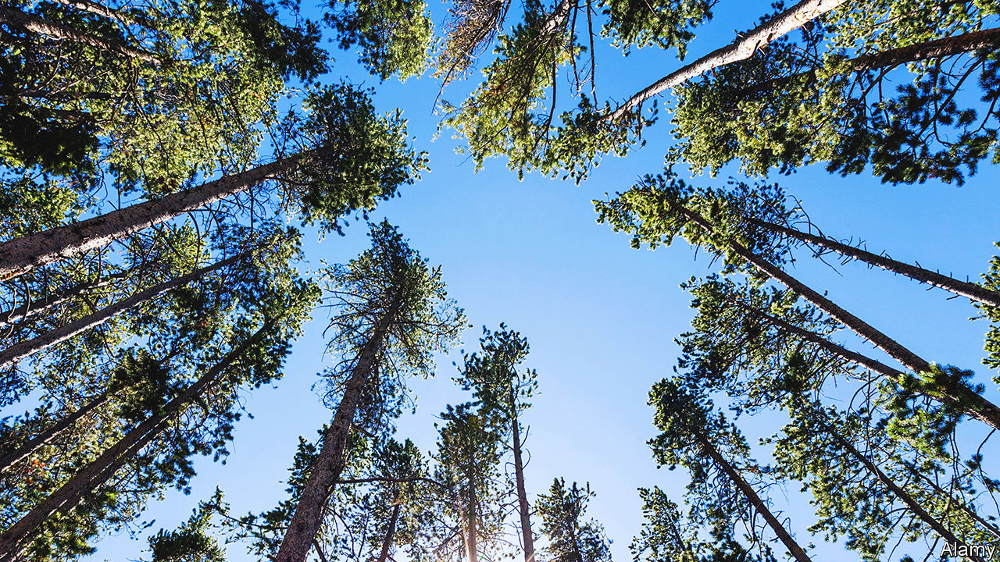

###### Seeing the wood for the trees

# Mass timber offers new hope for an old industry in the American West 

##### The strong, sustainable building material may help revitalise forests 

 

> Aug 11th 2022 

America’s pacific northwest was largely built on timber. But the industry lost an estimated $1.8bn in 2020, so once-bustling towns are scrambling to find alternative sources of income. Some are pinning their hopes on what can be a more sustainable use of the material: “mass timber”, small sections of wood held together with resin or a similar binder.

Big logging firms have pushed the small ones out of timber towns. Poorly managed wildfires have ruined trees that might have been used for products. And green groups have raised the alarm about over-harvesting. Can mass timber—strong, light and fire-resistant—give the sector a boost?

Since its invention in Austria in the 1990s, mass timber has been used extensively in Europe. But it has only recently caught on in America: 1,500 mass-timber structures have been built or planned since 2015 (when the country’s national building code approved the material), up from the 23 that existed in 2013. In July a 25-storey block in Milwaukee was certified as the world’s tallest mass-timber building.

Such buildings are much greener to erect than those made from energy-intensive steel and concrete. Mass timber is made from new-growth trees, which are usually the result of plantings and more quickly reach their age of use. It helps keep “working forests working”, says Marcus Kauffman of the Oregon Department of Forestry. Mass-timber projects are the main beneficiaries of $32m earmarked for wood-related innovations and grants in President Joe Biden’s infrastructure bill. 

Sustainability is a big part of the appeal. Forests are made more resilient by cutting small trees and brush that do not have market value, says Mr Kauffman. Yet mass-timber’s suitability for affordable housing and rapidly deployable shelters means the sector can expect robust demand, he says. In 2020 Oregon said the mass-timber industry presented “unique opportunities” for high-wage jobs and “statewide prosperity”.

Environmentalists, including Laurie Wayburn of the Pacific Forest Trust, a conservation group, worry that a booming sector may eventually do more to degrade forests than protect them. But for now, Ms Wayburn too thinks mass timber holds “a lot of promise”. The material strikes her as “a great blending of commerce and commodities and conservation”. ■


