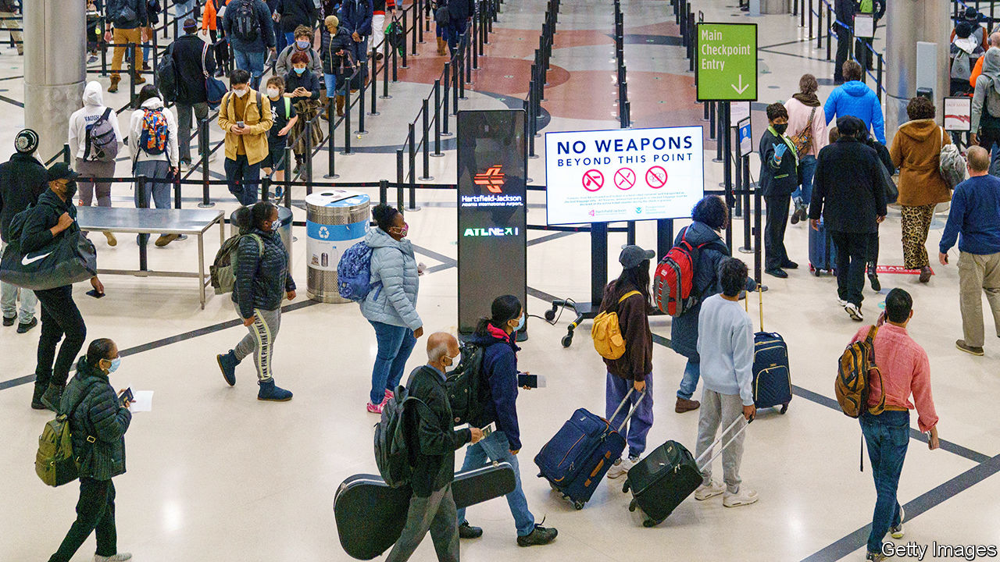
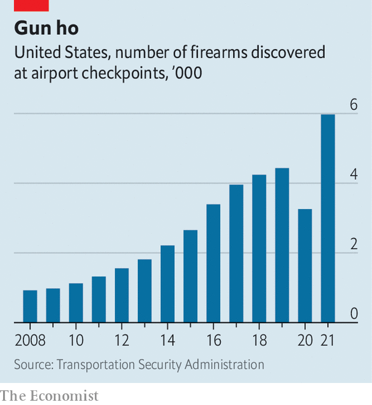

###### Flying with guns

# More Americans are trying to take their weapons on planes 

##### Loose gun laws lead to more interceptions at airports 

 

> Aug 11th 2022 

Hartsfield-Jackson International Airport, south of Atlanta, is, by passenger numbers, America’s biggest. Flying through it offers a quintessentially American airport experience. At the security checkpoint, where in other countries signs would remind you to discard liquids, televisions display a revolving 3d image of a handgun. Passengers are reminded in large lettering that no weapons are allowed in the concourse. For guns to be transported, they must be checked as baggage, unloaded, and locked in a dedicated container.

Atlanta’s airport also holds a less desirable accolade: as the airport where the most Americans are caught trying to bring guns through security. In 2021 Transportation Security Administration (tsa) agents found 507 guns in passengers’ hand luggage, a record. In the first six months of this year, another 200 were caught—a slight dip on the same period last year. More visible signage in the airport may have helped.

 


Across America, the number of guns found each year has been rising sharply. Occasionally weapons even scarier than guns are intercepted. In 2019 officials at Baltimore-Washington airport found a rocket launcher in the luggage of a Texan man flying home from Kuwait. In 2020, even though the number of passengers flying in America fell by 60% compared with 2019, the number of guns found decreased by only 27%. This might suggest that quieter airports enabled agents to catch a higher share—so in normal times, a worrying number of guns may be making it onto planes. In 2021 the number of guns caught at airport checks hit a record just shy of 6,000, more than twice as many as in 2015 (see chart).

According to Mark Howell, a tsa spokesman, most guns found are a case of “oops, I forgot” rather than any sinister intent. They crop up far more often in states with loose gun laws. People in Georgia or Texas often carry a gun as others carry their keys. Roughly 90% of firearms found are loaded. When passengers are stopped by tsa agents, they are fined (sometimes several thousand dollars) and handed over to police, who see if they have broken any local laws.

In Atlanta, police now simply direct passengers to return any guns to their cars, or to check them in as luggage. In April Brian Kemp, Georgia’s governor, signed a “constitutional carry” law, allowing people in the state to carry a concealed weapon without a permit. As a result, local police can no longer confiscate weapons found by tsa agents at the airport, or even compel owners to submit to questioning. “We are working on it,” Darin Schierbaum, Atlanta’s interim police chief, told the city council in June. Some might worry it is only a matter of time before one goes off in the air.


