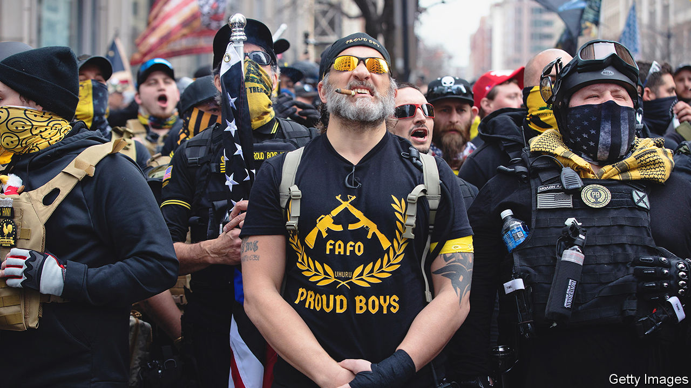
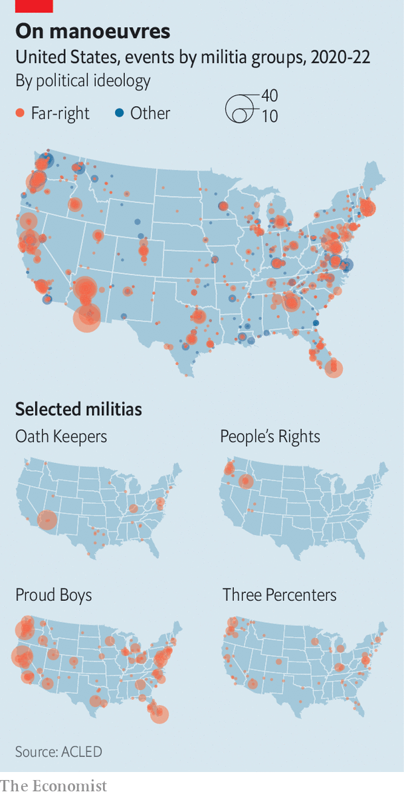

###### Extreme goes mainstream

# The insurrection failed. What now for America’s far right? 

##### Extremists are adapting to a post-January 6th America—by entering electoral politics 

 

> Aug 6th 2022 

About 15 people file into a sunny real-estate office in Denver, take their seats and face the front as if ready for a lecture. The next three hours are part sermon, part support group for conspiracy theorists. Attendees discuss events and concerns that preoccupy them. By their account, the World Economic Forum wants to lead a global government; Colorado’s primary elections ; the pope, and possibly Joe Biden, are holograms; and society is only ever two weeks away from collapse. 

The gathering is a local meeting of People’s Rights, a network for those who fear that their individual rights are being eroded by America’s federal government. It is the brainchild of Ammon Bundy, a candidate for governor in Idaho who is best known for having led armed stand-offs against the federal government at his family’s ranch in Nevada in 2014 and at a wildlife refuge in Oregon in 2016. The main selling-point of the group, which Mr Bundy set up in 2020, is its dial-a-militia function: if a member feels threatened, he or she can summon compatriots for help. 

Charles Tappan, who led the meeting, disavows Mr Bundy, and argues that the group is more interested in preparing for three scenarios—a globalist world takeover, alien invasion or the Rapture at the end of times—than taking up arms against the feds. Yet the conspiracies being voiced in Denver are similar to the concerns of voters who attended a recent campaign event for Mr Bundy in Sandpoint, Idaho, a small town that is an hour’s drive south of the Canadian border. Here, participants complain about federal overreach, “extreme environmentalists” and the mainstream media. “Am I an extremist?” one woman asks, rhetorically. “I don’t know!”

Mr Bundy’s evolution from militia leader to candidate for governor reflects a merging of the far right with electoral politics. Rather than fomenting insurrection, many extremists have adopted a new mentality: if you can’t beat them, join them. 

The origins of political disorder

The far right in America is a decentralised network of groups and militias, not a coherent movement. Factions differ in substance and style. The Oath Keepers recruit current and former police officers and soldiers to their ranks; the Boogaloo Bois are hostile to law enforcement; the Proud Boys are street brawlers; People’s Rights often looks for justification for its actions in the constitution or religious texts. These differences affect how each group operates. People’s Rights members in Denver, for example, are more likely to attend a meeting than make mischief on far-right websites such as 8kun. 

Yet many militias have been inspired by the same events. A straight line can be drawn from the  of the 1970s to People’s Rights and the attack on the Capitol on January 6th 2021. Some 50 years ago a coalition of ranchers, miners, loggers, oilmen and officials in western states were radicalised by opposition to new land-management laws that they viewed as a land grab by the federal government. Mr Bundy’s father, Cliven, counted himself among those “Sagebrush” rebels. For 20 years he refused to pay fees for grazing his cattle on federal land. 

In 2014, when the feds arrived to confiscate his cows, militia members from across the country assembled at Bundy Ranch to resist what they viewed as federal overreach bordering on tyranny. Jason Van Tatenhove, a former spokesman for the Oath Keepers, recently told the House committee investigating the January 6th riot that Oath Keepers were among the militants who showed up. Mr Bundy tried to replicate the stand-off two years later by occupying a wildlife refuge in eastern Oregon to protest against the imprisonment of two ranchers. 

It was probably not a deep passion for ranching that brought the Oath Keepers to Nevada. Militias “are looking for the photo op where they can be in a confrontation of their choosing, on their terms”, says James Skillen of Calvin University, who has written a book about the Sagebrush Rebellion and its heirs. The confrontation, he adds, should prove “that the federal government is the aggressor”. 

Mr Bundy keeps a small copy of the constitution in his shirt pocket, and often reads aloud from it to defend his beliefs. On a break from driving his campaign bus around Sandpoint, he explains that People’s Rights aims to systematically duplicate the call-to-arms his family sent out from their ranch in 2014. 

There seems to be a growing constituency for militias-on-demand, although private militias are banned in all 50 states. In 2021, one year after its founding, People’s Rights boasted at least 33,400 members in 38 states, according to the Institute for Research &amp; Education on Human Rights (irehr), a research group that studies the far right. A chilling poll from the University of Chicago’s Institute of Politics recently found that 38% of conservatives agreed it may soon be necessary to take up arms against the government. 

Covid-19 provided a rare opportunity for disparate militias to rage against the same thing. Far-right groups rallied around the idea that government officials were trampling on their individual freedom by imposing mask mandates and lockdowns. Mr Bundy says that fighting pandemic restrictions was the push he needed to start People’s Rights two years ago. Despite his penchant for leading armed militias against federal officials, Mr Bundy professes to be an “introvert” who just wants to be left alone. “The covid comes around and you realise that they’re not going to leave us alone,” he says. “I would love to just stay on my property and grow my garden and take care of my family. But it’s not the first time people have had to leave the fields to go and pick up a sword.” 

The Armed Conflict Location &amp; Event Data Project (acled), which tracks political violence around the world, has identified nearly 4,000 protests against covid constraints across America since 2020. The extremists who plotted to kidnap Michigan’s Democratic governor, Gretchen Whitmer, in 2020 were motivated by opposition to pandemic restrictions. 

 


Some 228 different militias, mostly right-wing, have organised 2,335 events over the past two years (see map). Many of them were protests against covid rules, or rallies for Donald Trump’s “Stop the Steal” campaign. Perhaps the most obvious foreshadowing of the riot on January 6th was the involvement of far-right extremists in at least 39 armed demonstrations at legislative facilities in the 12 months before the insurrection. 

Where People’s Rights was set up to combat perceived federal overreach, other militias were formed in response to the elections of Barack Obama and of Mr Trump. Mr Obama’s ascent to the presidency, and the global financial crisis of 2007-09, agitated many white men who were angry at the ways in which America was changing. The Oath Keepers and the Three Percenters, another militia, were formed in 2009 and 2008, respectively. 

Among the most striking aspects of the evolution of right-wing militias in recent years has been their rejection of anti-government principles in order to embrace Mr Trump. But Devin Burghart, the executive director of irehr, argues that “anti-government” is a misnomer. “They have always had a vision for government,” he says, “but their vision has always been about them controlling it.” 

At key moments Mr Trump gave militias the impression that someone sympathetic to their beliefs was finally in power. He said, for instance, that there were “very fine people” at a  in Charlottesville, Virginia, in 2017; he told  to “stand back and stand by” in 2020. The insurrection on January 6th was a last-ditch attempt to keep Mr Trump in power, and thereby preserve many militias’ vision for government. 

Mr Bundy was not at the Capitol on January 6th; he prefers local uprisings to the national sort. But he admits that his antics in Nevada and Oregon probably emboldened those who flocked to Washington. And the riot was useful to him. “People were going there with or without me,” Mr Bundy says. “So I said, ‘Hey, if you’re going there it’d be a great opportunity to recruit for People’s Rights.’”

January 6th marked a turning-point for far-right militias. In Nevada and Oregon the Bundys beat the charges levied against them. But hundreds of rioters have been held accountable for their assault on the Capitol. By August 10th at least 226 people had been sentenced for taking part in the attack, according to the Department of Justice. Their sentencing fed paranoia among right-wing groups, leading many to temporarily halt their protests. acled noted a steep decline in far-right violence after January 6th. 

Laboratories of autocracy

Extremist groups did not go completely dormant, however. Mr Burghart suggests that they reached the height of their recruiting prowess before the riot, and are now preparing for a new phase. For many, that includes taking part in mainstream politics—not from behind a police barrier, but through the ballot box. 

Until recently there were two distinct wings of the far-right movement: a paramilitary cohort that uses violence and intimidation to get what it wants, and a more mainstream crowd that participates in politics. But the gap between these wings is narrowing. Mr Bundy is not the only militia leader trying to bridge the divide. Mark Finchem, who admitted to being an Oath Keeper in 2014, is the Republican candidate vying to be Arizona’s top election official. Indeed, last year a Buzzfeed News analysis of leaked Oath Keepers records suggested that at least 28 elected officials had ties to the group.

They may not be the only ones. A recent irehr investigation combed through the Facebook profiles of all 7,383 state lawmakers in 2021 and 2022. Researchers found that 12% of all legislators, and 22% of Republican ones, belonged to at least one far-right Facebook group. 

This cohort has sponsored a smorgasbord of bills that aim to limit governments’ public-health powers and restrict voting rights, among other things. Many bills supported by these legislators have become law. And the study probably does not capture all state lawmakers with far-right views, as some may use other social-media sites or messaging services, such as Gab and Telegram. 

The types of bill sponsored by far-right lawmakers provide clues to the next issue that could galvanise militias in the way opposition to covid-19 restrictions did in 2020. In June, 31 members of the Patriot Front, a violent hate group, were arrested in Idaho for plotting to riot at a local lgbt pride celebration. In pursuing “parental rights”, far-right activists aim to gain control over what their children are . Aaron Weiss, deputy director of the Centre for Western Priorities, a conservation group, worries that fights over  could escalate to armed stand-offs. Common to many far-right extremists is disdain for environmentalism. 

If involvement in local politics does not bring about their desired changes, militia members have suggested they will pull away from politics. Rather than a civil war or a revolution, Mr Bundy envisages a “separation” from civil society of his acolytes and others like them. It is already happening, to some degree. Disaster “prepping” has long been fashionable among right-wingers, and that impulse has only intensified since January 6th. People’s Rights members in Denver discussed planting community gardens and subsistence farming to become more independent. Some seek “safe havens” in case of electricity blackouts. But it is not hard to imagine less extreme forms of dissociation happening more widely as the politics of red and blue states increasingly diverge.

Mr Bundy has a slim chance of becoming Idaho’s next governor. Brad Little, the incumbent, easily beat his Trump-endorsed rival in the Republican primary in May. To skip the primary, which he almost certainly would have lost, Mr Bundy decided to run as an independent, despite his professed affinity for the Republican Party. His support among the fringe offers a warning of how quickly things are shifting. “Probably three years ago I wouldn’t have been a viable candidate,” Mr Bundy tells his audience in Sandpoint. “But I am now.” ■


