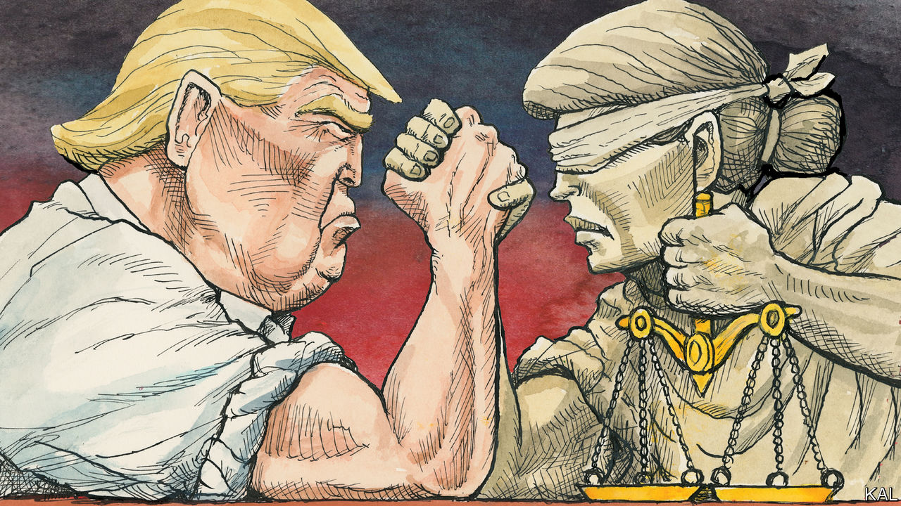

###### Lexington

# The raid on Mar-a-Lago could shake America’s foundations 

##### It has already given Donald Trump a boost 

 

> Aug 10th 2022 

“Another day in paradise,” Donald Trump cheerfully observed after fbi agents  in Florida as part of a criminal investigation. There is no reason to assume he was being sarcastic. The raid had conjured a Trumpian Eden: the nation’s eyes were riveted upon him once again; Republican legislators who had been edging away rallied behind him, as did potential rivals for the Republican presidential nomination; some of his supporters were again calling online for a civil war to defend their champion. Mr Trump was able to present himself in his favourite light, as the victim of dark, partisan forces out to protect the establishment by dragging him down. Having trashed the fbi and Department of Justice for years, he had prepared not just his core believers but probably half the country to suspect that the rule of law was being undermined, not honoured.

For these reasons and more, the raid is a nightmare for America. , the attorney-general, would have anticipated that. He is a painstaking former prosecutor and judge—too painstaking for many Democrats who, just as Republicans claim, are quivering to see Mr Trump prosecuted. If Mr Garland made the decision himself to proceed, as seems likely, he must have concluded that legal considerations left him with no choice.

But if so the Justice Department’s determination to keep things on the level is playing into the hands of a man for whom nothing is on the level. Mr Trump’s power to warp reality is so great that enforcing the law against him may actually help wreck the republic. Having withstood his attempts to steal the election, America’s judicial system could be in for a ferocious assault.

There are precious few facts about this investigation to rely upon; much of what is known comes from Mr Trump. This column is going to be speculative, maybe annoyingly so. For once, though, speculating how bad things might become is responsible, rather than frivolous. Mr Trump has again and again broken through the boundaries of the American political imagination.

Mr Trump was already  for a second term as president. He seems certain to do so now. Imagine that the raid yields evidence of criminality, leading to his indictment. Nothing in the former president’s history would suggest that, out of some sense of propriety, let alone shame, he would then suspend his campaign. Instead, he would have even greater reason to foment distrust and even hatred of the American legal system, as well as the administration of President Joe Biden. 

Even a speedy trial and conviction would be less likely to bar a Trump candidacy than to start more rounds of litigation. The constitution, which spells out the qualifications for serving as president, is silent on the question of a criminal record. This is a hypothetical scenario, but not a far-fetched one: America faces the possibility of an indicted or convicted candidate winning a presidential election while campaigning against the rule of law. Or, maybe worse, losing that election. You do not need to rely on speculation to picture what that would look like.

Yet maybe the raid will yield such damning evidence that even the Republican legislators who are threatening to investigate Mr Garland will instead repudiate Mr Trump at last. Or maybe one of the many other lines of inquiry into Mr Trump’s doings, or their cumulative weight, will have that effect. Mr Trump is under investigation in Georgia and New York. The raid appears to stem from an investigation into how he handled classified information; the Justice Department is conducting a separate investigation into his flailing to cling to office. 

Do not hold your breath. Lawmakers who crawled back to Mr Trump after the  are not likely to abandon him over a crime like making off with classified documents, particularly given a president’s vast power to declassify information. And Mr Trump, who studied under the ruthless red-baiting attorney Roy Cohn, has shown how slippery he can be. Michael Cohen, another former lawyer to Mr Trump, testified to Congress that he acted “like a mobster”, not giving direct orders that might implicate him but speaking “in a code”. The president who had the foresight to bar the White House photographer from his presence on January 6th, and leave no trail of telephone calls that day, seems unlikely to have left incriminating evidence lying around Mar-a-Lago. For a man so zealous in pursuit of his self-interest, that would be an astonishing lapse. 

Mr Trump dines out

One warm evening in 1999, Donald Trump stepped out of a famous restaurant, Sylvia’s, on Malcolm X Boulevard in Harlem. Word had spread that the famous developer was eating there, and a large, excited crowd had gathered to greet him. He had been feted all evening by tv stars, financiers and former ballplayers. The stakes seemed lower then, before the attacks of September 11th 2001, and his boasting and lies came off as funny, even roguishly charming.

As Lexington, in those days a writer at a different publication, followed Mr Trump into the crowd and towards his limousine, he called out the question that had been on his mind all night: what was it about Mr Trump that drew people to him like this? “I don’t think about it…” he called back over his shoulder, with a grin. “Whatever it is, it is.”

All these years later, the answer is obvious. The force is Mr Trump’s own desperate need, his vaulting narcissism. That is now the mightiest force in America’s public life, the black hole at the centre of its politics. It has warped the principles of the Republican Party, yanked the Democratic Party  and ripped reputations away from once-respected men and women. It is tearing at America’s governing institutions. The raid on Mar-a-Lago may have been necessary to serve justice. A prosecution may eventually prove necessary as well. The hope is that the rule of law has weight enough to survive the contest. ■


