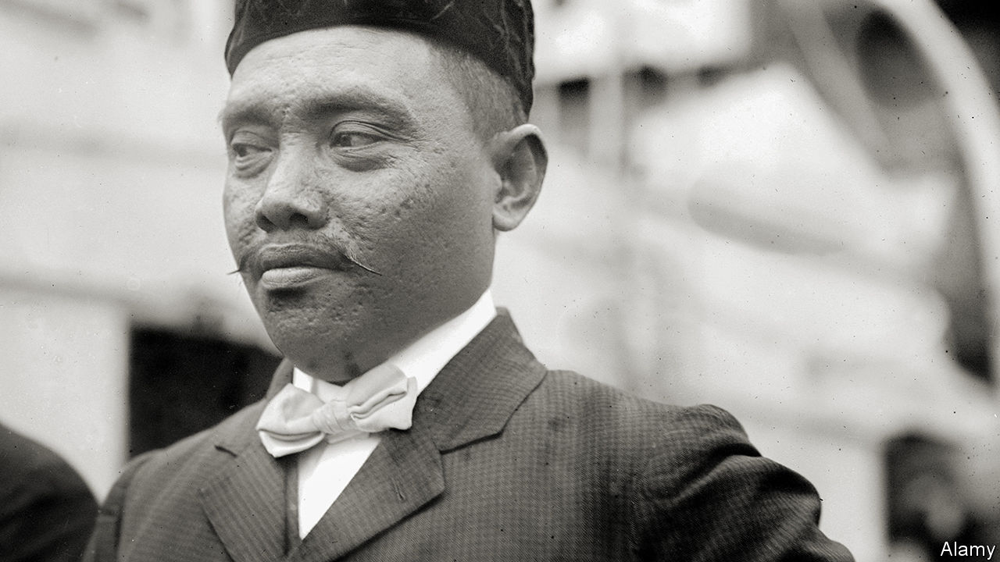
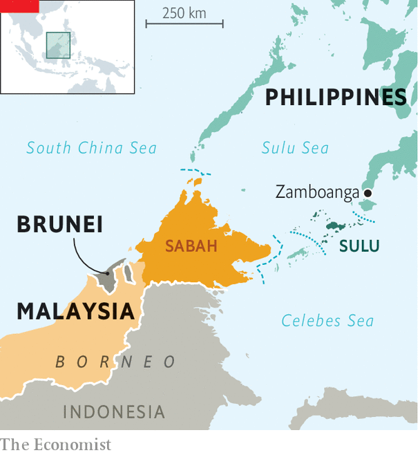

###### The riches of the earth

# A judgment in Europe awards billions to a forgotten Filipino monarchy 

##### An unlikely arbitration case ends with Malaysia owing $15bn to the heirs of a long-ago sultan 

 

> Aug 18th 2022 

There exist few easier ways to become filthy rich than by ruling a patch of Borneo, Asia’s largest island. It is there that the Sultan of Brunei sleeps every night in the world’s biggest residential palace. Ponder, then, the opportunity missed by the Sultanate of Sulu, an archipelago in the southern Philippines (see map), which for centuries stretched far enough west to be Brunei’s neighbour. Today its former slice of Borneo is the Malaysian state of Sabah, and much of the money from the oil pumped there ends up in Kuala Lumpur, Malaysia’s capital. Descendants of Jamalul Kiram II, the last sultan of Sulu, who died in 1936, have had to settle for more modest lives. 

 


Until now. In February, a Spanish arbitrator in Paris ordered the government of Malaysia to pay $15bn to eight descendants of Kiram II. It is the second-largest arbitration award ever. Malaysia has appealed against the decision, but its effects are already being felt. Last month a court in Luxembourg seized assets owned by Petronas, Malaysia’s state oil firm (Petronas claims nothing of value was nabbed). The news has provoked outrage in Malaysia, where an election is expected to be called soon. 

The case revolves around a deal struck in 1878, whereby Sulu let the British North Borneo Company, a colonial enterprise, use its slice of Borneo for a yearly fee. Under the English version of the treaty the Sultanate would “cede” the land. The original promises merely to lease it. Upon achieving independence from Britain in 1963, Malaysia inherited Sabah and all attached obligations, and for 50 years it sent 5,300 ringgit ($1,200) to the sultan’s legal heirs. That makes Sabah distinct from other 19th-century land grabs, says Elisabeth Mason, a lawyer for the claimants. “It’s a rare, perhaps unique, example of a colonial contract that endures uninterrupted into modern times,” she says. 

In 2013 Malaysia cut off the payments to the heirs after a relative, declaring himself to be the true sultan of Sulu, staged a  of Sabah in which 60 people died. Claiming breach of contract, the heirs warned of impending legal action. Malaysia ignored them for two years and later boycotted hearings in Europe, allowing the claimants’ lawyers to advance arguments unchallenged. Yet Malaysia is a signatory to an international convention on arbitration, and will probably have little choice but to abide by the ruling. The judgment awarded the heirs 15% of fossil-fuel and palm-oil revenues since 2013 and of estimated future earnings. 

Many in Malaysia are furious that a lawyer—not even a judge—in Europe can dispose of billions from their treasury. More damaging still is the wound to national dignity. Few Malaysians realised that sovereignty over their second-biggest state has all the while come with an asterisk. Politicians of all stripes are desperate to redirect blame for a case bungled by four successive prime ministers. Sabahans wonder why a squabble in the name of their state, Malaysia’s poorest, should end with money going to anyone else but them. 

The potential appearance of $15bn is causing commotion elsewhere as well. The eight claimants have all been instructed to move house and speak to no one. The 20 or so other pretenders to the throne are either buttering up the legal heirs or pretending to be the true victors of the case in local media. Lawyers for the claimants say a man even showed up in their office in London, brandishing business cards which declared him to be the prime minister of Sulu. No such position exists. 

Not that anyone would know. Most foreigners are too frightened to go to Sulu. Its jungles have become a base for Abu Sayyaf, a band of bloodthirsty jihadists and pirates who claim common cause with al-Qaeda. A string of kidnappings helped give the islands a reputation as one of the most dangerous backwaters in Asia. Violence has receded in recent years, says Al Jacinto, a journalist based in the nearby city of Zamboanga. But Sulu still lacks amenities such as clean water, electricity and internet. 

The heirs’ legal bill has reached $22m so far. That was covered upfront by Therium, a litigation fund based in London, which in exchange will take a cut of whatever Malaysia eventually pays. The two sides may end up settling for less than $15bn. Subtract legal fees and chunky commissions, and that could still leave the heirs a large enough sum to make even the Sultan of Brunei sit up and take notice. ■

