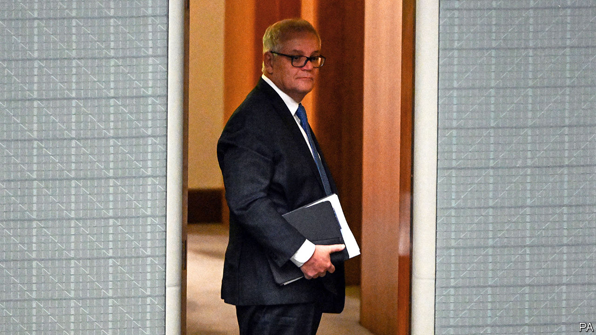

###### Cabinet me-shuffle

# A secret government power grab is revealed in Australia 

##### The former prime minister quietly made himself minister of everything 

 

> Aug 18th 2022 

Australia’s first Pentecostal prime minister, Scott Morrison, is fond of ministries. Delivering a sermon at a church in Perth after losing a federal election in May, he advised worshippers to trust in God, not governments. Australians have recently learnt that he has a penchant for ministries of the political kind as well.

The former Liberal, meaning conservative, prime minister (pictured), now an opposition mp, secretly swore himself into five different ministerial portfolios between March 2020 and May 2021. He held so many that he struggled to recall them all. He did not tell voters that he was extending his powers. Even his colleagues were kept in the dark. 

To Australians, this is as odd as it is alarming. “I cannot conceive of the mindset that has created this,” said the , Anthony Albanese, speaking for many of the country’s 25m people. Mr Morrison’s actions, he argued, were an “unprecedented trashing of the Westminster system”, which does not bestow presidential powers on its leaders. 

Mr Morrison first started accruing portfolios in the early days of the pandemic, according to journalists at the, a conservative newspaper. To keep covid-19 at bay, his government wanted to invoke emergency powers under the country’s Biosecurity Act, but doing so gave vast, unchecked powers to the health minister (then Greg Hunt). Mr Morrison and his attorney-general, Christian Porter, reasoned that creating a second minister of health would be a safeguard. It might prove useful if someone fell ill, they thought. Mr Hunt welcomed the idea, and the prime minister was secretly sworn in with a signature from the governor-general.

Soon after, Mr Morrison made himself co-minister of finance, giving him power over emergency spending. He continued to pile up portfolios as fears about the pandemic faded, installing himself as joint home affairs minister and treasurer in May 2021. None of the incumbents in these jobs was told that they were job-sharing.

He also took on powers unrelated to covid, making himself minister of resources. In that portfolio, unlike the others, he wielded his new authority. As the federal election loomed, he overruled the resources minister, Keith Pitt, to cancel an unpopular permit for gas exploration off the coast of New South Wales. (Climate change was a  for voters, and the project was controversial in wealthy conservative seats.) The company, Asset Energy, is challenging the decision in court.

Even his detractors are shocked that he would so “undermine the integrity of government”, as Karen Andrews, his home affairs minister, put it. As calls for his resignation grew louder, Mr Morrison proffered a defence on August 17th. His actions were a rational precaution in extraordinary times, he claimed. Australians expected him to take on all the responsibility he could to keep them safe. Yet those duties had to be kept secret, he reasoned, lest they be “misconstrued and misunderstood”, thus rocking faith in government. 

No other Australian prime minister has amassed such powers, whether in wartime or pandemic, let alone in secret. Mr Morrison says he only wanted a say over portfolios which gave “unilateral decision-making powers of ministers”, implying that he sought a tighter grip on areas of government that he could not otherwise control. The centralising of power may sit poorly with voters. Yet it does not appear that he acted illegally; there is nothing in the constitution to bar two ministers from being appointed to the same portfolio. Even so, Mr Albanese is seeking legal advice on his predecessor’s actions. Reforms, he says, may be needed to prevent future prime ministerial power grabs. ■

