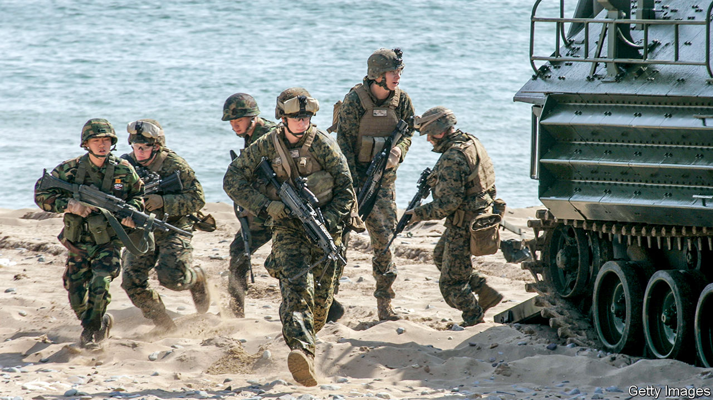

###### Return to form

# America and South Korea restart their big military drills 

##### Donald Trump’s talks with Kim Jong Un, and the pandemic, had put them on hold 

 

> Aug 18th 2022 

After donald trump met Kim Jong Un in Singapore in 2018, he appeared sympathetic to the North Korean position. Having secured from his counterpart a commitment to the “complete denuclearisation of the Korean peninsula”, and feeling well on the way to a “comprehensive and complete deal”, Mr Trump called for an end to joint military drills between America and South Korea, which started in the 1950s. Not only were they expensive, he claimed, but they were “very provocative”, echoing North Korea’s propagandists. 

Reality set in when talks fell apart at their second meeting, in Hanoi the following year. Yet covid-19 and the lingering hope of rapprochement meant that joint exercises have been cancelled or scaled down ever since. Yoon Suk-yeol, who took over as South Korea’s president in May, has been keen to bring them back. On August 22nd the two armed forces will start their first full-scale drills since 2017. 

Led by South Korean generals, tens of thousands of both countries’ troops will be put through their paces until the end of the month, rehearsing scenarios such as responding to the bombing of a nuclear power plant. Such exercises test officers’ decision-making skills and soldiers’ effectiveness in the field in case of an attack from the North. The aim is to drill forces until they know their missions instinctively, says Chun In-bum, a retired South Korean lieutenant-general who has been involved in over 50 joint exercises. 

The exercises are also sorely needed, says Clint Work of the Stimson Centre, a think-tank in Washington. Conscripts come and go and officers change roles often, so regular training is necessary to ensure everyone knows their duties. Usually this turnover is staggered, ensuring some continuity. But the long gap since the previous exercises has sapped readiness. And North Korea has been developing new conventional weapons over that period. New threats require new training. 

Beyond preparedness, the exercises serve several other purposes. The first is reassurance. North Korea conducted a  earlier this year and is thought to be on the verge of another nuclear-weapons test. Joint drills show the South Korean public that their government is taking the threat seriously and that America remains engaged. That helps to assuage South Korean fears of abandonment, which feed calls for an , something America does not want. Moreover, drills test how ready the South Korean armed forces are to take the lead in military affairs on the peninsula, something the Americans have desired since the 1970s. 

Exercises also act as a deterrent, warning North Korea against probing for weaknesses in the South’s armour. But deterrence always comes with risk: it is hard to convey military strength to a thin-skinned regime without antagonising it. On August 17th, as American and South Korean forces were conducting preliminary drills, North Korea test-fired two cruise missiles. General Chun points out that the allies maintained preparedness with small-scale exercises over the past few years without drawing attention to them. 

There is also the risk of annoying China. The presence of America in what China sees as its backyard is already a sore point. Mr Yoon managed to sidestep Chinese ire by avoiding Nancy Pelosi, the speaker of America’s lower house, when she stopped in South Korea after visiting Taiwan in early August. But an  over an American missile-defence system deployed in South Korea has recently reignited. And South Korea not only participated in missile-defence drills with America and Japan this month, but also publicised that fact.

As far as America and South Korea are concerned, neither North Korea nor China has any right to grumble. The exercises are defensive and merely a return to the status quo. That does not mean that North Korea will not decry them as a dangerous provocation. Fiery words from north of the 38th parallel are as much part of the status quo as live-fire drills. ■

