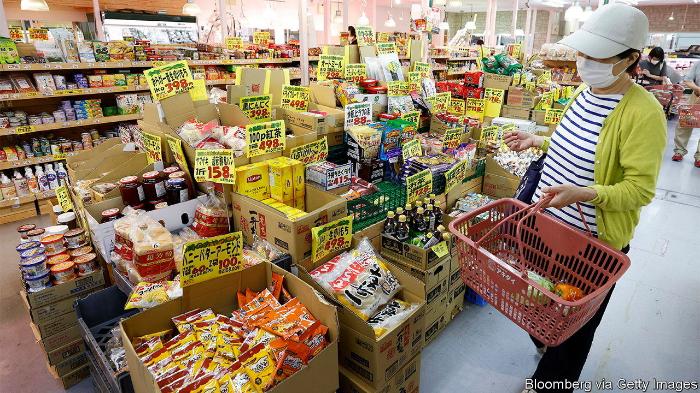

###### Tasty stick growth

# Prices are rising in Japan, but not wages 

##### The pandemic and commodity prices have done what years of loose monetary policy could not 

 

> Aug 18th 2022 

Umaibo has delighted Japanese people for decades. The cylindrical puffed-corn treat, whose name means “delicious stick”, comes in 15 flavours, from salami to spicy cod roe. The price makes all the more appealing: the same ten yen ($0.08) since it hit the market in 1979. So when Yaokin Corporation, the firm which makes Umaibo, put up prices by two yen in January, it made national news. “We’re witnessing a turning point in history,” tweeted Osawa Atsushi, a musician whose rock band crooned about Umaibo’s “miracle price” in a hit song in 2010.

“It’s not just Umaibo, all of the prices have been going up!” cries Ohtani Fumihito, the owner of a snack shop in Tokyo that sells the sticks alongside other cheap treats. Core consumer prices in Japan, which exclude fresh food, rose 2.2% year-on-year in June. Figures for July, to be released on August 19th, are expected to maintain the trend. The Bank of Japan (boj) now reckons prices will rise by 2.3% in the current fiscal year. That would be the first time prices outstrip the bank’s 2% target since it was introduced in 2013, excluding the impact of sales-tax hikes. The covid-19 pandemic and commodity shocks from the war in Ukraine seem to have done what years of loose monetary policy .

Inflation has been far more restrained in Japan than elsewhere in the rich world. (It has passed 9% in America and 10% in Britain.) As in other countries, it is being spurred by the rising cost of imports more than by runaway demand. “We have the bad kind of inflation,” says one Japanese ceo. “It’s not the product of a healthy economy.” Stripping out both fresh food and energy, prices rose just 1% in June compared with a year earlier. While other rich-world central banks have put up rates to tame inflation, the boj has kept them negative, wary of raising them before it is sure that demand is strong enough to push up prices.

Several factors have kept prices in Japan relatively grounded. First, the economy has not recovered as rapidly from the pandemic as in other countries. Consumers have remained cautious for far longer than elsewhere. Whereas America’s gdp regained its pre-pandemic size by the second quarter of 2021, Japan’s did so only in the second quarter of this year. Decades of low inflation or outright deflation have also left firms more reluctant to pass rising costs along to consumers. 

Crucially, wages have not grown alongside prices. During this year’s , the season of annual salary negotiations, big firms gave full-time employees rises of just 2.3%, barely more than last year’s 1.8%. and well below the government’s 3% target. In contrast to , wage growth has not accelerated significantly, despite an unemployment rate of 2.6% in June. That is a big reason why the boj expects inflation to fall below 2% in 2023 and 2024, as commodity prices dip.

Nonetheless, many policymakers and economists reckon Japan still has a chance to break free from decades of low or no inflation. Japanese are beginning to expect prices to go up. The boj’s  survey, which covers business conditions, shows inflation expectations above 2% not only in the short term, but also in three years’ time. Growing input costs are starting to be reflected in retail prices across a wider range of goods. Data for June showed rising prices for over 70% of items in the consumer-price basket, the highest share on record. Optimists hope that if inflationary pressures persist until next spring’s , wages might also start growing.

Yet plenty of potential stumbling blocks remain. If America falls into recession, the yen would probably appreciate, creating fresh deflationary pressures. The government is already being pushed to alleviate the impact of rising prices. On August 15th, Kishida Fumio, Japan’s prime minister, ordered officials to draw up new plans for fuel and food subsidies. And even when pandemic-induced caution fades, consumers who are unaccustomed to substantial inflation and are receiving minimal pay raises may hold back on spending, thus dampening demand. ■

