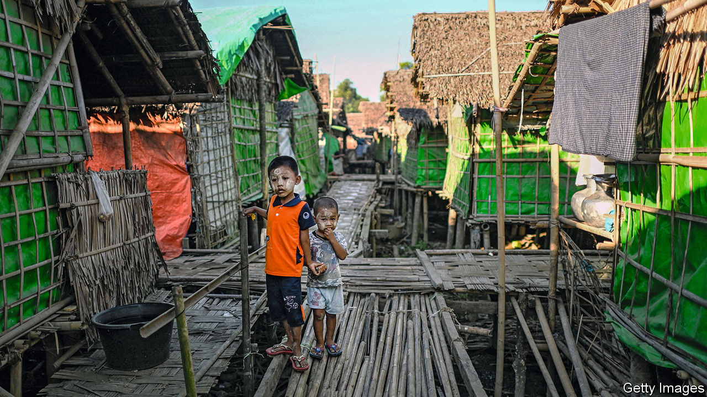
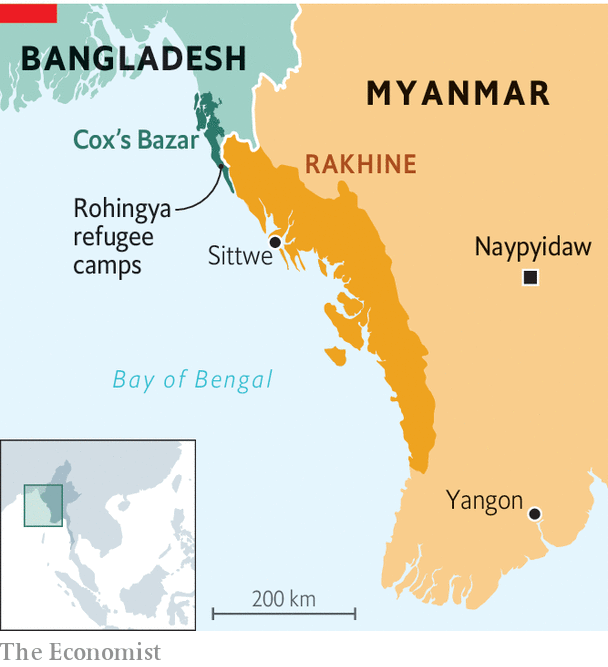

###### Five years on

# The Rohingyas are being wiped out in slow motion 

##### Conditions are dire for the Muslim minority group on both sides of the Myanmar-Bangladesh border 

 

> Aug 18th 2022 

On a vacant patch of land in Sittwe, the capital of Rakhine state along the western flank of Myanmar, grass grows long under the hot sun. A house once stood on this plot, though all trace of it is long gone. Mohammed, a 36-year-old Rohingya man, grew up in that house and lived there until 2012, when he and his family were forced to flee by a band of ethnic Rakhines wielding sticks and torches. That summer mobs of Rakhine villagers and Burmese soldiers razed Rohingya villages and killed hundreds of people belonging to the long-persecuted Muslim minority group. Some 140,000 Rohingyas were displaced in the melee and herded into camps, where they have remained ever since. 

The pogrom of 2012 laid the groundwork for a bigger bout of bloodshed five years later. In 2017 Burmese security forces launched a campaign of mass killing, rape and arson in northern Rakhine, in what the un has branded as genocide. Nearly 750,000 Rohingyas fled to Bangladesh, where they live in the world’s biggest refugee camp (see map). 

 


In the decade since the rampage of 2012 and the five years since the genocide of 2017, the Rohingyas have been subject to conditions designed to  from the ethnic group, according to the un. Crossing over into Bangladesh afforded some respite, at first. Yet the Bangladeshi government has long since begun to view the refugees as a burden. Violence in the camps is rampant, with much of it committed by the Bangladeshi security forces. No matter which side of the border Rohingyas find themselves today, their experience is the same: hunger and misery surrounded by barbed wire. 

The Burmese army, which has run Myanmar for most of the past 50 years, began persecuting Rohingyas decades ago. It first attempted to drive them off their land in 1978, using the now familiar tools of murder, arson and rape. Its high command considers them Bangladeshi interlopers, with no claim to Burmese citizenship—as do many other Burmese. It enshrined that view in law 40 years ago, turning the Rohingyas into the world’s largest community of . 

It was not until 2012, however, that the government began to herd Rohingyas into camps. This segregation, in addition to the imposition of a matrix of repressive laws, which include restrictions on marriage and having children, amount to a system of apartheid, according to Human Rights Watch (hrw), an advocacy group. After the genocide of 2017, this vice tightened. 

Today about a fifth of the Rohingyas who remain in Myanmar live in what Fortify Rights, a pressure group, calls “modern concentration camps”. One unfortunate resident, Hla Maung, lives cheek by jowl with 11 relatives in one of the cramped shelters into which families are crowded. These structures were originally designed to last two years. Many have been badly damaged by monsoons and flooding over the past decade. In April some 28,000 Rohingyas were living in shelters deemed by the un to be structurally unsound. Because international aid agencies must apply to travel to the camps two weeks in advance, they cannot always repair shelters right away. “Living conditions are, by design, squalid,” observed hrw in a recent report.

Harsh restrictions on movement make life harder still. More than three-quarters of displaced Rohingyas cannot leave their camps at all, according to a survey conducted in 2015 by the Centre for Diversity and National Harmony, a Burmese ngo. The rest may travel, but only to a Rohingya ghetto in Sittwe or to Sittwe General Hospital, the sole facility in the state that provides specialised treatment. Medical referrals are granted only for emergencies and even then getting the necessary travel authorisation can take days. Access to health care in the camps is limited. In the more remote ones, doctors visit for just a couple of hours once or twice a week. Rates of disease and child mortality are higher in the camps than elsewhere in the state, according to the International Rescue Committee, an aid organisation.

Those who can leave the camps must get a “village departure certificate” which costs up to 5,000 kyat ($3.45). Sometimes security forces demand travellers present an identity card proving their citizenship, which most Rohingyas lack. All Rohingyas must pass through numerous checkpoints manned by soldiers who demand bribes, and to leave they must often also pay for a “security escort”, which costs up to 20,000 kyat. These restrictions prevent Rohingyas from working, making it difficult for them to supplement the cash or food aid they receive from ngos, which residents say is insufficient for their daily needs. 

For the roughly 300,000-350,000 Rohingyas who have not been herded into camps, conditions are still dire. They, too, are rarely granted permission to get treatment at Sittwe General Hospital. And though they continue to live in their own homes, a mesh of restrictions hems them in as well. They are not allowed to leave their districts without authorisation. Security checkpoints strewn throughout their villages are manned by soldiers who enforce curfews (from 6pm to 6am) and rules limiting gatherings in public areas to no more than five people. Violations of these rules lead to beatings or detention. 

These conditions appear calculated to bring about the “slow death” of the Rohingyas, says the un. Their numbers in Myanmar have dropped precipitously. Before 2017 the country was home to as many as 1.3m Rohingyas. (No reliable numbers exist as they were not included in the last census in 2014, the first in 30 years.) Now the population is closer to 600,000. Most fled to Bangladesh. But many are likely to have died because of the grim living conditions. 

There are dismaying parallels between the experiences of Rohingyas in Rakhine state and those in the refugee camps of Bangladesh. At first refugees could work in surrounding towns, recalls Hakim Ullah, who has lived in the refugee settlement in Cox’s Bazar district since 2017. Now they need permission to leave the camps. Shops and schools in the camps were demolished earlier this year by the Bangladeshi authorities, who have banned paid work and . “The refugee camps have become detention camps”, says Rahamat Ullah, a Rohingya civil-rights activist who lives in Cox’s Bazar.

Nor have refugees traded freedom for safety. Militant groups and criminal gangs operating in the camps , kidnappings and robberies. Bangladesh’s security forces do much of the terrorising themselves, according to reports from human-rights groups. The Armed Police Battalion, the specialist unit responsible for security in the camps, acts “with impunity”, says Ashraf Zaman of the Asian Human Rights Commission, a pressure group based in Thailand. The battalion has reportedly beaten children and raped women. The Bangladeshi forces are so brutal, that they remind Mr Hakim Ullah of the Burmese army. (Bangladeshi authorities did not respond to multiple requests for comment from .)

As long as the Burmese army is in power, little about the Rohingyas’ condition is likely to change. “Life in the camps is worse than prison,” says Mohammed, who now lives in a camp outside Sittwe. At least prisoners know the length of their sentence. Rohingyas do not know if they will ever be released. Even if they are, many would have no home to return to. The authorities long ago bulldozed the ruins of houses like Mohammed’s, and sold the land to developers—making it easier to remove every last trace of the group. ■

