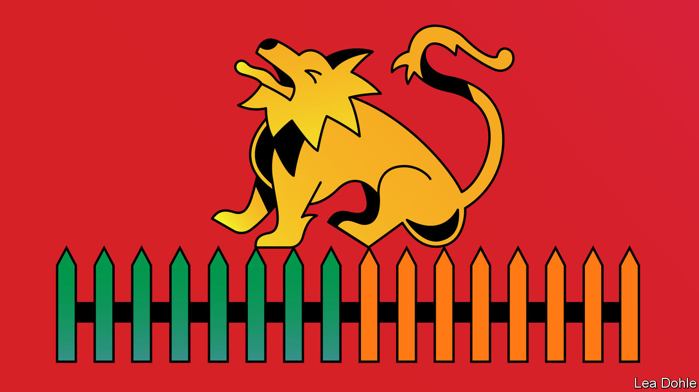

###### Banyan

# The rising prominence of the Indian Ocean worries the countries in it 

##### The arrival of a Chinese ship in Sri Lanka raises hackles in India 

 

> Aug 18th 2022 

On august 15th Ranil Wickremesinghe, Sri Lanka’s president, travelled to the Katunayake air base near Colombo, the capital, to take delivery of a Dornier 228 maritime surveillance aircraft, a gift from India. The very next day, , a Chinese surveillance ship, docked in the port of , in the south, despite objections from India and America. Meanwhile, , a Chinese-built Pakistani frigate, called at the port of Colombo on August 12th. 

For Sri Lanka, it has been a tricky few days. Responding to allegations in the Indian press, its navy denied that it was conducting “war games” with the Pakistani boat. But the Chinese ship captured the imaginations of both Sri Lankans and Indians. Originally due to dock on August 11th, its arrival was “deferred” at the request of Sri Lanka under pressure from India, which fears the vessel can track its missile launches. 

All of which would be delicate enough under normal circumstances. But Sri Lanka, which  on its debt in May, is dependent on the goodwill of its creditors and its neighbours. China alone accounts for 10% of the country’s $32bn in foreign borrowing, and is usually reluctant to offer write-downs. India has been a stalwart ally over the past several months, providing some $4bn in loans and aid to keep Sri Lanka afloat. Maintaining good relations with both countries is essential if Sri Lanka’s debt is to be made sustainable. Hence the slightly awkward compromises regarding all the visiting vessels. 

“We’ve so far kept out the power rivalry from the Indian Ocean,” Mr Wickremesinghe said in an  with  the day before he went to accept India’s gift. But it is becoming more difficult to maintain a balance, he says, in light of the war in Ukraine and China’s no-limits alliance with Russia. “I think we have to face up to that situation and work with everyone…Sri Lanka, of course, has a special relationship with India where we have to look after each other’s interests. But most countries in the Indian Ocean want to stay out of the power rivalry. So we have to be clear about that and say what our policies are.” 

That is easier in theory than in practice, as the  saga shows. China was reportedly furious at the request to defer its arrival. It insists it is merely a “scientific research vessel” rather than the nefarious spy ship India claims it is. These are “very normal exchanges between two countries that enjoy a long friendship”, the Chinese ambassador told reporters. 

Such wrangling between Asia’s giants is likely to become more common in the coming years. Ties have been strained ever since a Himalayan border clash between their forces in 2020, which killed 20 Indian soldiers and five Chinese ones. Tens of thousands of troops are massed on either side of their border. The relationship “is not normal [and] it cannot be normal as the border situation is not normal”, Subrahmanyam Jaishankar, India’s external affairs minister, said recently. This month Indian officials refused to say what Chinese ones wanted to hear about Taiwan, stating only that “relevant policies are well known and consistent”. 

The tension has implications not just for South Asia but the Indian Ocean, too. Many island nations “recognise China’s newfound interest in their regions as an opportunity,” writes Darshana Baruah of the Carnegie Endowment, a think-tank in Washington. They also see, she adds, that Chinese attention has spurred a  from such countries as India and America. The Indian Ocean may become a stage for “strategic competition between major rival powers”, Ahmed Khaleel, the Maldives’ foreign minister, said last year at a forum organised by the think-tank. “But our hope is that the Indian Ocean will not witness a security dilemma in which activities by larger outside powers to enhance their own security interests create insecurity for others in the region,” he said. 

Mr Wickremesinghe, too, is concerned that the Indian Ocean will become the next venue for great-power tussles. “Nancy Pelosi on her own has created a crisis,” he says, referring to a visit to Taiwan this month by the speaker of America’s House of Representatives, which enraged China. “We don’t want any of that happening here. We see India as the net security provider in the area. And then all other countries can also be present as long as it doesn’t lead to rising tensions or increase the rivalry between states.” That position is understandable. Yet the flip-flopping over , which irritated both China and India, is a sign of how hard it will be to maintain. 


 


