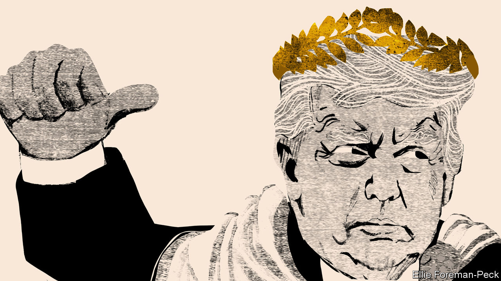
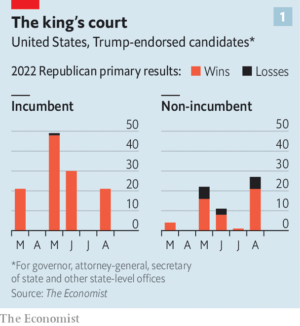
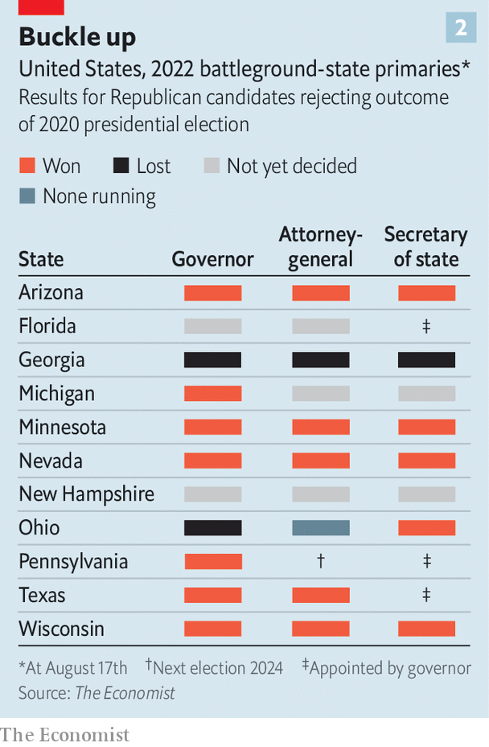
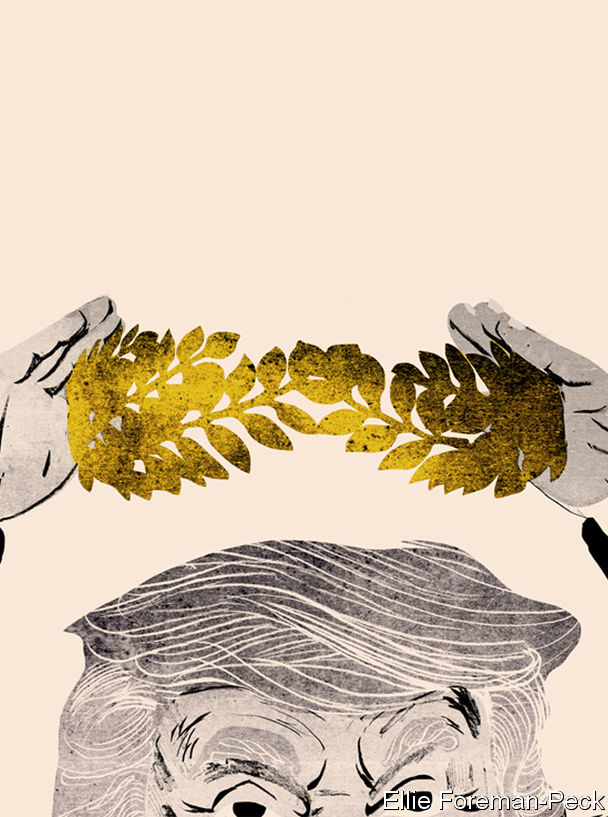

###### The Nero of Mar-a-Lago

# Donald Trump’s hold on the Republican party is unquestionable 

##### And it is putting his acolytes into offices that control elections 

 

> Aug 18th 2022 

Like his presidency, the after-presidency of Donald Trump is riddled with extreme contradictions. Here is a man deeply mired in investigations into a range of possible crimes—a mire it is hard to imagine any previous politician escaping. And yet he is so powerful within his party that his disapproval can sink the career of almost any elected representative who speaks out against him, no matter how unassailable their pedigree or impeccable their credentials. Two events, only eight days apart, prove the paradox.

On August 8th fbi agents turned up at Mar-a-Lago, Mr Trump’s club and private mansion in Florida, with a warrant to search the premises for top-secret documents and presidential records kept in violation of federal laws, including the Espionage Act. They left with 11 boxes of material. , and indeed to criminal investigation; but this was something new even for him. 

On August 16th Liz Cheney, who won re-election to Wyoming’s single seat in the House of Representatives with 69% of the vote in 2020, was trounced in the primary election which would have allowed her to contest the seat again this autumn. Ms Cheney, once seen as a rising star, is the daughter of local Republican royalty—former Vice-President Dick Cheney, who represented the same seat in Congress for ten years. But she is also one of just ten Republican legislators who voted to impeach Mr Trump over his conduct before and during the attack on the Capitol by his supporters on January 6th 2021. She has since helped lead the congressional committee investigating Mr Trump’s role on that dire day. In the face of Mr Trump’s resultant fury her illustrious parentage and unassailably conservative beliefs were as naught. 

Not all those who have irked Mr Trump have been purged from the party’s ranks. Georgia’s governor, Brian Kemp, and its secretary of state (chief elections officer), Brad Raffensperger, both helped thwart Mr Trump’s attempts at post-election cheating. Despite efforts to unseat them, Georgia’s primary voters made them the party’s nominees in May. But the price of self-preservation was silence. “I’ve never said a bad word about [Mr Trump’s] administration and I don’t plan on doing that,” Mr Kemp said. Republican senators and representatives do not always do exactly as Mr Trump would wish. In private many will admit their exhaustion with him—sometimes their loathing, too. But in public they hold their tongues. The party’s base is still devoted to Mr Trump (65% net approval in polls) and to his Big Lie about the 2020 election (70% tell pollsters they believe it was stolen from him), and he can focus their ire on anyone whose head rises above the parapet. His power in the party is not absolute. But it is unquestionable. 

 


Most candidates seeking to run as a Republican this year have seen a kiss from the king as essential to victory—and fear his possibly fatal displeasure. In races for open seats, Mr Trump’s endorsement picks have won four in five times (see chart 1). As a result, the party which lost the White House and the Senate two years ago is going into the forthcoming elections looking more, not less, like the man who led it to that defeat. 

Despite that, the Republicans’ chances of taking the House seem good, and they could take the Senate too. And while the precise quantity and distribution of Republicans to be returned remains unknown, their quality is already apparent: they will act as fierce Trump loyalists. There will be no let-up in their vociferous denunciation of any and all attempts by “the regime” to impose the rule of law on their liege. Any investigative committees they come to control will abruptly lose interest in Mar-a-Lago’s safes and turn their attention to President Joe Biden’s administration and family. And the chances of another, better-orchestrated attempt to steal an election will grow.

The undisputed centre of this empire of paranoia is Arizona. Last year, Republicans in the state legislature took the unprecedented step of subpoenaing all the ballots cast in Maricopa County (which includes Phoenix and 61% of the state’s voters) and launching a partisan audit. Their chosen company, Cyber Ninjas, had ties with the “stop the steal” movement and no prior election experience. After all the effort, and the frenzied following of the former president’s dearest supporters, the ninjas came up empty. That did nothing to chasten the conspiracists. After the findings were released, Mr Trump simply released a statement lying about the discovery of “significant and undeniable evidence of FRAUD!” and resumed his campaigning. 

 


Republican primary voters went on to choose ardent supporters of the Big Lie for all three statewide positions that will certify the next presidential election—governor, attorney-general and secretary of state. The Republican parties in various other potential swing states, including Michigan and Nevada, have chosen to field Big Lie endorsers as their candidates for some or all of the same offices (see chart 2).

None of these crusaders embodies pugilism-as-bombast as well as Kari Lake, the nominee for governor in Arizona. Her policy platform for democracy is to obsess over the last, “stolen” presidential election and fantasise about future steals being planned; her border policy is to declare illegal immigration an invasion and blow up drug tunnels; her water policy is, in part, to “fill Lake Mead with liberal tears” (after desalination). She is already being mooted as a running-mate for Mr Trump in 2024.

On the eve of the primary election on August 1st, in a muggy warehouse bar in Phoenix, Ms Lake whipped up the crowd against “those bastards back there”—the media, of which, as a television presenter, she was a member for two decades. At the same rally, Abe Hamadeh, the party’s nominee for attorney-general, declared that “we all know that our elections have been hijacked; our justice system has been corrupted.” And yet the most hardcore of the lot is Mark Finchem, a leading “stop the steal” proponent who has previously admitted to being a member of the Oath Keepers militia. He attended the January 6th riot (but maintains he did not enter the Capitol) and has said that Mr Trump would not have lost the state in Arizona had he been in charge of its elections. He is now the party’s nominee for secretary of state. If democracy dies in America, it will start in the desert.

The election of the Trump-appointed slate means that the “rule of law is teetering” in Arizona, according to Bill Gates (not that one), a Republican member of the Maricopa County Board of Supervisors. In other times a man like Mr Gates, a Harvard-educated lawyer and businessman who supports tighter voter-identification laws and low rates of taxation, might have aspired to statewide office, too. But with openness to electoral nullification a new litmus test for such candidates he counts himself out. He says his party has a tumour which is metastasising, and that its nature has changed fundamentally. “We’ve become a European far-right party.”

America’s national front

The recent Conservative Political Action Conference (cpac), in Dallas, Texas, confirmed as much. Once derided as an out-there fringe, cpac is now a gathering of the party’s best beloved. But its content is hardly any less extreme. An opening speaker was Viktor Orban, the prime minister of Hungary and champion of “illiberal democracy”, who was enthusiastically received for assailing progressives, globalists, illegal migrants and George Soros. Admirers mobbed anti-globalist and conspiracist stars like Steve Bannon, a former senior adviser to Mr Trump freshly convicted of contempt of Congress, and Nigel Farage, the prime instigator of Brexit.

The movement’s unifying goal is to save America by completely destroying the enemy. “We will bring Big Tech down to their knees!” screamed Lauren Boebert, a Republican congresswoman. “We drove a stake through the heart of the McCain machine,” said Ms Lake of the devotees of Arizona’s most recent Republican to run for the presidency, with a vampire-killing gesture to accentuate her point. “What President Trump did bring out was he unveiled the left, and especially their affiliation with the media, for what they really stand for…socialism,” says Scott Perry, a Republican congressman from Pennsylvania who is under federal scrutiny trying to overturn the election. Even if Mr Trump had not been there, the profound mark on his party would have been unmistakable.

But he was there. And in fine form. “The election was rigged and stolen and now our country is being systematically destroyed,” he said to rapturous applause. “I ran twice, I won twice…and now we may have to do it again,” he teased. Vintage Trumpian complaints made their appearances: the American carnage (“the streets of our Democrat-run cities are drenched with the blood of innocent victims”); the border (“it’s an invasion”); and the “fake news media”. But the biggest ovations came over “critical race theory and left-wing gender ideology” and the former president’s calls to “keep men out of women’s sports” and abolish the Department of Education. A straw poll at the convention gave him a 99% approval rating; 69% said they would support his almost-promised candidacy in 2024. 

Second in that poll, with 24%, came Ron DeSantis, the governor of Florida. Mr Trump, when crowing over his own numbers, pointedly pretended not to know this—thus confirming that he, like the rest of the party, sees Mr DeSantis as his most viable rival. A humourless culture warrior, Mr DeSantis has branded himself a fighter against woke corporations, media and schools. His appeal is his ability to triangulate between the party’s America First diehards and exhausted moderates, presenting himself as a successor to, rather than a repudiation of, what has come before. 

Once a Trump mini-me—in 2018 an infamous campaign ad had him schooling his infant children in Trumpism—he now keeps his distance. But he is happy to go round the country stumping with Trump darlings like Ms Lake or J.D. Vance, the Senate nominee in Ohio. The governor has usurped Mr Trump’s position as guest-in-chief on Fox News, a partisan television channel. He has raised more than $100m. Much of it has come from former Trump donors who think the risk of another loss against Mr Biden is too high. 

Mr DeSantis’s appeal is that he is “Trump without the baggage”, says Sarah Longwell, a Republican strategist who runs many Republican focus groups. The fall-out from the search of Mar-a-Lago has been a jarring reminder of the tumult and chaos the man cannot help but bring with him. “People are happy—overwhelmingly—with the direction of the party. And that means America First,” says Ms Longwell. “Even if Trump the man loses some altitude…the party has now changed for ever.”

The problem with “Trump without the baggage” as a strategy, though, is that the baggage gets a say. In the unlikely event that Mr Trump decides, very much against the run of play, not to stand in 2024 Mr DeSantis will be very well placed. If he does run again, Mr DeSantis, who is only 43, could simply decide to sit this one out. If the younger man decides to make a fight of it, it will be a battle for which he is not well-equipped. He is not a gifted orator and a head-to-head confrontation would be bruising. Florida’s shores already host the shipwrecks of two other Republicans from the state—Jeb Bush, a former governor, and Marco Rubio, a senator—who did not survive Mr Trump’s derision and humiliating insults when they challenged him in 2016.

Baggage is as baggage does

There are three things which could, in principle, make Mr Trump less formidable: the depredations of age, legal sanctions and political misjudgments. On the first, at 76 a sudden, severe deterioration in health is obviously possible. That said, the former president appears hale and hearty. 

His legal jeopardy seems more acute. The fbi’s dropping by Mar-a-Lago is only one of his problems. His business dealings are under investigation in New York. The House Committee on Ways and Means is making progress in its efforts to look at his tax records. State prosecutors in Georgia have empanelled a grand jury that is investigating his exhortation that Mr Raffensperger “find 11,780 votes” somewhere in the state in order to overturn his election loss. It has already issued subpoenas to compel testimony from allies such as Rudy Giuliani, Mr Trump’s lawyer, and Lindsey Graham, a senator from South Carolina. Investigators at the Department of Justice are closely following the work of the January 6th committee and have been seizing mobile phones and documents from those most closely involved in the efforts to keep Mr Trump in power.

But the possibility of prosecution seems to fire Mr Trump and his supporters up, rather than turn them off. They treat it as offering a form of vindication—evidence of how much “the regime” wants him off the scene. The political risks for the law-enforcement agencies involved are huge. Not charging Mr Trump gives him an air of impunity; charging him unsuccessfully would make him look invincible. “The downside of going after him,” according to Paul Rosenzweig, a senior official under George W. Bush who worked on the Whitewater investigation in the 1990s, is that “even the federal government might miss with a nullified jury”—that is, one in which some jurors would acquit come what may.

 


The possibility of indictments may hasten Mr Trump’s announcement of his candidacy, the better to play the victim. Casting the prosecution of a presidential candidate as a deep-state conspiracy is peculiarly compelling. 

Senior Republicans are privately terrified Mr Trump might make that move before the November elections. Though they feel confident of taking the House, they are already worried that his interventions may cost their party the Senate. In at least five of the states which will decide who controls the chamber, Mr Trump endorsed political neophytes; duly selected as candidates, they seem to be underperforming. Blake Masters, a 36-year-old former venture capitalist who is the party’s nominee in Arizona, is trailing Mark Kelly, the Democratic incumbent, by ten percentage points. Mehmet Oz, a carpet-bagging celebrity doctor running in Pennsylvania, faces a similar shortfall. An ad complaining about the cost of crudités has not helped. 

Having given the Democrats control of the Senate in 2020—by flubbing two run-off elections in Georgia after he incessantly complained about electoral fraud—Mr Trump may, through his endorsements, have helped them keep it in 2022. And if, come election day, he has announced his candidacy he may damage the party’s prospects further. Democrats would much prefer to run against Mr Trump than on the basis of their economic record. Ronna McDaniel, the chair of the Republican National Committee, has tried to steer Mr Trump away from such a course by publicly reminding him that the party would no longer pay his considerable legal bills if he were to formally declare his candidacy.

That said, a failure in the mid-terms which seriously jeopardised Mr Trump’s standing would have to be both cataclysmic and very clearly his fault. That is why some of his enemies are looking at a fourth thing which might weaken him: a direct challenge. This would not be an attempt to beat Mr Trump to the nomination as a means to achieve office, as a run by Mr DeSantis would be. It would treat keeping him out of office as an end in itself. 

Here eyes naturally fall on Ms Cheney. Her relish for such a role was clearly set out in her concession speech on the night of August 16th: “I have said since January 6 that I will do whatever it takes to ensure Donald Trump is never again anywhere near the Oval Office. And I mean it,” she said, framed for the television cameras by a vintage Chevrolet pickup and neatly stacked hay bales impaled with American flags. Her willingness to sacrifice elected office shows her resolve. 

The last hurrah?

There is no chance of Ms Cheney splitting the party; the schism which anti-Trump establishment types promised first in 2016 and then in 2020 looks even less likely today. Her approval rating among Republicans is a remarkable minus 52 points. But there are other conservatives who, like her, are unwilling to vote for either Mr Trump or a Democrat. By appealing to them she could well deny the party in which she has spent her life a few swing states. This appears to be something she is considering: “I love what our party has stood for. But I love my country more.”

It might seem that the Democrats should not need such help against opponents so divorced from reality. But if some Republicans worry that Mr Biden could beat Mr Trump again, plenty of Democrats worry that he couldn’t. Nor do other plausible nominees look strong. And if the election is close, Mr Trump may benefit from followers who will soon be in a position to influence its certification. A constitutional crisis looms. 

“It’s funny,” says Mr Gates of the Maricopa Board of Supervisors. “The Democrats say, ‘We need a strong Republican Party for this democracy.’ And my feeling is we actually need a strong Democratic Party to help our Republican Party get better.” ■


